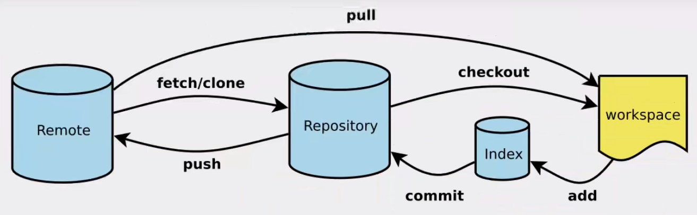
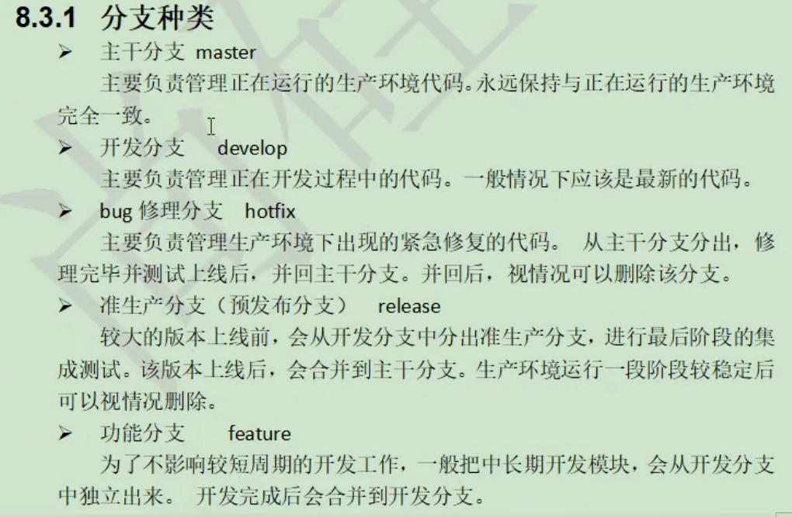

### Git各仓库图



### 项目搭建

1. #### 本地搭建

   ```bash
   git init		初始化
   git remote add origin git@115.159.38.240:lmb0989/test.git
   ```

2. #### 远程克隆

   ```bash
   git clone [url]
   ```

### 忽略文件

 在项目目录下建立".gitignore"文件，此文件有如下规则

```bash
# 匹配示例
# 						    #注释
logs/						# 忽略当前路径下的logs目录，包含logs下的所有子目录和文件
/logs.txt					# 忽略根目录下的logs.txt文件
*.class						# 忽略所有后缀为.class的文件
!/classes/a.class			 # 不忽略classes目录下的a.class文件
tmp/*.txt					# 只忽略tmp目录下的.txt文件
**/foo						# 可以忽略/foo, a/foo, a/b/foo等
```

>各语言忽略文件参考
>
>https://github.com/github/gitignore


### 命令

```bash
git status [filename]		 		   # 查看指定文件状态
git status							  # 查看所有文件状态

git add [filename]					   # 添加相应文件到暂存区
git add .							  # 添加所有文件到暂存区
git commit -m "message"	[filename]	 	# 提交暂存区的内容到本地仓库
```

### 版本历史

```bash
# 查看版本
git log								# 最完整的版本历史信息
git log --pretty=online			      # 简洁的显示方式
git log --oneline					 # 更加简洁的显示方式
git reflog							# 带版本索引hash值的简洁显示方式

# 前进和回退
# 先执行git reflog显示出版本索引hash值
git reset --sort   版本索引hash值/HEAD		# 只修改版本库中的HEAD指向
git reset --mixed  版本索引hash值/HEAD		# 修改版本库和缓存区的HEAD指向
git reset --hard   版本索引hash值/HEAD		# 同时修改版本库、缓存区和工作区的HEAD指向
```

### 比较差异

```bash
git diff [filename]							# 将工作区的文件和缓存区进行比较
git diff [版本索引hash值/HEAD] [filename]	  # 将工作区的文件和版本库进行比较（不加[filename]将比较多个文件）
```

### 分支



```bash
#查看分支列表 
git branch -v							# 列出本地所有分支
git branch -r							# 列出所有远程的分支

# 新建分支
git branch [branch-name]				 # 新建一个分支（但依然停留在当前分支）
git checkout [branch-name]				 # 切换到对应分支
git checkout -b [branch]				 # 上面两个命令的整合：新建一个分支，并切换到该分支

# 合并分支
# 先切回要和合并的分支线上
git checkout [branch-name]
git merge [branch-name]					# 合并指定分支到当前分支

# 删除分支
git branch -d [branch-name]
git push origin --delete [branch-name]		# 删除远程分支
git branch -dr [remote/branch]

```


### 还原所有的修改

```bash
git checkout . && git clean -df
```

