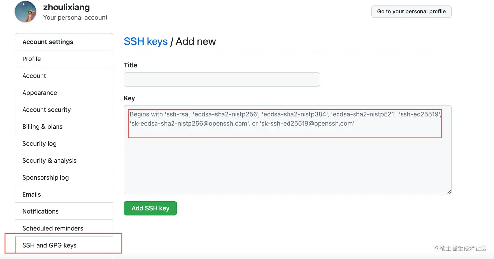
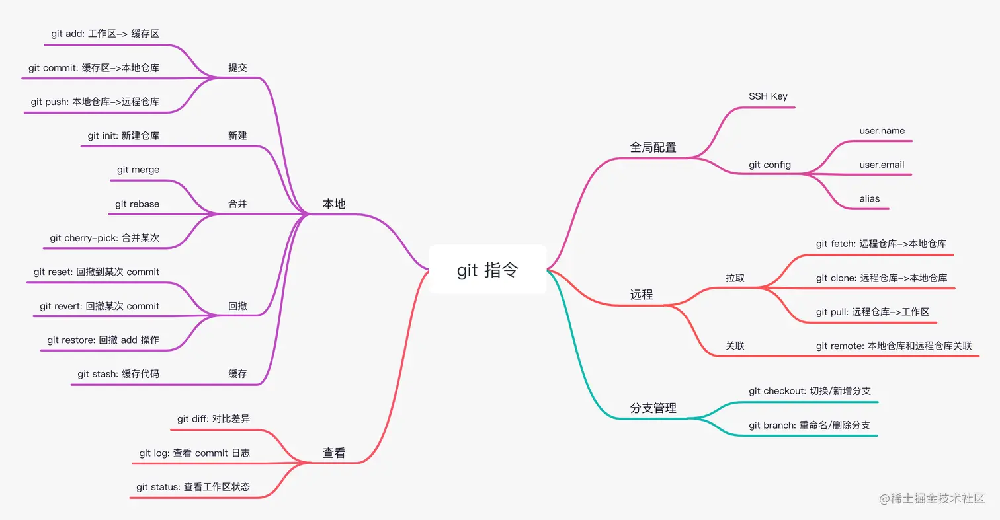

### Git 各仓库图


### 配置用户信息

```bash
perl 代码解读复制代码# 配置用户名
git config --global user.name "yourname"

# 配置用户邮箱
git config --global user.email "youremail@xxx.com"

# 查看当前的配置信息
git config --global --list

# 通过 alias 配置简写
## 例如使用 git co 代替 git checkout
git config --global alias.co checkout
```

### ssh key

向远端仓库提交代码时，需要在远端仓库添加本地生成的 ssh key。

1. 生成本地 ssh key，若已有直接到第 2 步:

   ```bash
   ssh-keygen -t rsa -C "youremail@xxx.com"
   ```

2. 查看本地 ssh key:

   ```bash
   cat ~/.ssh/id_rsa.pub
   ```

3. 将 ssh key 粘贴到远端仓库：

   

### 本地搭建

```bash
git init		初始化
git remote add origin git@115.159.38.240:lmb0989/test.git
```

### 远程克隆

```bash
# 克隆远端仓库到本地
git clone <git url>

# 克隆远端仓库到本地，并同时切换到指定分支 branch1
git clone <git url> -b branch1

# 克隆远端仓库到本地并指定本地仓库的文件夹名称为 my-project
git clone <git url> my-project
```

### git remote: 关联远程仓库

`git remote` 用于将本地仓库与远程仓库关联

```bash
# 查看远程仓库
git remote -v

# 关联本地 git init 到远程仓库
git remote add origin <git url>

# 新增其他上游仓库
git remote add <git url>

# 移除与远程仓库的管理
git remote remove  <git url>

# 修改推送源
git remote set-url origin <git url>
```

### git add: 提交到暂存区

```bash
# 将所有修改的文件都提交到暂存区
git add .

# 将修改的文件中的指定的文件 a.js 和 b.js 提交到暂存区
git add ./a.js ./b.js

# 将 js 文件夹下修改的内容提交到暂存区
git add ./js
```

### git commit: 提交到本地仓库

```bash
# 将工作区内容提交到本地仓库，并添加提交信息 your commit message
git commit -m "your commit message"

# 将工作区内容提交到本地仓库，并对上一次 commit 记录进行覆盖
## 例如先执行 git commit -m "commit1" 提交了文件a，commit_sha为hash1；再执行 git commit -m "commit2" --amend 提交文件b，commit_sha为hash2。最终显示的是a，b文件的 commit 信息都是 "commit2"，commit_sha都是hash2
git commit -m "new message" --amend

# 将工作区内容提交到本地仓库，并跳过 commit 信息填写
## 例如先执行 git commit -m "commit1" 提交了文件a，commit_sha为hash1；再执行 git commit --amend --no-edit 提交文件b，commit_sha为hash2。最终显示的是a，b文件的 commit 信息都是 "commit1"，commit_sha都是hash1
git commit --amend --no-edit

# 跳过校验直接提交，很多项目配置 git hooks 验证代码是否符合 eslint、husky 等规则，校验不通过无法提交
## 通过 --no-verify 可以跳过校验（为了保证代码质量不建议此操作QwQ）
git commit --no-verify -m "commit message"

# 一次性从工作区提交到本地仓库，相当于 git add . + git commit -m
git commit -am
```

### git push: 提交到远程仓库

```bash
# 将当前本地分支 branch1 内容推送到远程分支 origin/branch1
git push

# 若当前本地分支 branch1，没有对应的远程分支 origin/branch1，需要为推送当前分支并建立与远程上游的跟踪
git push --set-upstream origin branch1

# 强制提交
## 例如用在代码回滚后内容
git push -f
```

### git pull: 拉取远程仓库并合并

`git pull` 会拉取远程仓库并合并到本地仓库，相当于执行 `git fetch` + `git merge`

```bash
# 若拉取并合并的远程分支和当前本地分支名称一致
## 例如当前本地分支为 branch1，要拉取并合并 origin/branch1，则直接执行：
git pull

# 若拉取并合并的远程分支和当前本地分支名称不一致
git pull <远程主机名> <分支名>
## 例如当前本地分支为 branch2，要拉取并合并 origin/branch1，则执行：
git pull git@github.com:zh-lx/git-practice.git branch1

# 使用 rebase 模式进行合并
git pull --rebase
```

### git checkout: 切换分支

```bash
# 切换到已有的本地分支 branch1
git checkout branch1

# 切换到远程分支 branch1
git checkout origin/branch1

# 基于当前本地分支创建一个新分支 branch2，并切换至 branch2
git checkout -b branch2

# 基于远程分支 branch1 创建一个新分支 branch2，并切换至 branch2
git checkout origin/branch1 -b branch2
## 当前创建的 branch2 关联的上游分支是 origin/branch1，所以 push 时需要如下命令关联到远程 branch2
git push --set-upstream origin branch2

# 撤销工作区 file 内容的修改。危险操作，谨慎使用
git checkout -- <file>

# 撤销工作区所有内容的修改。危险操作，谨慎使用
git checkout .
```

### 还原所有的修改

```bash
# 修改的文件被还原，新添加的文件也会被删除
git checkout . && git clean -df
```

### git restore: 取消缓存

`git restore` 用于将改动从暂存区退回工作区

```bash
# 将 a.js 文件取消缓存（取消 add 操作，不改变文件内容）
git reset --staged a.js

# 将所有文件取消缓存
git reset --staged .
```

### git reset: 回滚代码

`git reset` 用于撤销各种 commit 操作，回滚代码

```bash
# 将某个版本的 commit 从本地仓库退回到工作区（取消 commit 和 add 操作，不改变文件内容）
## 默认不加 -- 参数时时 mixed
git reset --mixed <commit_sha>

# 将某个版本的 commit 从本地仓库退回到缓存区（取消 commit 操作，不取消 add，不改变文件内容）
git reset --soft <commit_sha>

# 取消某次 commit 的记录（取消 commit 和 add，且改变文件内容）
git reset --hard <commit_sha>

## 以上三种操作退回了 commit，都是退回本地仓库的 commit，没有改变远程仓库的 commit。通常再次修改后配合如下命令覆盖远程仓库的 commit：
git push -f
```

### git revert: 取消某次 commit 内容

`git revert` 相比于 `git reset`，会取消某次 commit 更改的内容，但是不会取消掉 commit 记录，而是进行一次新的 commit 去覆盖要取消的那次 commit

```bash
# 取消某次 commit 内容，但是保留 commit 记录
git revert <commit-sha>
```

### git stash：缓存代码

`git stash` 用于将当前的代码缓存起来，而不必提交，便于下次取出

```bash
# 把本地的改动缓存起来
git stash

# 缓存代码时添加备注，便于查找。强烈推荐
git stash save "message"

# 查看缓存记录
## eg: stash@{0}: On feat-1.1: 活动功能
git stash list

# 取出上一次缓存的代码，并删除这次缓存
git stash pop
# 取出 index 为2缓存代码，并删除这次缓存，index 为对应 git stash list 所列出来的
git stash pop stash@{2}

# 取出上一次缓存的代码，但不删除这次缓存
stash apply
# 取出 index 为2缓存代码，但不删除缓存
git stash apply stash@{2}

# 清除某次的缓存
git stash drop stash@{n}

# 清除所有缓存
git stash clear
```

### git cherry-pick: 合并指定 commit

`git cherry-pick` 可以选择某次 commit 的内容合并到当前分支

```bash
# 将 commit-sha1 的变动合并至当前分支
git cherry-pick commit-sha1

# 将多次 commit 变动合并至当前分支
git cherry-pick commit-sha1 commit-sha2

# 将 commit-sha1 到 commit-sha5 中间所有变动合并至当前分支，中间使用..
git cherry-pick commit-sha1..commit-sha5

# pick 时解决冲突后继续 pick
git cherry-pick --continue：
# 多次 pick 时跳过本次 commit 的 pick 进入下一个 commit 的 pick
git cherry-pick --skip
# 完全放弃 pick，恢复 pick 之前的状态
git cherry-pick --abort
# 未冲突的 commit 自动变更，冲突的不要，退出这次 pick
git cherry-pick --quit

```

### 版本历史

```bash
git status [filename]		 		   	# 查看指定文件状态
git status							  	# 查看所有文件状态

# 查看版本
git log								# 最完整的版本历史信息
git log --pretty=online			      # 简洁的显示方式
git log --oneline					 # 更加简洁的显示方式
git reflog							# 带版本索引hash值的简洁显示方式

# 前进和回退
# 先执行git reflog显示出版本索引hash值
git reset --sort   版本索引hash值/HEAD		# 只修改版本库中的HEAD指向
git reset --mixed  版本索引hash值/HEAD		# 修改版本库和缓存区的HEAD指向
git reset --hard   版本索引hash值/HEAD		# 同时修改版本库、缓存区和工作区的HEAD指向
```

### git diff: 对比差异

```bash
# 当工作区有变动，暂存区无变动，对比工作区和本地仓库间的代码差异
#  当工作区有变动和暂存区都有变动，对比工作区和暂存区的代码差异
git diff

# 显示暂存区和本地仓库间的代码差异
git diff --cached
# or
git diff --staged

# 显示两个分支之间代码差异
git diff <分支名1> <分支名2>

git diff [filename]							# 将工作区的文件和缓存区进行比较
git diff [版本索引hash值/HEAD] [filename]	  # 将工作区的文件和版本库进行比较（不加[filename]将比较多个文件）
```

### git fetch: 获取更新

`git fetch` 用于本地仓库获取远程仓库的更新，不会 merge 到工作区

```bash
# 获取远程仓库特定分支的更新
git fetch <远程主机名> <分支名>

# 获取远程仓库所有分支的更新
git fetch --all
```

### 分支


```bash
#查看分支列表 
git branch -v							# 列出本地所有分支
git branch -r							# 列出所有远程的分支

# 新建分支
git branch [branch-name]				 # 新建一个分支（但依然停留在当前分支）
git checkout [branch-name]				 # 切换到对应分支
git checkout -b [branch]				 # 上面两个命令的整合：新建一个分支，并切换到该分支

# 合并分支
# 先切回要和合并的分支线上
git checkout [branch-name]
git merge [branch-name]					# 合并指定分支到当前分支

# 删除分支
git branch -d [branch-name]
git push origin --delete [branch-name]		# 删除远程分支
git branch -dr [remote/branch]

```


### 其他

- 解决 git 拉取代码需要输入密码问题

  执行 git config --global credential.helper store，在~/.gitconfig 目录下会多出一个文件，这里会记录你的密码和帐号

  *再执行 git pull 输入一次正确的帐号密码之后就不用再输入了。*

### 总结

已确认
