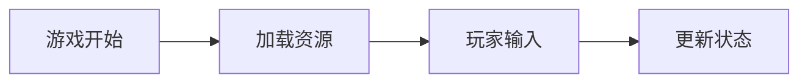
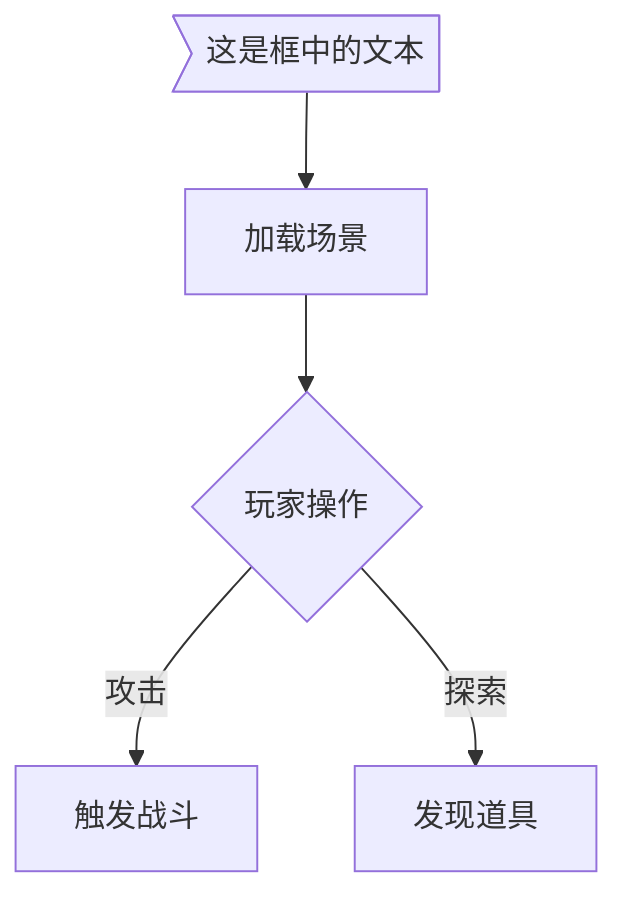
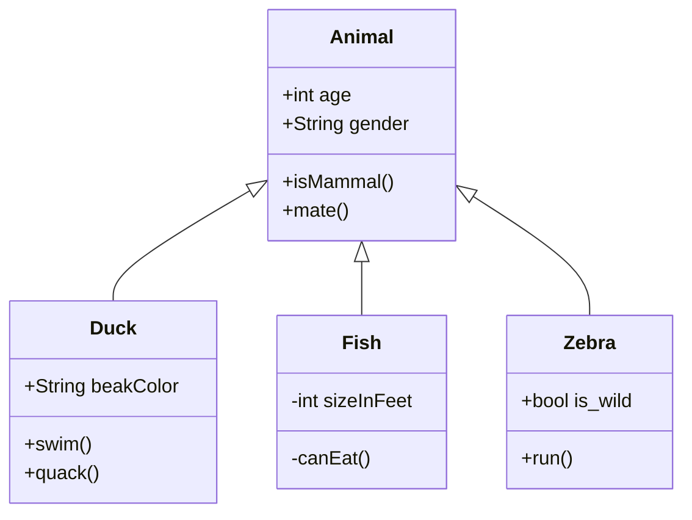

## JS判断两个时间戳是否为同一天

```javascript
const is_same_day = function(t)
{
	return new Date(t).toDateString() === new Date().toDateString();
}
```








pie
    title 为什么总是宅在家里？
    "喜欢宅" : 15
    "天气太热或太冷" : 20
    "穷" : 500





