使用得心应手的IDE来开发应用程序，可以使我们的工作事半功倍。而调试则更可以让我们准确的定位BUG，发现问题。 
本文讲述如何使用 [WebStorm](http://www.jetbrains.com/webstorm/) 这个怪兽级JavaScript IDE来调试 [Chat of Pinus](https://github.com/node-pinus/chatofpinus)。 
如果你更喜欢 [Eclipse](http://www.eclipse.org/) 等其他IDE，希望本文也可以有一些帮助。

## 前言

* 首先我们需要知道，NodeJS应用程序可以在运行命令中加入`--debug=5858`参数，可以使得NodeJS程序监听本地`5858`端口，并开启调试模式。

* 其次，Pinus的运行原理是：`pinus start`时，启动了`master`服务器，然后其先读取配置文件，再启动由`game-server/config/servers.json`文件中经过配置的各个服务器进程。其中，你看到的`id`、`host`、`port`等等都是子服务器的启动参数，这些参数都会放到启动命令行中`app.js`的后面。

* 再次，Pinus的设计人员最初已经考虑到了直接在`node`后`app.js`前添加参数的简便方法：在服务器配置文件中，配置条目中插入`"args": " 你想要的参数 "`后，便可以你指定的参数运行`node`。

## 修改配置以启动带有调试模式的服务器

### 一、打开文件

打开`game-server/config/servers.json`。为了便于便于开发，我们将服务器数目缩减至每功能1个运行实例。这样你就会看到：

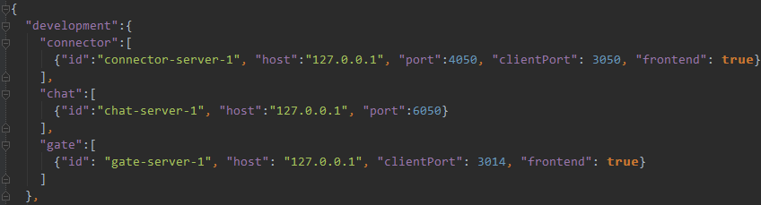

### 二、修改并保存

我们对`gate`服务器的负载分配原理产生了兴趣，想要调试它。这时，我们只需要在`{"id": "gate-server-1", ...`的行末，花括号`}`前，插入下面代码`, "args": " --debug=32312 "`。使`gate`服务器的配置组变成这样：

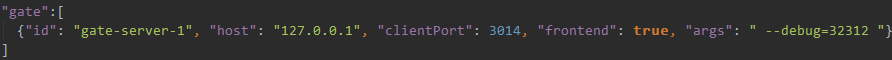

当再次启动服务器时，`master`服务器会读取新的配置，并以这个配置运行`gate-server-1`服务器。

而该服务器的进程，会监听`32312`端口，以便调试器连接。将端口设置的偏高是为了减少端口冲突的可能性。开发过程中，如果启动后发现有报`ADDRINUSE`（端口已被占用）的错误，请使用`pinus kill --force`杀光Pinus程序，并调整此处的端口值。

## 配置IDE的调试器

### 一、打开`Edit Configurations...`对话框

可以从运行、调试按钮前面的小三角进入，或者从工具栏中选择`Run` - `Edit Configurations...`。

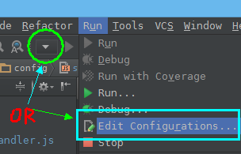

### 二、新增一条`Node.js Remote Debug`

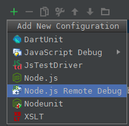

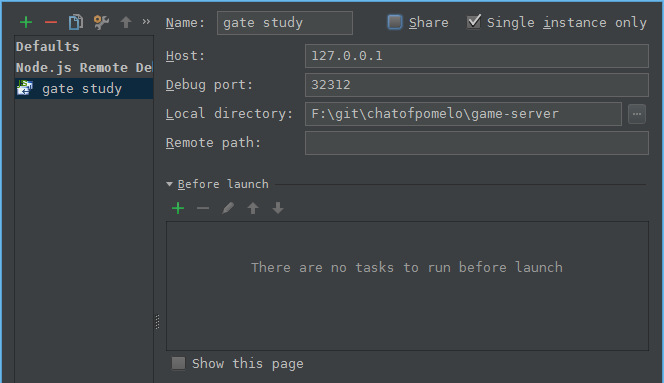

`Name`栏名字可以随意起，但最好选择明确易懂的。然后选中`Single instance only`，这样只会启动一个调试器。而不会有很多相同的调试器都连到后面指定的调试端口。

下面的`Host`写<b>本地`127.0.0.1`</b>，`Debug Port`填入刚刚上面指定的端口号，我这里用`32312`，与前面配置文件中的完全一致。`Local directory`指定当前的`game-server/app.js`目录所在目录。[**补充：在webstorm 8 里面 没有 local directory 选项了，不设置页可以调试**]

### 附：运行配置

当然你可能已经注意到了，这里的`Configurations`不仅包含调试，还包括运行配置。运行配置方法跟一般的NodeJS程序配置方法相同。NodeJS新人可以参考图片中配置。注意被框的内容。

[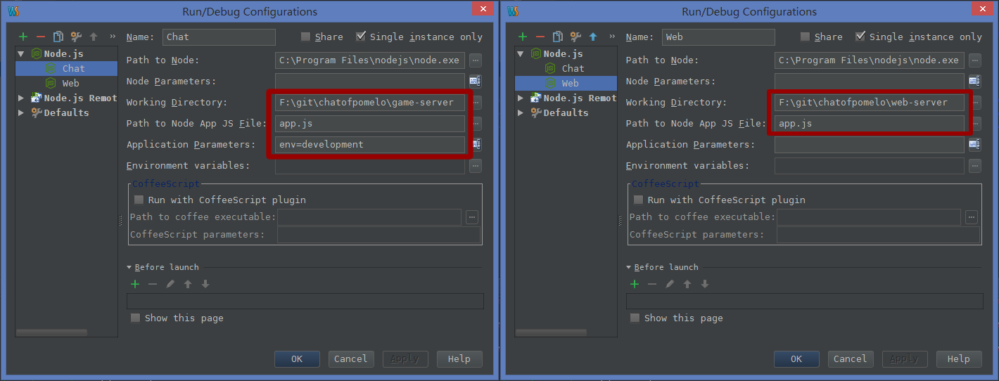](https://f.cloud.github.com/assets/1926860/306139/b7fa3a74-966f-11e2-9a26-666f9f011d4e.png)

## 准备调试

### 一、分别启动Web、Chat服务器

如果你有做过运行Chat和Web服务器的配置，现在就可以从运行、调试按钮前面的配置下拉菜单中，分别选择`Chat`以及`Web`后，点击[►]运行按钮。运行后，可以从IDE下方的控制台输出中查看日志输出，可以检查一下这两个服务器的启动是否成功。如果出现红字，多半表示启动失败。你可以根据提示的报错信息Google或者 [提交Issue](https://github.com/node-pinus/pinus-cn/issues/new) ，以查找解决方案。

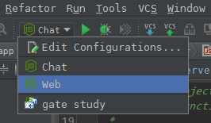

### 二、连接调试器

再从配置下拉菜单中选择刚刚的调试配置`gate study`，之后点击[☼]调试按钮。检查窗口下方的`Debugger`，可以看到有提示说`Connected to 127.0.0.1:32312`。

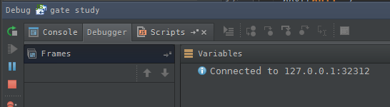

### 三、设置断点

由于我们想调试`gate`服务器中，与connector分配相关的代码，所以在IDE中，打开`app/servers/gate/handler/gateHandler.js`。定位到 [第30行](https://github.com/node-pinus/chatofpinus/blob/master/game-server/app/servers/gate/handler/gateHandler.js#L30) ，在此处下一个断点。

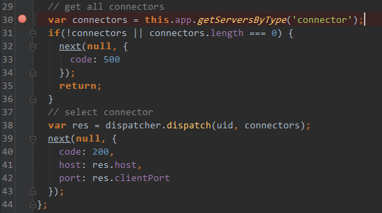

## 实践

浏览器中打开 http://127.0.0.1:3001/index.html 会看到 `Chat of Pinus`标题的登录页面。填入两栏表单后，点击【JOIN】按钮。

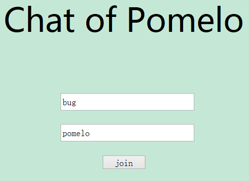

此时，页面将不会做出任何反应，是因为服务器端的代码被断点拦下了。而IDE会因为调试器而被激活：

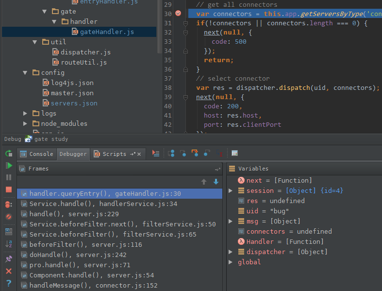

下方窗口中，除了常规调试用到的StepOver、StepInto、StepOut等必须功能外，有很多好用的工具，比如即时表达式求值、切换异常发生时自动中断……这里就不深入探讨了。

## 可用的聊天应用

### 常识

Web服务器启动成功后我们可以看到它提示说可以访问`http://127.0.0.1:3001/index.html`了。但我们都知道127.0.0.1是本机IP地址，如果真正要跟其他人“聊天”的话，这样是不行的。因为别人不一定能打开127.0.0.1:3001，即便打开了，也无法跟你在一起聊天。

所以将这里的127.0.0.1换成你自己电脑的可被网络上其他成员访问到的地址，我这里的地址是`192.168.1.61`。OK，我可以在浏览器里打开`http://192.168.1.61:3001/index.html`，因为本机调试没有任何问题，所以我也信心满满的将这个地址告诉了与我同一网络的同事。

### 发现问题

<b>这时出现了一个问题，我自己可以登录到聊天界面，而其他任何人都无法登录。</b>

根据其他人的浏览器Console输出，可以看到他们都连接一下`192.168.1.61:3014`端口后，又去连接`127.0.0.1:3050`，所以他们才无法登录的。

而`3014`端口刚好是`gate`服务器，问题就出在这里，还是继续调试一下吧。

在经过一番断点切换后，可以发现`gateHandler.queryEntry`最后跑到了 [第39行](https://github.com/node-pinus/chatofpinus/blob/master/game-server/app/servers/gate/handler/gateHandler.js#L39) 的 `next`函数上。

    var res = dispatcher.dispatch(uid, connectors);
    next(null, {
    	code: 200,
    	host: res.host,
    	port: res.clientPort
    });

可以看到，返回内容的 `host` 使用了`res.host`，`res`又来自`connectors`，`connectors`来自配置文件。

而`game-server/config/servers.json`下`connector`服务器的 [配置条目](https://github.com/node-pinus/chatofpinus/blob/master/game-server/config/servers.json#L4L6) ，可以清楚的看见`"host":"127.0.0.1"`。

### 解决问题

源头找到了，立刻将这里的`127.0.0.1`全部替换成我本机`192.168.1.61`。并且重启`Chat`服务器。

同时再刷新访问的时候，便可以登录进来了。

## 写在后面

细心的人或许发现，调试器连接的IP地址，是<b>127.0.0.1</b>，但你或许在想，既然是叫"Remote Deubgger"，应该可以连接除`127.0.0.1`以外的IP吧？
我也是这么想的。但是，在不借助其他工具的情况下，不能办到。

就是说，不借助一个代理工具，是没办法连接到除了`127.0.0.1`地址的调试端口的。

你可以借助NodeJS官方 [Wiki](https://github.com/joyent/node/wiki/using-eclipse-as-node-applications-debugger) 文章结尾（Ctrl-F后，搜索"You probably noticed"）的方法及代码，来完成一个代理工具。以便调试部署在远端服务器上运行的代码。

同时这篇文章也是 Eclipse 的调试指导文章。