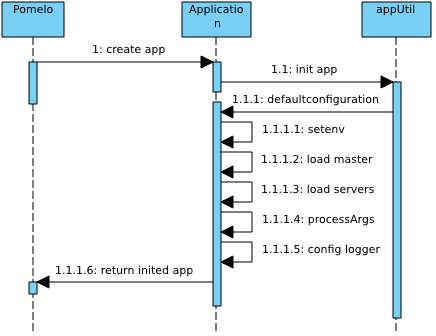
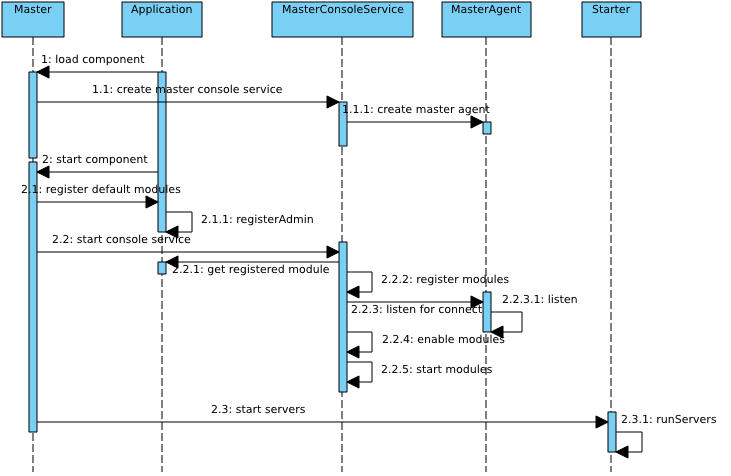

使用pinus开发应用时，我们一直关注的是给框架填入相应的回调，给app配置一些上下文。而没有太多关心整个框架的驱动力量。 在我们启动应用的时候，我们会在game-server目录下执行pinus start，然后就能看到很多log信息，这样就启动了很多服务器。但是我们并没有太多关心框架是如何做到这一点的，在这部分，将试图向你讲述pinus框架是如何驱动的。

首先看下图:

这张图是以chat为例，当chat应用启动后，使用命令
    

    pstree -au

得到的进程树的一部分，我们从图上可以清楚地看出，`pinus start`调用进程会创建子进程，子进程执行的是`node app.js env=development`,然后这个子进程又会创建很多子进程，这些子进程执行的跟原进程同样的文件，只是多了更多的参数，它们后面会有一些诸如id，serverType，port等这样的参数。

好了，现在我们可以做一些简单的解释了，`pinus start`的进程直接创建的那个子进程，实际上就是我们的master服务器进程，而由master服务器创建的那些子进程，他们执行的是类似于
    

    `node <BasePath>/app.js env=development id=chat-server-1 ...`

这样命令的则是由master服务器创建的子进程，这些子进程也就是我们的应用服务器。当然，这里的进程都在一台主机上，所以会有父子关系，也就是说master进程是其他应用服务器的父进程。如果各个进程分布在不同的物理主机上的话，pinus默认会使用ssh的方式远程启动相应的服务器，那样的话，master进程与应用程序进程就不会再有父子关系了。
下面我们从pinus.createApp调用开始，来梳理pinus的启动过程。
首先我们使用`pinus start`，此时命令行工具pinus会检测start后面有没有其他参数，比如是否需要daemon的形式启动，后面的参数是否指定了env等，在这里，我们仅仅使用了`pinus start`，后面没有跟任何其他参数，此时命令行工具将会为其添加一个默认的env参数，即 `env=develpment`，然后就启动了node.js进程，如下：

    `node <BasePath>/app.js env=development`

此时`pinus start`就以没有过多参数的方式启动了app.js。

Application的初始化
=========================

接下来我们来分析app.js的执行:

如上面的时序图所示：

*  pinus调用createApp()
*  pinus的createApp调用中会调用app的init方法，完成对app的初始化
*  app会使用appUtil提供的defaultConfiguration来完成自己的初始化配置
*  appUtil的defaultConfiguration会调用app的一些初始化方法，这些方法包括setEnv，loadMaster，loadServers，parseArgs，configLogger。这里setEnv操作会将当前的env设定为development， loadMaster调用会加载master服务器的配置信息，loadServers会加载所有的应用服务器的配置信息。parseArgs是一个很关键的操作，由于我们在启动参数中仅仅指定了env，其他的参数并没有指定，此时pinus认为目前启动的不是应用服务器，而是master服务器。这样，当前的进程将使用master的配置信息，并将其自己的serverId，serverType等参数，均设置为master服务器所有的。实际上，对于应用服务器来说，如我们在上面进程树图中看到的那样，如果启动的是应用服务器的话，其`node app.js`后面将会带有很多参数，包括id，serverType，port，clientPort等参数，这些参数在parseArgs这一步将会被处理，从而确定当前服务器的id，当前服务器的类型以及其他所必须的配置信息。
*  在执行完上面的操作之后，app进入到INITED状态，同时pinus的createApp返回。

在pinus的createApp()返回后，我们在app.js里，往往会对app进行一些配置，比如调用app.set设置一个上下文变量的值，app.route调用配置个路由等。

Master服务器启动
====================

当执行完上面的用户编辑的代码后，将会进入到的是 app.start()调用, 当app.start调用时，首先会加载默认的组件，对于master服务器来说，其加载的默认组件为master组件和monitor组件。下面主要分析master组件在启动中的作用，分析一下master组件的启动过程：

如上面的时序图所示:

* 首先app.start()首先会加载默认组件，由于没有指定服务器类型，此时会默认为master类型，拿到master的配置信息，加载Master组件，由于Master组件是以工厂函数的方式导出的，故会创建Master组件，Master组件的创建过程会创建MasterConsole，MasterConsole会创建MasterAgent，MasterAgent会创建监听Socket,用来监听应用服务器的监控和管理请求的。

* 在加载完所有的组件包括Master组件后，会启动所有的组件，对于Master服务器来说，会启动Master组件和Monitor组件，也就是调用相应组件的start方法，这里先讨论Master组件。Master组件会注册默认的Module，这是通过Application的registerAdmin实现的，这里多说一句，如果用户自定义了Module，可以在app.start调用之前调用registerAdmin，将自定义的Module挂到app上。

* 在将所有默认的Module都挂到app上后，Master组件会启动MasterConsoleService。在启动MasterConsoleService时，MasterConsoleService会从app处拿到所有挂到其上面的Module，然后将Module注册到自己的Module仓库中，这一步实际上就是Module放到一个以ModuleId做键的Map中，以使得后来有请求时，可以直接进行查询回调。

* 然后，开启MasterAgent的监听，这个时候，Master组件就已经可以接受监控管理请求了。

* 在开启监听后，下一步就是enable所有的Module, 主要就是根据Module的参数type和interval，来确定Module的回调触发方式，是周期性的由Master来拉，还是周期性的由Monitor来推，还是不是周期性的触发，使用其他的事件触发方式。如果使用了周期性的触发的话，将会对周期性的事件进行调度，调度是由pinus-schedule提供的。

* 下一步，将启动所有的Module，如果有Module定义了start方法的话，将在这步被回调，pinus核心中的Module console就提供了start方法。到这一步为止，Master组件已经开启了请求监听，挂载好了每一个Module相应的回调函数，并且对需要周期执行的监控任务已经完成了调度。

* 是时候启动所有的应用服务器了。当Master组件完成了所有的其自身的Module的初始化和开启任务后，Master会委托Starter来完成整个服务器群的启动。需要注意：由于每一个服务器一旦启动，就会向Master报告其状态，所以Master组件必须在启动应用服务器之前就准备好对来自服务器的监控数据作出回应，因此，这也是为什么Master组件在完成很多其自身的操作后，才去启动应用服务器。

* 我们知道，在app初始化的时候，master服务器已经加载了所有服务器的配置信息，每一个服务器要启动的地址，服务器的类型，服务器应该监听的端口等信息。Starter在启动这些服务器的时候将会分析服务器是在本地启动还是远程启动，如果在本地启动的话，将会起一个子进程，如果在远程启动的话，会使用ssh的方式远程启动相应的进程。这个时候的启动命令行，将会附带更多的参数，对于chat例子中来说，其chat-server启动命令行大概如下面的样子:

  `node <BasePath>/app.js env=development id=chat-server-1 host=127.0.0.1 port=6050 serverType=chat`

* 此后，应用服务器将会被启动。

* 在调用了Master组件的start方法后，由于Master方法没有定义afterStart方法，故此时Master组件的启动过程已经完毕，Master组件将会监听来自其他服务器的Monitor发出的请求或者给其他的Monitor推送通知，当然这些操作都是在对应的Module定义的回调中进行的。

应用服务器启动
====================

* 对于应用服务器来说，与master服务器一样，会执行app.js,也会创建app，加载一些配置信息，setEnv等。应用服务器与Master服务器在App init阶段唯一的不同就是，Master服务器的启动命令行中，没有具体服务器参数，使得pinus会把其当作Master服务器启动，而应用服务器的启动命令行，则包含了全部的应用服务器参数，因此pinus会按照他们具体的配置信息为其默认加载不同的组件，对于master服务器来会加载Master组件，对于应用服务器来说，则会根据应用服务器的配置不同，默认加载相应的组件。

* 在创建完app，并完成初始化后，app.js中的对app进行配置的代码会执行，这里包括app.route调用，app.set调用等等。

* 在执行完用户的配置代码后，app.js进入到Application.start调用，在这里pinus框架会针对每一种服务器将默认加载不同的组件。 对于pinus来说，所有服务器的执行都可以看作是对其组件进行生命周期管理的过程。每一个pinus的组件都会定义start，afterStart，stop方法，用来框架进行生命周期管理时候回调。下面展示了其调用顺序:

* pinus框架总是先顺序地调用所有组件的start方法后，才去顺序的调用每个组件的afterStart方法。设置afterStart方法的原因是，可能有组件互相依赖的时候，某些组件的某些启动过程依赖于另外某个组件的启动过程时，可以将有依赖的部分放到afterStart方法里面，这样可以使得在有依赖的部分执行时，其所依赖的组件已经完成初始化。或者还有一些需要等待全局就绪的工作也可以放到这里来做。

* 不同的组件在启动时会开启不同的功能，关于应用服务器加载的组件的具体启动过程，由于涉及到其提供的功能细节，将在后面介绍，这里关注的不是组件的细节功能，而是整个应用程序的驱动方式。

* 当所有组件的afterStart方法都调用完毕后，应用服务器启动完成。此时，由于其加载的组件开启了监听接口，应用服务器将接受外来的请求，然后进入相应的回调。

服务器的关闭
===============

当我们调用了`pinus start`启动了master服务器，master服务器又启动了所有的应用服务器后，所有的服务器都进入到自己的事件循环中，接受外来的请求事件或者是自身的定时器事件执行相应的回调方法。

当我们想关闭服务器时候，我们可以很暴力地使用`Ctrl+C`直接结束掉所有的进程，也可以优雅地通过命令行工具执行`pinus stop`进行关闭。实际上，命令行工具是作为pinus管理框架中的client角色的，它使用的Module是pinus内建的console，通过console Module给master服务器发出关闭服务器请求，master会给每一个服务器发出停止通告。每个应用服务器接收到stop通告后，回调函数里面会调用app.stop, app.stop则会如上面图中那样，按照加载的逆序分别调用每一个组件的stop回调方法。当所有的组件的stop调用完后，服务器完成关闭。master在发出停止通告后，自己稍作等待也调用app.stop,stop掉自己加载的组件完成关闭。

总结
==========

我们在这里阐述了pinus应用从启动到关闭的整个流程，pinus应用的整个流程实际就是对其所加载的组件的生命周期的管理过程，pinus的核心功能都由其组件提供。每一个组件在导出的时候，往往导出的都是一个工厂函数，通过工厂函数，app在加载的时候才会创建相应的组件。app在整个pinus应用中，并不执行逻辑业务，它仅仅被当作一个全程驱动的入口以及一个上下文环境。对整个应用其关键性的调用为app的start调用和app.stop调用，其中app.start启动服务器，app.stop关闭服务器。app.start一般都是在app.js中由用户来调用，而app.stop一般都是系统的某个组件接受到停止服务器请求时进行的异步回调。关于具体加载的一些组件的功能，将在相关部分进行详述。

