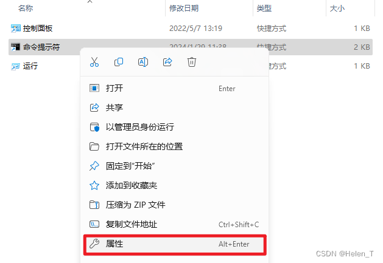
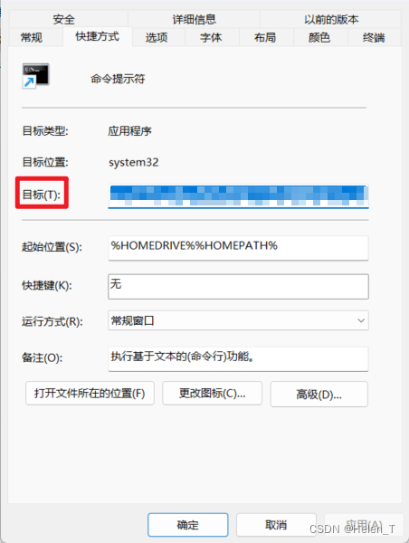

## 特征

🌎 跨平台支持（macOS、Windows、Linux）

✨ 单文件，轻松安装，即时启动

🚀 以速度为中心

📂 适用于`.node-version`和`.nvmrc`文件

## fnm常用命令

- 列出远程版本

  ```bash
  fnm ls-remote 
  ```

- 安装&卸载

  ```bash
  fnm install 16.8.0
  fnm install --latest 		# 安装最新版本
  fnm install lts         	# 安装最新 LTS 版本
  
  # 在安装时指定镜像
  fnm install 16.8.0 --node-dist-mirror=https://npmmirror.com/mirrors/node/
  
  fnm uninstall 16.8.0 		# 卸载16.8.0版本
  ```

- 切换版本

  ```bash
  fnm use 16.8.0
  fnm default <version>		# 设置默认版本（全局生效）
  ```
  
- 查看版本

  ```bash
  fnm list					# 查看系统上安装了哪些版本 
  fnm ls
  
  fnm current					# 显示当前使用的 Node.js 版本
  ```
  
- 设置 Node.js 版本别名

  ```bash
  fnm alias <version> <name>		# fnm alias 20.10.0 A
  
  # 使用
  fnm use A 						
  ```

- 其他

  ```bash
  fnm prune						# 清理无用的 Node.js 版本
  fnm clean						# 清除缓存
  fnm --version					# 显示 fnm 版本
  fnm help						# 帮助命令
  ```

## 不同项目自动切换不同的node版本

根据项目中的 `.node-version` 或 `.nvmrc` 文件，或packages.json#engines#node自动切换版本：

#### 环境变量配置

>引用
>
>https://blog.csdn.net/Helen_T/article/details/135912916

- ### Powershell

1、在下面的目录新建profile.ps1文件

```
%USERPROFILE%\Documents\WindowsPowerShell\Microsoft.PowerShell_profile.ps1
```

> 提示：
>
> - %USERPROFILE%：表示用户目录，直接在文件管理的地址栏输入 %USERPROFILE%后回车
> - WindowsPowerShell为新建的目录, 如果安装node后命令仍然无法识别，将文件夹名称改为PowerShell

 2、将下面的代码写入到上面的配置文件里面
```bash
fnm env --use-on-cd --version-file-strategy=recursive | Out-String | Invoke-Expression
```

- ### CMD

1、搜索 cmd，打开文件所在位置


2、对 “命令提示符” 右键，点击属性



3、修改“目标”为下面的值

```bash
%windir%\system32\cmd.exe /k %USERPROFILE%\bashrc.cmd
```



4、进入用户目录（%USERPROFILE%），添加文件 bashrc.cmd

5、将下面的代码写入到上面的配置文件里面

```bash
@echo off
:: for /F will launch a new instance of cmd so we create a guard to prevent an infnite loop
if not defined FNM_AUTORUN_GUARD (
    set "FNM_AUTORUN_GUARD=AutorunGuard"
    FOR /f "tokens=*" %%z IN ('fnm env --use-on-cd --version-file-strategy=recursive') DO CALL %%z
)
```

- ### git bash

  进入用户目录（%USERPROFILE%），在[git bash](https://so.csdn.net/so/search?q=git bash&spm=1001.2101.3001.7020)的配置文件 .bash_profile 添加下面的代码
  
  如果用户目录没有.bash_profile，则新建一个文件

```
eval $(fnm env | sed 1d)
export PATH=$(cygpath $FNM_MULTISHELL_PATH):$PATH
 
if [[ -f .node-version || -f .nvmrc ]]; then
   fnm use
fi
```

## webstorm找不到node路径的解决办法

将%USERPROFILE%\AppData\Roaming\fnm\aliases\default\路径添加到PATH


>github地址：
>
>https://github.com/Schniz/fnm