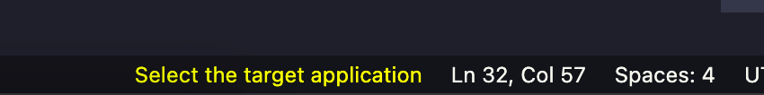
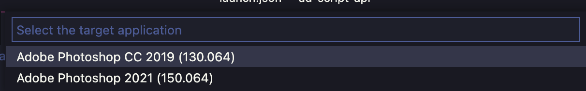
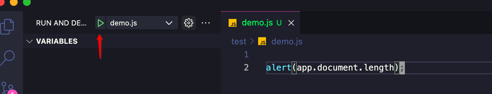
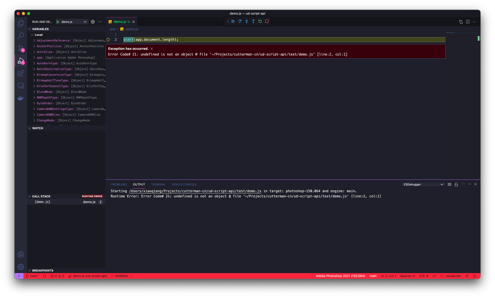
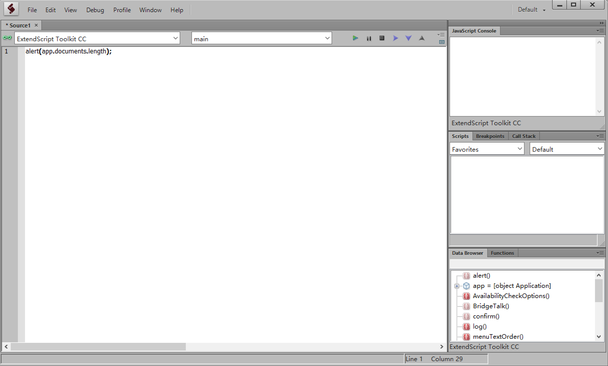
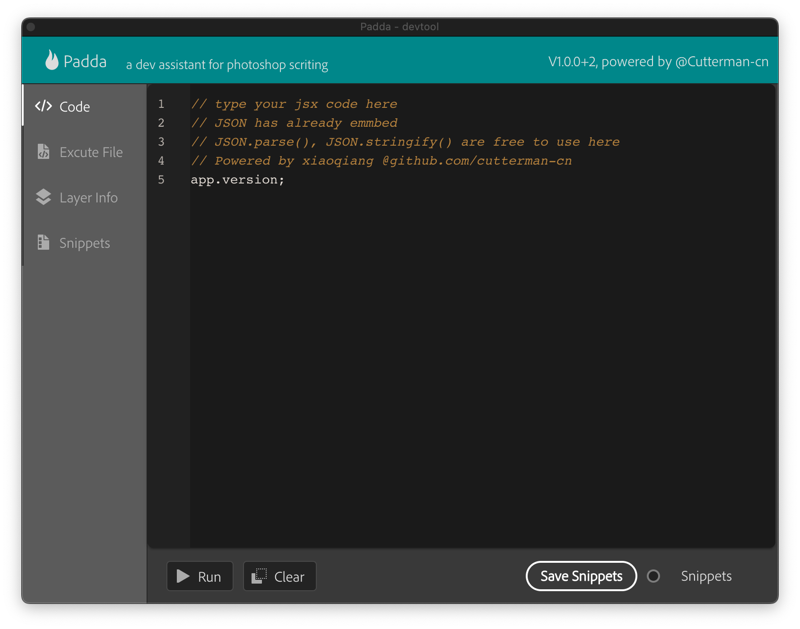
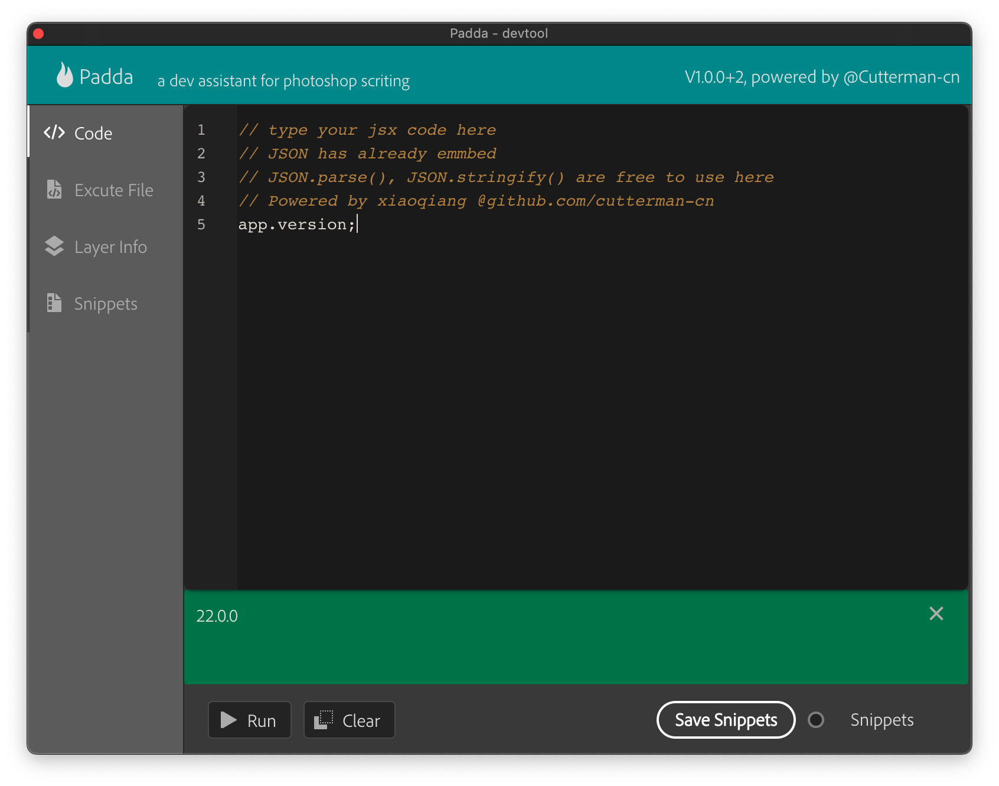
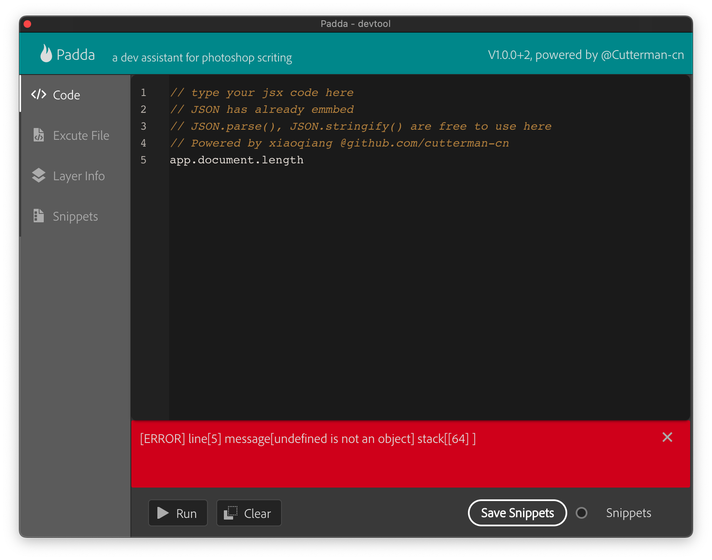
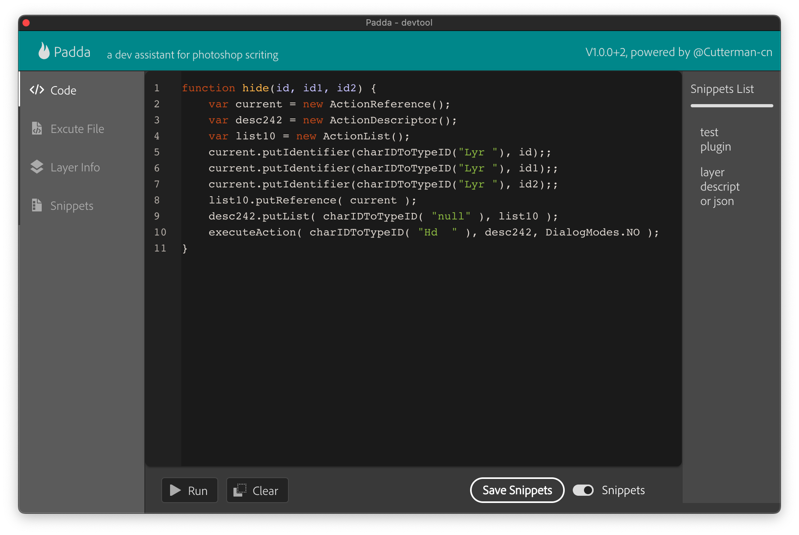

- 代码编辑器：[Visual Studio Code](https://code.visualstudio.com/)，理论上你用记事本编写代码也没关系，但是目前 ExtendScript 的 debugger 工具只有 VSCode 的 debugger 扩展还在维护。而且用 VSCode 你还可以安装一些 CEP 开发辅助的扩展，例如我开发的 [Adobe Extension Development Tools](https://marketplace.visualstudio.com/items?itemName=YuTengjing.adobe-extension-devtools) 和 [Scripting Listener](https://marketplace.visualstudio.com/items?itemName=YuTengjing.scripting-listener)

- Debugger： [ExtendScript Debugger](https://marketplace.visualstudio.com/items?itemName=Adobe.extendscript-debug&ssr=false#review-details) 是 VSCode 上用于 debug ExtendScript 和 CEP 扩展的 debugger 插件，如果需要向官方反馈这个插件的问题请去：[forums.adobeprerelease.com](https://forums.adobeprerelease.com/exmancmd/discussion/160/extendscript-debugger-2-0-beta-3-0-release/p1)，在插件市场的评论区反馈是没用的


vscode安装完成之后，随便新建一个测试文件 demo.js

```
alert(app.documents.length);
```

接着打开VSCode左侧运行按钮，创建一个启动配置 **launch.json**

```
{
    "version": "0.2.0",
    "configurations": [
        {
            "type": "extendscript-debug",
            "request": "launch",
            "name": "demo.js",
            "program": "${workspaceFolder}/demo.js",
            "stopOnEntry": false
        },
    ]
}
```

接着点击底部 **选择目标应用** 就弹出电脑上安装好的Ps版本

[](https://blog.cutterman.cn/assets/gallery/contents/Snip20211017_2.png)

[选择目标应用](https://blog.cutterman.cn/assets/gallery/contents/Snip20211017_2.png)


[](https://blog.cutterman.cn/assets/gallery/contents/Snip20211017_3.png)

[选择Ps版本](https://blog.cutterman.cn/assets/gallery/contents/Snip20211017_3.png)


最后，点击运行，就可以在Ps中看到执行的效果了

[](https://blog.cutterman.cn/assets/gallery/contents/Snip20211017_4.png)

[运行脚本](https://blog.cutterman.cn/assets/gallery/contents/Snip20211017_4.png)


如果你的脚本执行有错误，它能够直接定位到对应的行，并且输出一些上下文，和传统的前端调试差不多

[](https://blog.cutterman.cn/assets/gallery/contents/Snip20211017_5.png)

[错误提示](https://blog.cutterman.cn/assets/gallery/contents/Snip20211017_5.png)


你还可以在你的编辑器中设置断点，进行JSX脚本的单步调试，你通过 $.write() 打印的内容，会在底部的Console中进行输出，非常好用。总体来说，**ExtendScript Debugger** 是Adobe希望用来替代老旧的那款ExtensionScript编辑器 ExtensionToolkit

然而……然而……

Adobe一如既往的尿性，这个项目也停止维护更新了，最后一次升级是在2019年7月，这个插件还是存在很多Bug，稳定性也一版，经常不不动，就连不上Ps了，这个时候，可能可以通过重启Ps/VSCode/电脑等来恢复链接状态

### 2. ExtendScript Toolkit

这是早期Adobe提供的用于开发调试ExtensionScript的开发工具，支持代码编写，断点调试等特性

[](https://blog.cutterman.cn/assets/gallery/contents/extensiontoolkit.png)

[Extension Toolkit](https://blog.cutterman.cn/assets/gallery/contents/extensiontoolkit.png)


功能不太多，基本够用，应该是目前比较常用的JSX脚本调试工具。

然而……然而……

这个产品也一样不升级维护了，由于是32位的程序，目前在最新版本的Mac系统上已经无法安装了，于我这样的Mac常驻开发者而言，就非常忧伤

### 3. Padda

由于，上面的2款工具，第二款我的Mac用不了，第一款呢有特别不稳定，对于时不时要测试JSX脚本的我，决定自己开发一个……

[](https://blog.cutterman.cn/assets/gallery/contents/Snip20211017_6.png)

[Padda](https://blog.cutterman.cn/assets/gallery/contents/Snip20211017_6.png)


这是一款运行在Ps上的插件，它内置了一个简易的文本编辑器，可以让你写Jsx代码，并立刻运行拿到结果。 我在日常开发插件产品的时候，经常需要在Ps上测试一段小脚本，看看是否工作是否正常，这时候就可以把代码贴到这个编辑器里头，直接运行就可以了。底部的输出窗口会显示当前脚本的执行状态和最后输出结果。

[](https://blog.cutterman.cn/assets/gallery/contents/Snip20211017_7.png)

[output](https://blog.cutterman.cn/assets/gallery/contents/Snip20211017_7.png)


如果代码执行有错误，输出窗口会显示报错的行和一些基本的错误提示

[](https://blog.cutterman.cn/assets/gallery/contents/Snip20211017_8.png)

[Error](https://blog.cutterman.cn/assets/gallery/contents/Snip20211017_8.png)


支持脚本高亮，提供了代码快照功能，就是可以把当前执行的这段代码保存起来，这样当我在测试多段代码之间切换的时候，会非常有用。另外我也会把一些常用的代码片段通过这种方式保存起来，随时调用读取，并修改调试，满意后，再拷贝到我的项目工程当中，非常方便。

[](https://blog.cutterman.cn/assets/gallery/contents/Snip20211017_10.png)

[Error](https://blog.cutterman.cn/assets/gallery/contents/Snip20211017_10.png)


该工具还提供了执行本地脚本文件，读取图层信息，代码快照管理等功能，都是很常见和使用的一些特性。目前该项目在持续维护升级当中，工具免费，代码开源，我会随着日常开发不断往里面迭代功能，如果有小伙伴用得上，欢迎一键三连，想要添加功能的，可以在github上提issue