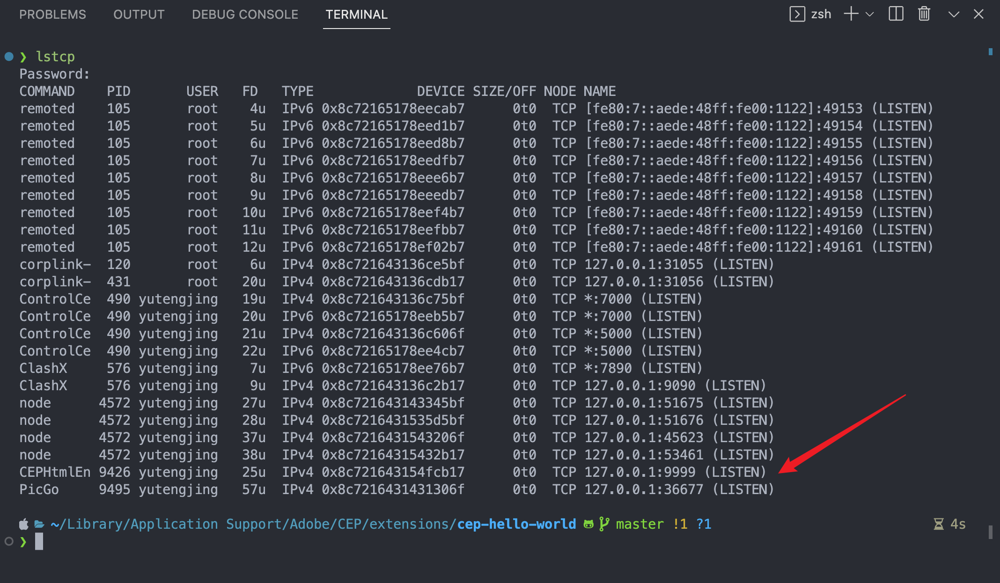
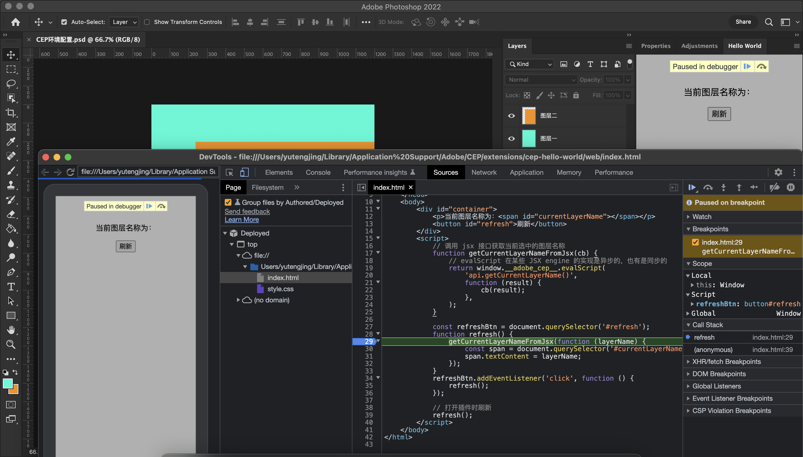

## 浏览器环境代码 debug

由于 CEP 的浏览器环境代码下可以混编 nodejs 代码，因此浏览器 v8 的代码和 nodejs v8 的代码是可以混在一起调试的，也就是说 debug 的时候你可以直接从浏览器原生代码跳进 nodejs 的函数，再跳回来。

### 配置 .debug 文件

在开启了 CEP 的 debug 模式后，我们便可以在不签名的情况下加载 CEP 插件。如果需要 debug 浏览器环境的代码或者查看网页的 DOM 元素，首先要做的便是配置 .debug 文件。

在 CEP 项目的根路径增加 .debug 文件。这是一个 xml 格式的文件，需要注意的是虽然是 xml 格式，但是**不能使用注释语法**。之前我就踩过这个坑，查了半天才发现之所以没法 debug 居然是因为我在 xml 文件里用了注释语法…。在添加完 .debug 文件后记得先关闭面板再重新打开面板让 ps 加载 .debug 文件。

```xml
<!-- !!! 拷贝这段代码去用的时候记得删掉所有注释 -->
<!-- 可以指定多个插件面板的 debug 配置 -->
<ExtensionList>
    <!-- id 为面板 id -->
    <Extension Id="org.ytj.helloWorld.panel">
        <HostList>
            <!-- 不同的宿主可以使用不同的端口号 -->
            <!-- port 为 chromium remote debug 的端口 -->
            <Host Name="PHSP" Port="9999" />
            <Host Name="PHXS" Port="9999" />
        </HostList>
    </Extension>
</ExtensionList>
```

如果这个时候我们查看一下 tcp 端口占用，我们会发现 CEP 的 Html engine 占用了 9999 这个 tcp 端口：

```
# lstcp 是一个 alias
alias lstcp="sudo lsof -iTCP -sTCP:LISTEN -P -n"
```



由于这个文件的后缀名不是 xml, 因此 vscode 无法识别它为 xml，为此我们需要配置 vscode 的文件类型映射：

```
// .vscode/settings.json
{
  "files.associations": {
    // 将所有 jsx 代码映射为 javascript 代码而不是 javascriptreact
    "**/JSX/**/*.jsx": "javascript",
    // .debug 文件映射为 xml
    ".debug": "xml",
    // 将 scripting listener 的 日志文件识别为 javascript
    "**/Desktop/ScriptingListenerJS.log": "javascript"
  }
}
```

### 使用 chrome 远程调试

我们 debug 浏览器环境代码采用的是 remote debug，如果你以前有开发过移动端网页，使用 chrome 远程调式过 node/react native 之类的话应该对 remote debug 很熟悉了。

通过上面的配置给我们的面板扩展指定了远程调式的端口号：9999。接下来我们使用 chrome 打开地址 `chrome://inspect`，启用 `Discover network targets`。点击 `Configure...` 按钮来配置 chrome 扫描的端口号，我们添加 `localhost:9999`。刷新一下，就可以在 remote target 列表中找到 PS 托管的插件服务了。


点击上图中的 `inspect` 按钮可以打开 remote devtools 窗口对浏览器代码进行调试了。



### 踩坑记录

1. 如果你是使用 edge 浏览器来调试，`chrome://inspect` 对应的是 `edge://inspect`
2. 实测在 Windows 系统上当你打开 `chrome://inspect` 页面，扫描到 CEP 的 remote target 会比较慢，10s 以内都不奇怪。
3. 每次当你关闭调式中的 CEP 扩展，当前的 remote devtools 窗口都会失效，需要你从新到 `chrome://inspect` 页面点击 `inspect` 打开新的 devtools 窗口
4. 目前 CEP 的 debug 有个 bug，在开着 devtools 的情况下，很多 DOM 事件会失效。例如 hover 事件，mouseMove 事件等。所以当你在调试如按钮的 hover 样式或者 mouseMove 事件代码时请关掉 devtools 窗口。这也是我为什么会自己还封装了一套跨端的日志框架的原因。

演示的代码对应这次提交：[配置调试浏览器代码](https://github.com/tjx666/cep-hello-world/commit/62ab13ad596b48826ec9f0ae115384daacd8ba3d)

## ExtendScript 代码 debug

早期 CEP 扩展是使用 [ESTK](https://extendscript.docsforadobe.dev/extendscript-toolkit/index.html#the-extendscript-toolkit) 来调试的，但是目前这个项目已经放弃维护。官方替代品为 VSCode 插件：[ExtendScript Debugger](https://marketplace.visualstudio.com/items?itemName=Adobe.extendscript-debug)。这是个闭源插件，开发者是 [ErinF](https://forums.adobeprerelease.com/exmancmd/profile/discussions/ErinF)。如果大家想要反馈插件问题可以去他发布的插件更新帖子下面评论。

目前插件来到了 V2.0.3，V2 对 V1 版本的代码完全重写，目标就是稳定性，性能，扩展性优化，以及改善了对 VSCode 自身能力的适配。并没有增加什么新功能，区别较大的就是新增了 attach 模式。

### debug 级别

通过在 jsx 代码中设置 $.level 可以设置 jsx 的 debug 级别：

- 0：关闭 debug
- 1：在遇到运行时异常时断点
- 2：完整的 debug 模式

一般来说直接在 index.jsx 最开始直接 `$.level = 2` 即可，当然最好是区分开发环境设置，关闭 debug 模式性能可能会好点。

```
// index.jsx
$.level = isProduction ? 0 : 2;
```

### 配置

这部分没什么太多可以说的，我就贴一下最常用的 debug 配置吧：

```json
// .vscode/launch.json
{
  "version": "0.2.0",
  "configurations": [
    // 对当前打开的文件进行 debug
    {
      "name": "Run File",
      "type": "extendscript-debug",
      // launch 模式每次 debug 时插件会和 ps jsx engine 建立一次连接，当代码执行结束自动断开
      // 这种 debug 方式其实和一般我们 debug nodejs 代码没区别
      "request": "launch",
      // 指定 jsx 代码执行的宿主环境，指定后就不用每次 debug 的时候都要选择宿主
      "hostAppSpecifier": "photoshop",
      // 指定执行的入口文件为当前打开的文件
      // 查看所有的 VSCode 变量：https://code.visualstudio.com/docs/editor/variables-reference#_predefined-variables
      "script": "${file}",
      // 在 debug variables panel 中隐藏函数属性 (包括操作符重载)，内建属性（包括 arguments）
      "hiddenTypes": ["Function", "builtin"]
    },
    {
      "name": "Attach Debug",
      "type": "extendscript-debug",
      // attach 模式相当于建立一个持久连接，每次代码执行结束连接不会断开，除非手动断开连接
      "request": "attach",
      "hostAppSpecifier": "photoshop"
    }
  ]
}
```

配置完你就可以像 debug 普通的 js 代码一样使用 VSCode 断点，或者在需要断点的地方写 `debugger` 语句。


如果你想点一次 debug 按钮同时 debug 浏览器中的 JavaScript 和宿主执行的 ExtendScript，可以参考下面的配置：

```json
{
  "version": "0.2.0",
  "configurations": [
    {
      "type": "chrome",
      "request": "attach",
      "name": "[Attach] CEP JavaScript",
      "port": 7777, // <-- Whatever debug port you have configured.
      "webRoot": "${workspaceRoot}",
      "pathMapping": {
        "/": "${workspaceRoot}"
      }
    },
    {
      "type": "extendscript-debug",
      "request": "attach",
      "name": "[Attach] CEP ExtendScript",
      "hostAppSpecifier": "premierepro-22.0"
    }
  ],
  "compounds": [
    {
      "name": "[Compound] Debug CEP",
      "configurations": ["[Attach] CEP JavaScript", "[Attach] CEP ExtendScript"]
    }
  ]
}
```

对应的代码提交：[增加 debug 配置](https://github.com/tjx666/cep-hello-world/commit/c6ee78fbe6e2d6572e0005af8af24b134bdea2dc)

### 局限性

#### 不支持 sourcemap

目前官方的 Debug 工具最大的遗憾就是不支持 sourcemap，这意味着如果我们 jsx 代码想要使用 TypeScript 编写就没法在源码中调试，这也是我目前 CEP 工程化中最遗憾的一点。

不要和我说话你不需要 debug，但凡项目逻辑复杂点，人肉 debug 都是折磨。也不要说什么我可以直接在编译后的代码内 debug。

编译前：

```typescript
// index.ts
class Test {
  hello() {
    console.log('hello');
  }
}

for (const num1 of [1, 2, 3]) {
  for (const num2 of ['a', 'b', 'c']) {
    console.log(num1 + num2);
  }
}
```

编译后：

```javascript
var Test = /** @class */ (function () {
  function Test() {}
  Test.prototype.hello = function () {
    console.log('hello');
  };
  return Test;
})();
for (var _i = 0, _a = [1, 2, 3]; _i < _a.length; _i++) {
  var num1 = _a[_i];
  for (var _b = 0, _c = ['a', 'b', 'c']; _b < _c.length; _b++) {
    var num2 = _c[_b];
    console.log(num1 + num2);
  }
}
```

可以看出编译后的代码和编译前的代码区别还是很大的，在编译后的代码里 debug 你要花很多额外的时间去将它和源码的逻辑对应起来。这还不是关键问题，最大的问题是你怎么去处理 import，打包成单文件？打包成单文件那代码更乱了。

#### 调试 CEP 插件调用的 jsx

执行 jsx 有两种常用方式：

- debugger 扩展直接运行
- CEP 插件 manifest.xml 的 标签，或者 `window.__adobe_cep__.evalScript()`

后者支持部分宿主 debug，例如 AE。部分宿主不支持，例如 PS。

如果你要调试 AE 的 CEP 扩展执行的 JSX 代码，那使用 `attach` 模式即可，因为插件和宿主一直是连着的，CEP 回调中执行的 jsx 代码如果被打了断点也能正常的被 debugger 插件定位调试。

## 总结

本篇讲述了任何软件开发中非常重要一环：debug。我希望读者能够意识到：debug 工具不只是用来定位和修复 bug 的，它还是一份 api 文档。当你需要实现一个功能的时候，也可以借助 debug 去查看相关的 jsx 变量。

CEP 系列教程暂时就到此结束，后续我还会写一些 CEP 的文章，但是不再以教程的形式来写，并且不会从新人的视角来写。写新人教程实在是太费劲了，很多时候说明一个稍微比较深入的点需要写很多预备知识。目前还想写的主题有：提升 CEP 开发体验，CEP 工程化，jsx 性能优化，跨端通信框架，跨端日志，内存泄漏分析等。至于什么时候写，会不会写那就看心情了。指不定我哪天被裁了，以后不写 CEP 插件那就永远不写了。