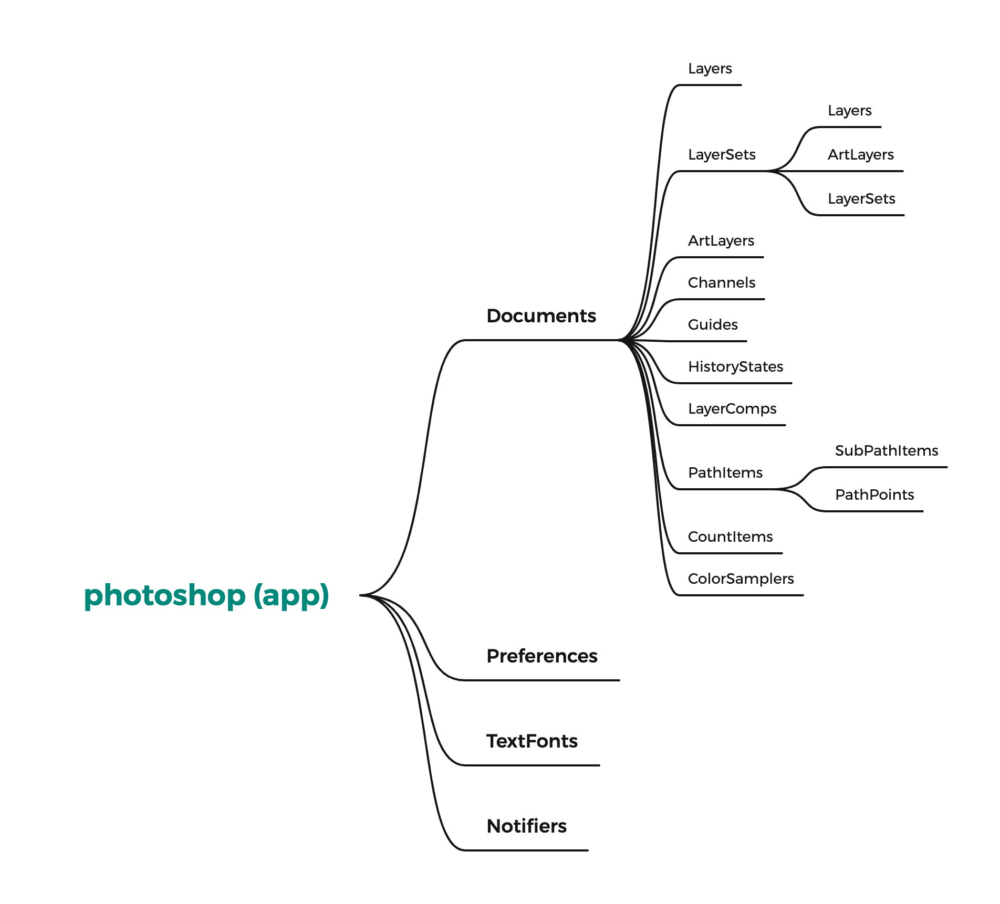

## ExtendScript语言

下面是Adobe官方给出的一段针对这个语言的介绍

> ”[…] an extended form of JavaScript used by several Adobe applications, including Photoshop, Illustrator, and InDesign. ExtendScript implements the JavaScript language according to the ECMA-262 specification. [It] supports the 3rd Edition of the ECMA-262 Standard, including its notational and lexical conventions, types, objects, expressions, and statements. ExtendScript also implements the E4X ECMA-357 specification, which defines access to data in XML format.”

从里面我们就可以看到，JSX采用的ES3标准，是一套非常非常非常旧的语言集合，我们目前基于chrome的web开发，一般都用到了ES6的标准，那是差的不是一两个时代，你不能在JSX里头使用各种新的语言特性，比如**let**, **const**, **箭头函数** 等等，这些在里面都跑不起来，你只能一路**var**到底，同时有一些你平常习惯了的函数可能也没有，比如

```
Array.indexOf() // JSX的Array对象里头并没有indexOf函数
```

针对这种场景，你可以自己做一些Array的扩展，或者就是乖乖的用for去遍历。

不过虽然如此，借助整个web繁荣的生态，我们依然可以用最新的语言集合来编码，然后通过编译工具生成目标语言，比如我自己日常开发，就喜欢用**Typescript**来开发，然后通过webpack/ts编译、混淆、打包然后在进行发布，这个部分对web开发的前端同学应该都很熟悉，我就不展开介绍了。教程后面的篇章，会讲插件的打包，混淆，发布相关，会在介绍这块内容。


[](https://blog.cutterman.cn/assets/gallery/contents/Snip20211128_1.png)

[Typescript](https://blog.cutterman.cn/assets/gallery/contents/Snip20211128_1.png)


## 脚本DOM编程

大多数涉及到脚本插件开发的小伙伴，都会从官方那里找到**photoshop-cc-javascript-ref.pdf**这样的参考文档，这也是插件开发所能找到的最全，最完整的官方参考资料了…

[](https://blog.cutterman.cn/assets/gallery/contents/Snip20211128_2.png)

[photoshop cc javascript reference](https://blog.cutterman.cn/assets/gallery/contents/Snip20211128_2.png)


从这个文档里头，我们找到可以针对Ps编程需要的一些接口Api，使用方法，注意事项等。而它价值最大的是给与开发着一张编程图谱：即宿主可操控对象的DOM树。对于前端开发着而言，经常面对的是HTML的DOM树，看到Ps的这个DOM树结构，也应该非常适应，我对这个DOM树做了一些归类，如下图

[](https://blog.cutterman.cn/assets/gallery/contents/Photoshop.png)

[photoshop dom tree](https://blog.cutterman.cn/assets/gallery/contents/Photoshop.png)


然后文档也告诉我们DOM的顶级层级是**app**，一切都可以通过它开始

```
var doc = app.activeDocument; // 获取当前文档
var layer = app.activeDocument.activeLayer;  // 获取当前选中的图层
```

其中**app**是一切的入口，同时它又是默认值，可以缺省，即

```
var doc = activeDocument; 
var layer = activeDocument.activeLayer; 
```

通过文档中的接口，我们可以通过**Layers/Layer**来操作图层相关的内容，通过**Guides**来操作参考线，**PathItems**操作路径等内容，具体每个对象具备的接口和使用方法，文档当中都有，我这里就不一一介绍了，下面通过几个示例，讲述其中的一些需要注意的点

### 1. 图层操作

涉及到图层相关的对象有ArtLayer/ArtLayers/Layers/LayerSet/LayerSets，其中ArtLayer是一般图层，区别于LayerSet是图层组，ArtLayers/LayerSets分别是一般图层和图层的集合，即包含了一堆这样的图层

[](https://blog.cutterman.cn/assets/gallery/contents/Snip20211128_3.png)

[ArtLayer & LayerSet](https://blog.cutterman.cn/assets/gallery/contents/Snip20211128_3.png)


而Layers是图层统称，即可以是ArtLayer，也可以是LayerSet， 所以通常我们不知道图层里头都是哪些的时候，就可以用Layers，下面的例子我们遍历document的**一级图层**打印图层信息

```
var layers = app.activeDocument.layers;
for (var i=0; i<layers.length; i++) {
    var layer = layers[i];
    $.writeln("doc.layers[" + i + "] " + layer.name + ". id: " + layer.id + ". itemIndex: " + layer.itemIndex);
}
```

上面的例子，有一个**非常重要**的地方要记住，它不是遍历当前文档中的所有图层，而是只会输出图层面板上的一级图层。我们知道Ps的图层结构，层级是可以不断深入的，所以这里就有了层级的概念，每次Layers都只能遍历当前层级的第一个子层级列表。

[](https://blog.cutterman.cn/assets/gallery/contents/Snip20211128_5.png)

[ArtLayer & LayerSet](https://blog.cutterman.cn/assets/gallery/contents/Snip20211128_5.png)


所以要遍历所有图层，我们就需要判断当前图层是否是图层组（LayerSet），如果是图层组，意味着里头还有图层，如此反复。通常我们用递归的方法来完成这样的操作：

```
// 递归方式遍历文档中的所有图层
function loopLayers(layers) {
    for (var i=0; i<layers.length; i++) {
        var layer = layers[i];
        $.writeln("doc.layers[" + i + "] " + layer.name + ". id: " + layer.id + ". itemIndex: " + layer.itemIndex);
        if (layer.typename == "LayerSet") { // 如果当前图层是图层组，就遍历它里头的图层
            loopLayers(layer.layers);
        }
    }
}
loopLayers(activeDocument.layers);
```

通过上面的代码我们可以递归遍历文档中的所有图层，并拿到想要的信息，不过你会发现当文档图层很多，嵌套很深的时候，这个方式会很慢，后面我会介绍更快的办法，暂时……先这样。下面我给了一个图层列表，通过上面的代码进行测试，可以看到结果如下

[](https://blog.cutterman.cn/assets/gallery/contents/Snip20211128_6.png)

[loop layers](https://blog.cutterman.cn/assets/gallery/contents/Snip20211128_6.png)


```
doc.layers[0] Layer 5. id: 8. itemIndex: 8
doc.layers[1] Group 1. id: 6. itemIndex: 7
doc.layers[0] Layer 4. id: 5. itemIndex: 6
doc.layers[1] Layer 3. id: 4. itemIndex: 5
doc.layers[2] Layer 2. id: 3. itemIndex: 3
doc.layers[3] Layer 1. id: 2. itemIndex: 2
doc.layers[4] Background. id: 1. itemIndex: 1
```

从上面的输出结果，我们可以看到如下几个特征：

1. 虽然图层是有层级的，但是他们的index却是一维的，图层位于越上面的，index值越大，在视觉层面，它就会盖住下面的图层，这个和HTML/CSS中的z-index类似

2. 如果你调整了一些图层的顺序再执行上面的代码，会发现对于图层的调整而言，图层的ID是不会发生变化的，但是它的index会做相应的调整，来保证视觉顺序

   

   layer adjustment

   ```
   doc.layers[0] Layer 2. id: 3. itemIndex: 8
   doc.layers[1] Layer 1. id: 2. itemIndex: 7
   doc.layers[2] Group 1. id: 6. itemIndex: 6
   doc.layers[0] Layer 4. id: 5. itemIndex: 5
   doc.layers[1] Layer 3. id: 4. itemIndex: 4
   doc.layers[3] Layer 5. id: 8. itemIndex: 2
   doc.layers[4] Background. id: 1. itemIndex: 1
   ```

3. 如果你仔细观察输出的结果，你会发现index里头少了**3**，id里头少了**7**，这是为什么呢？这是因为当你新建了一个图层组的时候，Ps在后面预留了一个图层index，这个预留的值会在你拖动图层到图层组的时候派上用场，比如你可以把一个图层移动到图层组的里面，外面，末尾的位置等等，都是通过这个预留的图层索引来操作的。这块内容，我们在后面讲动作管理器的时候还会提到。至于在DOM下，你要增加一个图层非常简单，不用关心这个隐藏的索引数值

```
// 给某个图层组添加一个图层
var layerSet = activeDocument.layerSets[0];
var layer = layerSet.artLayers.add();
```

### 2. 属性操作

从官方文档里头，我们可以看到对象提供了许多方法(methods)和属性(properties)，对于属性，我们有一个特别注意的地方是，有些属性是可以改的，有些是不能的

[](https://blog.cutterman.cn/assets/gallery/contents/Snip20211128_8.png)

[properties read write](https://blog.cutterman.cn/assets/gallery/contents/Snip20211128_8.png)


只有那些Read-Write的属性，你才可以设置它，比如你可以通过修改name属性来设置一个图层的名称，但是你不能通过设置typename来把一个普通图层改成图层组

```
var layerSet = activeDocument.layerSets[0];
var layer = layerSet.artLayers.add();
layer.name = "an awesome name";     // 可以设置名称
// 这样是不可以的
layer.typename = "LayerSet";
```

### 3. 单位

Ps提供了多种尺寸单位：像素/毫米/厘米/英寸等（可以在首选项->标尺&单位里头找到），它适用在不同的场景当中，当你要操作文档的时候，如果不进行设置，它就会采用当前用户使用的单位，这个往往会和你的预期不符，我们在脚本开发的时候，尤其需要注意这个，只要涉及到尺寸，距离相关的计算，都要考虑到这里。

[](https://blog.cutterman.cn/assets/gallery/contents/Snip20211128_9.png)

[Units & Rulers](https://blog.cutterman.cn/assets/gallery/contents/Snip20211128_9.png)


脚本提供了一个叫**UnitValue**的对象来包装所有的单位处理，你还可以通过该对象提供的**as**, **convert**两个方法来做单位的转换，具体使用参考官方的**Javascript-Tools-Guide-CC.pdf**文档

```
new UnitValue(70, "px");    // 表示70像素
new UnitValue(10, "in");    // 表示10英寸
```

由于单位的设置是在首选项里头进行的，前面我们看到API提供了首选项**Preference**的操作，于是我们可以通过设置首选项对应的值来修改默认的单位，这个在我们脚本编程的时候非常重要。又我们的代码执行完之后，还应该把用户原来的设置还原回去

```
// 先把用户原来的单位设置保存起来
var rulerUnit = preferences.rulerUnits;
var typeUnit = preferences.typeUnits;

// 把默认单位都设置成像素
preferences.rulerUnits = Units.PIXELS;
preferences.typeUnits = TypeUnits.PIXELS;

// 执行你的代码...

// 最后把用户的值还原回去
preferences.rulerUnits = rulerUnit;
preferences.typeUnits = typeUnit;
```

## 内置对象

JSX核心除了提供给我们一个DOM树之外，还提供了一些内置对象来完成一些其它操作

### 1. $对象

$ 是一个全局对象，它提供了一些属性和方法，在某些场景你可能用得上

```
// 0: No debugging
// 1: Break on runtime errors // 2: Full debug mode $.level;
// String. The current File Name: works only if it's been saved once // Won't work in the context of HTML Panels
$.fileName;
// Object. The Global namespace.
$.global;
// String. The current locale (e.g. "en_US"). It's Read-Write, so you can // change the locale of your scripts on the fly to test different languages $.locale;
// String. In my machine, " Macintosh OS 10.12.0/64"
$.os;
// The current Stack trace
$.stack;
// The line where the $.line itself is found
$.line;

//    ---------------------
// ===       METHODS       ===
//    ---------------------
// Write a String, without or with a linefeed $.write("Hello World!"); // no LF $.writeln("Ciao Mondo!"); // with LF
// Evaluates the ExtendScript code from a file that loads from a path, // provided as a string, and returns the result of the evaluation $.evalFile("~/Desktop/TEMP/foobarbazprr.jsx");
// Pauses for n milliseconds. Mind you: not equivalent to JavaScript setTimeout()
$.sleep(4000);
// Runs the garbage collection
$.gc();
// Set and Get Environment Vars
// Useful when you need, say, PS and Bridge to share variables $.setenv("HotFolder", "~/Desktop/TEMP"); $.getenv("HotFolder"); // "~/Desktop/TEMP"
// Set a breakpoint
$.bp();
debugger; // can be used as well within the code
```

### 2. 文件引用

当你的JSX文件很多的时候，如果进行文件引用会成为一个问题，通常，我们会在插件加载的时候，把这些jsx都加载进来，但是也还有另外一种方法，系统提供另一个#include指令，通过它我们可以引用其它JSX文件

```
// in main.jsx
#include "tools.jsx" 

// ...
```

### 3. 文件系统

宿主给我们提供了File/Folder两个对象，通过它我们可以操作本地系统的文件和文件夹，当我们需要做一些持久化存储的时候，或者从本地读取/存储一些文件的时候，就会用到这些对象的方法

```
var folder = new Folder('~/Desktop/');
$.writeln(folder.absolutePath);
```

相关的API大家看文档就可以了，后续篇章会有讲持久化存储的，还会再讲到这里

### 4. XML解析

通过提供的XML对象，我们可以比较方便的解析xml格式文件，虽然这种格式目前用的比较少了

```
/*
 * demo.xml
 * <root>
 *    <item>value</item>
 * </root>
 */
var file = new File("~/Desktop/demo.xml");
file.open("r");
var content = file.read();
file.close();
// 创建一个xml对象
var xmlObj = new XML(content); 
xmlObj.children().length; // 1
xmlObj.root[0].item;  // value
```

### 5. 其它

还有一些Socket, XMP, Localization等内置对象，一般用的都比较少，我就不再一一介绍了，感兴趣的查看官方文档即可。

## 总结

本文主要介绍了JSX的核心，通过官方给出的文档给大家做一个初步的介绍，并且介绍了DOM的基本概念和一些使用问题，通过DOM提供的API，我们可以对宿主做一些基本操作，比如创建图层，查找图层等。

本文介绍所涉及到的官方文档，我这里弄了一份，有需要的可以直接下载使用

[JavaScript-Tools-Guide-CC.pdf](https://blog.cutterman.cn/assets/files/JavaScript-Tools-Guide-CC.pdf)

[photoshop-cc-javascript-ref.pdf](https://blog.cutterman.cn/assets/files/JavaScript-Tools-Guide-CC.pdf)

[photoshop-cc-scripting-guide-2015.pdf](https://blog.cutterman.cn/assets/files/photoshop-cc-javascript-ref.pdf)

但是，你很容易就会发现，DOM提供的API太少了，能力非常有限，比如你可以通过名称来查找图层**getByName**，但是它只能在第一个子图层层级用，并且图层名称是可以重复的，这样你就很难找到唯一的某个图层。在比如**activeLayer**返回当前选中的图层，但是如果你选中了多个图层，它只能返回第一个，那我怎么拿到选中的图层列表呢？还有很多很多其它的操作，你会发现DOM里头都没有，大多数时候，你只依赖DOM提供的API，是完不成一件完整的事情的。

那怎么办呢？ 这就要涉及到我们下一篇要讲的**Action Manager**，也叫动作管理器，它是Photoshop提供的一种俗称**黑魔法**的东西，通过它，我们可以做更多的事情