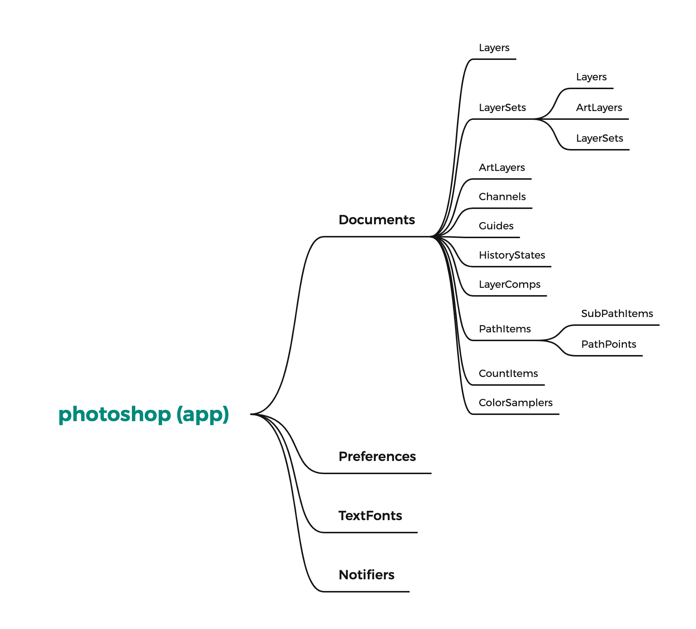
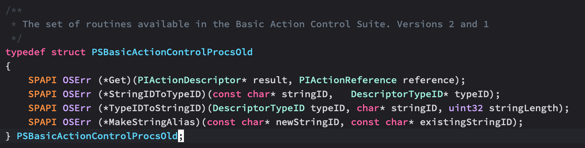
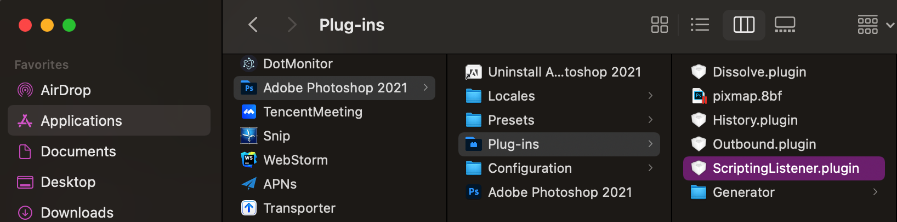
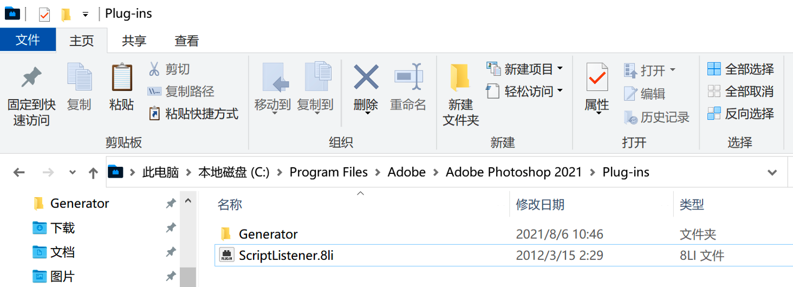
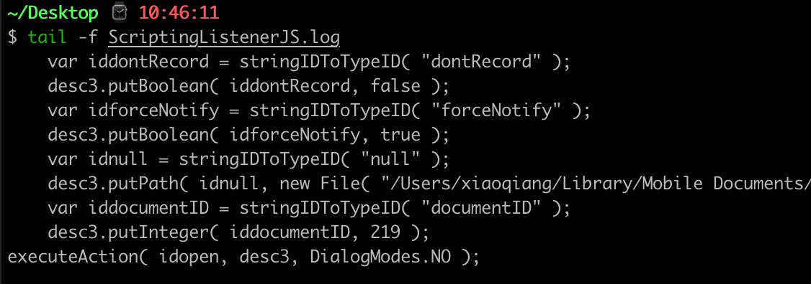
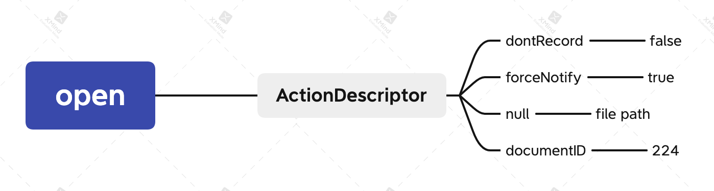
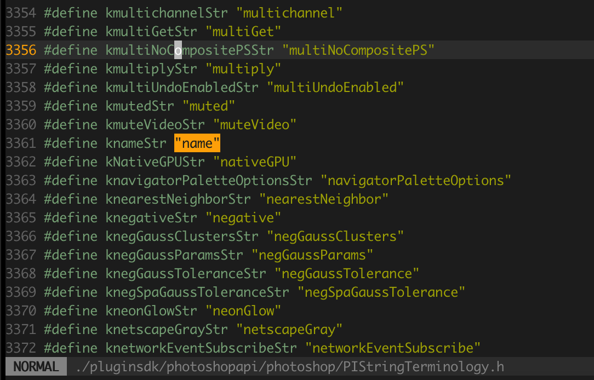
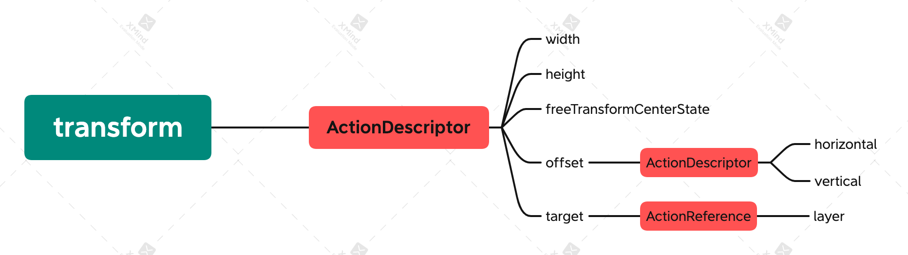
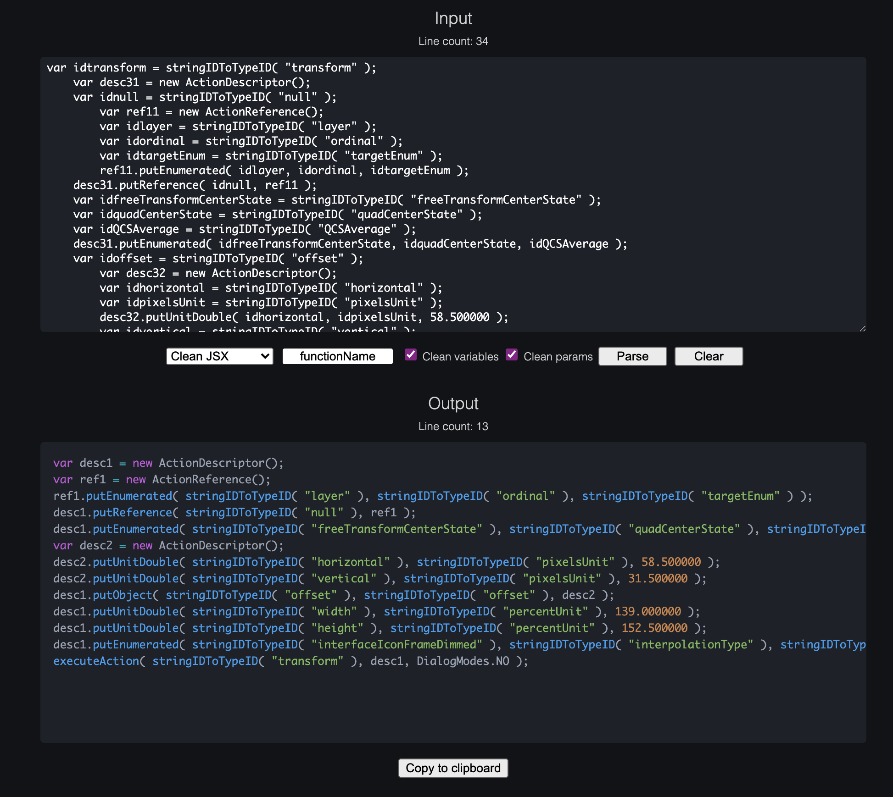
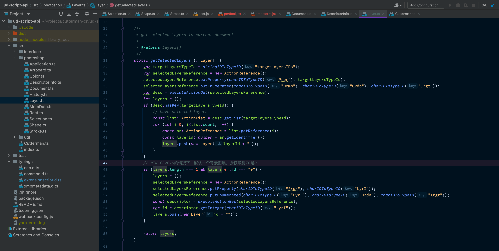

## 前言

上篇文章我们介绍了JSX的脚本核心 - DOM编程，它是Ps对外提供的一套API，提供了可以通过JS Api来调用宿主核心功能的接口，通过它我们可以完成需要的一些工作，而这也是官方文档提供给我们的有限的可用接口。但是你实际使用过程中就会发现，DOM提供的api太少太少了，大体也就能覆盖你日常需要的40%，剩下的很多需求，都无法通过DOM API来完成。

[](https://blog.cutterman.cn/assets/gallery/contents/Photoshop.png)

[photoshop dom tree](https://blog.cutterman.cn/assets/gallery/contents/Photoshop.png)


比如当选中的多图层的时候，你想拿到当前选中的多个图层，通过

```
app.activeDocument.activeLayer
```

只能拿到其中的一个，无法拿到所有选中的图层。再比如你想通过代码来选中**移动工具**，或者你想获取到图层的**图层叠加效果**等等，这些你在DOM API中都找不到相关的信息。于是，通常你就会在网上进行搜索，查找别人是怎么做的，搜着搜着，你可能就会在一些论坛上看到别人贴出来的这样的一坨代码


```
var idselect = stringIDToTypeID( "select" );
    var desc4 = new ActionDescriptor();
    var idnull = stringIDToTypeID( "null" );
        var ref1 = new ActionReference();
        var idpathComponentSelectTool = stringIDToTypeID( "pathComponentSelectTool" );
        ref1.putClass( idpathComponentSelectTool );
    desc4.putReference( idnull, ref1 );
    var iddontRecord = stringIDToTypeID( "dontRecord" );
    desc4.putBoolean( iddontRecord, true );
    var idforceNotify = stringIDToTypeID( "forceNotify" );
    desc4.putBoolean( idforceNotify, true );
executeAction( idselect, desc4, DialogModes.NO );
```

你会一边好奇，一边把代码拷贝出来贴进去，哎嘛，居然好使！接着你就会开始想这TMD是啥东西，紧接着继续搜索下去，你就会看到**Action Manager**这样的词，被翻译成中文大体是**动作管理器**/**动作代理**这样的词汇，你可能会想到，这可能是另外PS提供的另外一种API，于是你继续搜寻和它相关的信息，却发现，什么都搜不到，除了论坛上各种零星的代码随便，没有官方文档，没有非官方文档，没有任何地方会介绍这个东西是什么，怎么用，真的是什么都没有！

于是你会更加疑惑，每当你从论坛，群各种地方看到这种代码的时候，都会纳闷，他们是怎么写出来这种代码的？

[](https://blog.cutterman.cn/assets/gallery/contents/wtf.jpeg)

[WTF](https://blog.cutterman.cn/assets/gallery/contents/wtf.jpeg)


客观来说，官方确实没有提供有关**Action Manager**（以下简称AM）的完整资料，有限的内容只有在官方文档中找到比如**Action Descriptor**这样的类的接口说明，但这离实际使用差了十万八千里。

[](https://blog.cutterman.cn/assets/gallery/contents/Snip20211212_1.png)

[Action Descriptor](https://blog.cutterman.cn/assets/gallery/contents/Snip20211212_1.png)


接下来，我会通过上、中、下三篇文章，系统性的给大家介绍一下，这个有着**Ps脚本编程黑暗魔法**著称的**Action Manager**，到底是怎么回事，包含哪些部分，如何去使用它，如何能够像论坛里头那些大神一样可以写出来自己完全无法理解的代码。希望通过这三篇文章，你也可以靠自己的力量，亲自学会这种魔法。

> 文章篇幅较长，请摆正椅子，泡好咖啡。另，文章是我长时间思考、研究成果，内容原创，全网独一份，转载请注明出处。

## 背景介绍

早在PS4的年代，PS加入了**Action（动作）** 这个功能，对PS比较熟悉的小伙伴应该都了解这个东西，它可以记录你在PS上的各种操作，然后类似录像机一样把你的动作记录下来之后进行重放，就可以实现一些批量操作的任务。为了实现这样的机制，PS底层实现了一整套**动作 - 事件**机制，你在PS的每个操作，都会转化成一个Action（动作），在这个动作完成之后呢，又通过事件（Event）派发出来，给需要关心这个动作的其它组件进行监听，（我们前面文章讲到的事件机制就来此于此）。这套机制，是宿主引擎在C++层实现的，你依然可以在C++的SDK中看到它的影子

[](https://blog.cutterman.cn/assets/gallery/contents/Snip20211212_2.png)

[C++ SDK](https://blog.cutterman.cn/assets/gallery/contents/Snip20211212_2.png)


后来，随着Extend Script推出，Adobe大佬将这套机制进行了封装，提供了JS的API，本质上也就是一个桥接，最后JS的解释器转化到底层C++部分，所以你看到的这种不常见的语法和使用方式，归根到底是底层C的语法结构。再后来，Adobe科学家Thomas Ruark针对此写了一个非常有价值的插件**ScriptListener**，这个插件能够将你在PS中的操作，记录成一个动作脚本，将它输出出来，并且这个动作脚本是JS的方式提供的，也就是我们上面看到的那段代码，有了这个工具，大大降低了AM脚本获取的门槛（虽然门槛依然很高），它最大的价值，并不是给我们输出免费的代码，而是让我们可以窥探AM这个神秘的领域，打开了一扇窗户（嗯……不是门，一个很小的窗户）

[](https://blog.cutterman.cn/assets/gallery/contents/window-picky.jpeg)

[window](https://blog.cutterman.cn/assets/gallery/contents/window-picky.jpeg)


## ScriptListener

这个插件的重要性，可以说是CEP/脚本开发领域必备工具了，有了它，可以在DOM API需求满足度40%，提高到80%，所以我们先来介绍一下它的安装和使用。

首先下载插件，为了大家方便，我已经打包好了放在下面的链接当中，点击下载后解压，会看到两个文件，**ScriptingListener.plugin**是mac上用的，**ScriptListener.8li**是windows上用的

[ScriptListener Plugin](https://blog.cutterman.cn/assets/files/ScriptListener.zip)

将这个文件，拷贝到photoshop安装路径/plug-ins文件夹下，如下图

[](https://blog.cutterman.cn/assets/gallery/contents/Snip20211212_7.png)

[mac plug-ins](https://blog.cutterman.cn/assets/gallery/contents/Snip20211212_7.png)


[](https://blog.cutterman.cn/assets/gallery/contents/Snip20211212_4.png)

[win plug-ins](https://blog.cutterman.cn/assets/gallery/contents/Snip20211212_4.png)


安装完成之后，重启PS，接着你在PS上随便操作，就会发现在你的**桌面**上会生成一个**ScriptingListenerJS.log**文件，该文件记录下了你在PS的每一步操作对应的JS AM代码

[](https://blog.cutterman.cn/assets/gallery/contents/Snip20211212_8.png)

[ScriptingListenerJS.log](https://blog.cutterman.cn/assets/gallery/contents/Snip20211212_8.png)


你把这一段段的代码拷贝出来，放到你的编辑器（如Extend Toolkit）中运行，会发现它和你手动操作的行为是一模一样的。有了它，相当于有了一个学霸同桌，有地方抄作业了！

## Action Manager语法结构

好了，现在有了一个学霸同桌，接下来我们讲一下如何优雅的抄作业。

先看一个例子，我们用PS打开一个文件，就可以看到如下的代码输出

```
var idopen = stringIDToTypeID( "open" );
    var desc7 = new ActionDescriptor();
    var iddontRecord = stringIDToTypeID( "dontRecord" );
    desc7.putBoolean( iddontRecord, false );
    var idforceNotify = stringIDToTypeID( "forceNotify" );
    desc7.putBoolean( idforceNotify, true );
    var idnull = stringIDToTypeID( "null" );
    desc7.putPath( idnull, new File( "/Users/xiaoqiang/Desktop/Untitled-1.psd" ) );
    var iddocumentID = stringIDToTypeID( "documentID" );
    desc7.putInteger( iddocumentID, 224 );
executeAction( idopen, desc7, DialogModes.NO );
```

虽然我们还不太理解这段代码的详细意思，但是可以通过括号里头的参数半猜半蒙，**open**就是打开文件的意思，然后对应的文件路径在**new File(…)**里头，所以我们可以将这段代码封装一下，包装一个我们自己的文件打开函数，我们传进去一个可变的路径参数，这样就可以打开我们想要的文件了

```
function openDocument(filePath) {
    var idopen = stringIDToTypeID( "open" );
    var desc7 = new ActionDescriptor();
    var iddontRecord = stringIDToTypeID( "dontRecord" );
    desc7.putBoolean( iddontRecord, false );
    var idforceNotify = stringIDToTypeID( "forceNotify" );
    desc7.putBoolean( idforceNotify, true );
    var idnull = stringIDToTypeID( "null" );
    desc7.putPath( idnull, new File( filePath ) );
    var iddocumentID = stringIDToTypeID( "documentID" );
    desc7.putInteger( iddocumentID, 224 );
    executeAction( idopen, desc7, DialogModes.NO );   
}
```

仔细观察，会发现上面的代码有些冗余，看起来费劲的很，我们可以把里头的局部变量做一下优化，变成这样

```
function openDocument(filePath) {
    var desc7 = new ActionDescriptor();
        desc7.putBoolean( stringIDToTypeID( "dontRecord" ), false );
        desc7.putBoolean( stringIDToTypeID( "forceNotify" ), true );
        desc7.putPath( stringIDToTypeID( "null" ), new File( filePath ) );
        desc7.putInteger( stringIDToTypeID( "documentID" ), 224 );
    executeAction( stringIDToTypeID( "open" ), desc7, DialogModes.NO );   
}
```

代码简化之后，我们大体就可以看清晰它的脉络，它的整个过程如下

1. 创建了一个ActionDescriptor对象
2. 给这个对象设置了一堆属性
3. 执行一个**open**动作，把这个对象传给这个动作

[](https://blog.cutterman.cn/assets/gallery/contents/open.png)

[open document](https://blog.cutterman.cn/assets/gallery/contents/open.png)


关于ActionDescriptor这个类，我们可以在官方文档里头找到它的接口API，这个类有许多函数接口，我写了一个Typescript的typings

```
declare class ActionDescriptor {
    readonly count:number;  // The number of keys contained in the descriptor
    readonly typename: string;
    clear(): void;                                              // clear the descriptor
    erase(key: string): boolean;                                // erase a key from the descriptor
    getBoolean(key:number): boolean;                            // get the value of a key of type boolean
    getClass(key: number): number;                              // get the value of a key of type class
    getDouble(key: number): number;                             // get the value of a key of type double
    getEnumerationType(key: number): number;                    // get the enumeration value of a key
    getEnumerationValue(key: number): number;                   // get the enumeration value of a key
    getInteger(key: number): number;                            // get the value of a key of type integer 
    getKey(index: number): number;                              // get ID of the Nth key
    getList(key: number): ActionList;                           // get the value of a key of type list
    getObjectType(key: number): number;                         // get the class ID of an object in a key of type object
    getObjectValue(key: number): ActionDescriptor;              // get the value of a key of type object
    getPath(key: number): string;                               // get the value of a key of type Alias 
    getReference(num: number): ActionReference;                 // get the value of a key of type ActionReference
    getString(key: number): string;                             // get the value of a key of type string
    getType(key: number): DescValueType;                        // get the type of a key
    getUnitDoubleType(key: number): number;                     // 	get the unit type of a key of type UnitDouble
    getUnitDoubleValue(key: number): number;                    // get the value of a key of type UnitDouble
    getData(key: number): string;
    hasKey(key: number): boolean;                               // does the descriptor contain the provided key?
    isEqual(color: any): boolean;                               // return true if the provided color is visually equal to this color
    putBoolean(key: number,value: boolean): void;
    putClass(key: number,value: number):void;
    putDouble(key: number,value: number):void;
    putEnumerated(key: number,enumType: any,value: any):void
    putInteger(key: number,value: number):void;
    putList(key: number,value: any): void;
    putObject(key: number,classID: number,value: any):void;
    putPath(key: number,value: string): void;
    putReference(key: number,value: ActionReference): void;
    putString(key: number,value: string): void;
    putUnitDouble(key: number,unitID: number,value: number): void;
}
```

可是，那这里面的**stringIDToTypeID**是啥意思？**dontRecord**, **forceNotify**是做什么，为什么有一个**null**，我能猜到open是打开的意思，那关闭难道是close？那复制呢？从哪里可以找到这些命令的值呢？我们面临的问题还有很多，我们一个个来。

### 1. TypeID/CharID/StringID

在所有AM的代码片段中，你都会看到这些函数

1. charIDToTypeID
2. stringIDToTypeID
3. typeIDToCharID
4. typeIDToStringID

最常见的，应该是**charIDToTypeID**，该函数的参数，是一个4个字符长度的字符串缩写，比如Lyr 表示的是图层Layer的意思，Shw 表示的显示Show的含义。

```
// code sample 1
var desc1 = new ActionDescriptor();
var list1 = new ActionList();
var ref1 = new ActionReference();
ref1.putIdentifier(charIDToTypeID("Lyr "), this.id);;
list1.putReference(ref1);
desc1.putList(charIDToTypeID("null"), list1);
executeAction(charIDToTypeID("Shw "), desc1, DialogModes.NO);
```

你实验执行一下，下面的代码，会发现charIDToTypeID/stringIDToTypeID的执行结果是一串数值

```
charIDToTypeID( "Opn " )    //1332768288 
stringIDToTypeID("open")    //1332768288
```

然后typeIDToCharID/typeIDToStringID就是反过来把数值转成可读的字符串

```
typeIDToCharID(1332768288)  // Opn
typeIDToStringID(1332768288) // open
```

上面我们讲历时背景的时候提到了，底层是C的代码结构，我们看到的open, show等等命令，在引擎层就是一个HasMap，charIDToTypeID输出的数值就是该map的索引，计算机是不认识open这个单词的，所以我们通过函数将这个命令转成索引数值，在底层就可以找到对应的命令了。

我们还可以看到charIDToTypeID(“Opn “) == stringIDToTypeID(“open”)，所以两个都可以用，上面的code sample 1中也可以将charIDToType替换掉，如下

```
var desc1 = new ActionDescriptor();
var list1 = new ActionList();
var ref1 = new ActionReference();
ref1.putIdentifier(stringIDToTypeID("layer"), this.id);;
list1.putReference(ref1);
desc1.putList(stringIDToTypeID("null"), list1);
executeAction(stringIDToTypeID("show"), desc1, DialogModes.NO);
```

我们会发现，char对应的是一个C层的一个字符，4个字节长度，所以它的参数都是4长度的字符串，而string则是这个缩写的完整表达，为什么存在这两种功能相同表达方式不同的函数，这里头有历时原因，早期只有charIDToTypeID这个函数，通过命令字符串缩写来提供参数，后来随着PS的功能越来越多，只有4个字符串表示的缩写不够用了，于是推出了完整字符表示的stringIDToType这个函数，它通过完整的字符串表示命令，比如 **stringIDToTypeID(“targetLayersIDs”)** ，于是我们可以通过以下两个函数来做转换，查看缩写命令和完整命令，比如你看到一个缩写命令(N )，想知道它到底是啥意思，可以将它的完整字符弄出来

```
var typeId = charIDToTypeID("N   ");
var value = typeIDToStringID(typeId);   // name
```

通过**typeIDToStringID**和**typeIDToCharID**，我们可以将缩写命令和完整命令之间进行转换。

> 有个注意的点是，不是所有的缩写命令和完整命令都能相互转换，有些缩写命令没有提供完整字符命令，有些完整字符命令没有缩写命令

我们还没有回答上面一个问题，这些命令的集合，从哪里能找到？

所有的完整字符命令，可以在C++SDK的其中一个头文件中找到，如下位置

```
./pluginsdk/photoshopapi/photoshop/PIStringTerminology.h
```

[](https://blog.cutterman.cn/assets/gallery/contents/Snip20211212_9.png)

[PIStringTerminology.h](https://blog.cutterman.cn/assets/gallery/contents/Snip20211212_9.png)


然而有这样一个集合，并没有太多作用，这个文件定义了5k多个命令，你很难靠人肉去一个个看，看了也只能靠猜，效率低下，在后面一篇文章里头，我会讲述一个更好的办法，当我想要弄一个功能的时候，怎么能找到这个命令的值。

### 2. ActionDescriptor

我们再来看一个稍微复杂一点点的例子，调整图层的大小，我们在PS中通过图层的自由变换，可以改变元素的大小，会输出如下代码

```
var idtransform = stringIDToTypeID( "transform" );
    var desc31 = new ActionDescriptor();
    var idnull = stringIDToTypeID( "null" );
        var ref11 = new ActionReference();
        var idlayer = stringIDToTypeID( "layer" );
        var idordinal = stringIDToTypeID( "ordinal" );
        var idtargetEnum = stringIDToTypeID( "targetEnum" );
        ref11.putEnumerated( idlayer, idordinal, idtargetEnum );
    desc31.putReference( idnull, ref11 );
    var idfreeTransformCenterState = stringIDToTypeID( "freeTransformCenterState" );
    var idquadCenterState = stringIDToTypeID( "quadCenterState" );
    var idQCSAverage = stringIDToTypeID( "QCSAverage" );
    desc31.putEnumerated( idfreeTransformCenterState, idquadCenterState, idQCSAverage );
    var idoffset = stringIDToTypeID( "offset" );
        var desc32 = new ActionDescriptor();
        var idhorizontal = stringIDToTypeID( "horizontal" );
        var idpixelsUnit = stringIDToTypeID( "pixelsUnit" );
        desc32.putUnitDouble( idhorizontal, idpixelsUnit, 58.500000 );
        var idvertical = stringIDToTypeID( "vertical" );
        var idpixelsUnit = stringIDToTypeID( "pixelsUnit" );
        desc32.putUnitDouble( idvertical, idpixelsUnit, 31.500000 );
    var idoffset = stringIDToTypeID( "offset" );
    desc31.putObject( idoffset, idoffset, desc32 );
    var idwidth = stringIDToTypeID( "width" );
    var idpercentUnit = stringIDToTypeID( "percentUnit" );
    desc31.putUnitDouble( idwidth, idpercentUnit, 139.000000 );
    var idheight = stringIDToTypeID( "height" );
    var idpercentUnit = stringIDToTypeID( "percentUnit" );
    desc31.putUnitDouble( idheight, idpercentUnit, 152.500000 );
    var idinterfaceIconFrameDimmed = stringIDToTypeID( "interfaceIconFrameDimmed" );
    var idinterpolationType = stringIDToTypeID( "interpolationType" );
    var idbicubic = stringIDToTypeID( "bicubic" );
    desc31.putEnumerated( idinterfaceIconFrameDimmed, idinterpolationType, idbicubic );
executeAction( idtransform, desc31, DialogModes.NO );
```

这坨代码不好阅读，我们做一下简化

```
var desc1 = new ActionDescriptor();
    var ref1 = new ActionReference();
        ref1.putEnumerated( stringIDToTypeID( "layer" ), stringIDToTypeID( "ordinal" ), stringIDToTypeID( "targetEnum" ) );
    desc1.putReference( stringIDToTypeID( "null" ), ref1 );
    desc1.putEnumerated( stringIDToTypeID( "freeTransformCenterState" ), stringIDToTypeID( "quadCenterState" ), stringIDToTypeID( "QCSAverage" ) );
        var desc2 = new ActionDescriptor();
        desc2.putUnitDouble( stringIDToTypeID( "horizontal" ), stringIDToTypeID( "pixelsUnit" ), 58.500000 );
        desc2.putUnitDouble( stringIDToTypeID( "vertical" ), stringIDToTypeID( "pixelsUnit" ), 31.500000 );
    desc1.putObject( stringIDToTypeID( "offset" ), stringIDToTypeID( "offset" ), desc2 );
    desc1.putUnitDouble( stringIDToTypeID( "width" ), stringIDToTypeID( "percentUnit" ), 139.000000 );
    desc1.putUnitDouble( stringIDToTypeID( "height" ), stringIDToTypeID( "percentUnit" ), 152.500000 );
    desc1.putEnumerated( stringIDToTypeID( "interfaceIconFrameDimmed" ), stringIDToTypeID( "interpolationType" ), stringIDToTypeID( "bicubic" ) );
executeAction( stringIDToTypeID( "transform" ), desc1, DialogModes.NO );
```

为了更好理解，我们将优化后的代码做了缩进，以便更清晰的看到它的层次结构，要理解AM的代码结构，我们应从下往上看，最后一行代码，执行了一个动作，动作命令是**transform**，我们可以很好理解他是自由变换，同时在执行这个命令的时候，传递给它一个参数，这个参数是一个ActionDescriptor（以下简称AD）对象，我们给整个AD对象设置了一堆参数，比如宽(width)，高(height)，水平位置(horizontal)，垂直位置(vertical)等等，我们对这个命令做一下拆解，可以得到这个图

[](https://blog.cutterman.cn/assets/gallery/contents/transform.png)

[execute action](https://blog.cutterman.cn/assets/gallery/contents/transform.png)


通过上面的图，我们可以发现AM的代码组织是有对应的层次结构的，它由多个ActionDescriptor/ActionReference/ActionList等对象组织而成，无论你看到的代码多复杂，都是由这几个对象组成，每个对象设置相应的属性值，最后组成一个完整的动作命令，并执行这个命令。

我们继续解读这断代码，**desc1**是一个完整的动作描述，这个动作描述对象本质就描述了一句话： 对某个目标对象，设置一些属性。那目标对象的代码在哪里呢？如下

```javascript
var ref1 = new ActionReference();
    ref1.putEnumerated( stringIDToTypeID( "layer" ), stringIDToTypeID( "ordinal" ), stringIDToTypeID( "targetEnum" ) );
desc1.putReference( stringIDToTypeID( "null" ), ref1 );
```

上面的代码定义了一个**ActionReference**（简称AR）动作引用，给这个AR对象设置了枚举属性**layer**，对应的值是**targetEnum**，从字面含义，我们就可以猜出来，这是当前选中的目标图层。然后把这个引用对象复制给desc1，**这里为什么是null呢？**，其实null的含义就是target，你会发现

```js
stringIDToTypeID("target") == charIDToTypeID("null")
typeIDToCharID(stringIDToTypeID("target")) // null
```

所以，含义就是我们desc1这个动作描述生效的目标对象就是当前选中的图层。有了操作对象了，然后是需要设置的一些属性，这些属性有一些是直接挂在desc1下的，有一些挂在另外一个AD下，比如**offset**这个属性，它包含了水平和垂直两个方向的数值，所以它是另外一个描述符对象，为了理解方便，我们将上面的结构用伪JSON来表示，一看就明白了

```
{
    "command": "transform",
    "descriptor": {
        "interfaceIconFrameDimmed": "bicubic",
        "width": 139,
        "height": 152,
        "offset": {
            "horizontal": 58,
            "vertical": 31
        },
        "freeTransformCenterState": "QCSAverage",
        "target": { 
            "layer": "targetNum"
        }
    }
}
```

在设置属性值的时候，desc1设置属性值的方法有很多putUnitDouble/putObject等，这些通过目标属性值就可以判断出来，其中第二个参数目标值的单位或者属性类型，这些类型大体是可枚举的

1. 数值型，putInteger/putDouble，参数类型是PS提供的数值类型UnitValue，比如pixelUnit表示像素，inchUnit表示英寸，还有百分比percentUnit等
2. 枚举类型，putEnumerated，参数类型对应的是一个xxxType这样（这里就是底层C++的某个结构体的体现）
3. 对象类型，putObject，比如AD/AR/AL等，这种场景，一般参数类型就是自己本身，比如

```
desc1.putObject( stringIDToTypeID( "offset" ), stringIDToTypeID( "offset" ), desc2 );
```

### 3. DOM VS ActionManager

在我们常规开发的时候，DOM和AM是可以结合使用的，反正大家都是JS代码，所可以混合在一起来达成目的，你可以优先用DOM API来完成操作，如果发现某个需求没有相应的API，则可以通过查看ScriptListener的代码输出，拷贝出来结合使用。通常，我们将拷贝出来的AM代码包装成一个函数，然后把里头可变的值作为参数传进去，以便后续调用

```
function transform(width, height, offsetX, offsetY) {
    var desc1 = new ActionDescriptor();
    var ref1 = new ActionReference();
    ref1.putEnumerated( stringIDToTypeID( "layer" ), stringIDToTypeID( "ordinal" ), stringIDToTypeID( "targetEnum" ) );
    desc1.putReference( stringIDToTypeID( "null" ), ref1 );
    desc1.putEnumerated( stringIDToTypeID( "freeTransformCenterState" ), stringIDToTypeID( "quadCenterState" ), stringIDToTypeID( "QCSAverage" ) );
    var desc2 = new ActionDescriptor();
    desc2.putUnitDouble( stringIDToTypeID( "horizontal" ), stringIDToTypeID( "pixelsUnit" ), offsetX );
    desc2.putUnitDouble( stringIDToTypeID( "vertical" ), stringIDToTypeID( "pixelsUnit" ), offsetY );
    desc1.putObject( stringIDToTypeID( "offset" ), stringIDToTypeID( "offset" ), desc2 );
    desc1.putUnitDouble( stringIDToTypeID( "width" ), stringIDToTypeID( "percentUnit" ), width );
    desc1.putUnitDouble( stringIDToTypeID( "height" ), stringIDToTypeID( "percentUnit" ), height );
    desc1.putEnumerated( stringIDToTypeID( "interfaceIconFrameDimmed" ), stringIDToTypeID( "interpolationType" ), stringIDToTypeID( "bicubic" ) );
    executeAction( stringIDToTypeID( "transform" ), desc1, DialogModes.NO );
}

// 对某个图层进行变换
var layer = activeDocument.artLayers.getByName("Layer 1");
activeDocument.activeLayer = layer;
transform(200, 300, 20, 30);
```

> ScriptListener插件输出的代码，冗余度很高，可读性很差，我们可以通过这个工具来进行代码优化

[parse action manager code](https://javieraroche.github.io/parse-action-descriptor-code/)

[](https://blog.cutterman.cn/assets/gallery/contents/Snip20211212_31.png)

[parse action manager code](https://blog.cutterman.cn/assets/gallery/contents/Snip20211212_31.png)


通常，大多数开发者都会根据自己的需要，将这些常见的AM代码做封装，以弥补DOM API的接口不足，通过实际验证我们发现AM的脚本执行效率要比DOM API高的多，所以推荐大家少用DOM API，尽量使用AM脚本来完成诉求。为了开发方便，我在前些年将这些AM脚本做了封装和抽象，包装了一套类似DOM API的库，比如对Document的常用操作，对Layer的常用操作，可以快速提升开发效率，该项目目前开源，并且在升级2.0版本，详情见

https://github.com/emptykid/photoshop-script-api

[](https://blog.cutterman.cn/assets/gallery/contents/Snip20211212_21.png)

[photoshop script api](https://blog.cutterman.cn/assets/gallery/contents/Snip20211212_21.png)


## 总结

以上，就是本篇的主要内容，讲述了如何通过ScriptListener插件来获取PS操作输出AM代码，并且对其中的代码做了一些介绍，让大家能够对这种不常见的语法结构做一些了解，希望阅读本篇文章之后，你看到那一坨AM代码，心理就不太怵了。但是这篇文章并没有解决一个很实际又很重要的问题：**我现在只学会了抄作业，不会自己写！**

我们发现ScriptListener输出的代码，基本都是我们在PS里头做了实际操作，它才会输出，做操作的过程是一个SET的过程，那如果我想GET一些数据，就无法从插件的输出里头获取到了，比如我想获取当前PS的主题颜色，获取当前选中的多个图层等，就无从下手了。还有，不是所有的PS操作，都会在ScriptListener中有输出，比如我要设置工具的属性值，在日志里头就不会有输出

[](https://blog.cutterman.cn/assets/gallery/contents/Snip20211212_41.png)

[tool options](https://blog.cutterman.cn/assets/gallery/contents/Snip20211212_41.png)


那该怎么办呢？

总体而言，我们对PS的诉求，无非就是GET：获取一些信息，和SET：修改一些信息，这两个诉求，我们将在后面两篇文章中详细道来，我们会在中篇介绍如何从PS中获取想要的信息，在下篇介绍如何修改这些信息，它们会介绍通用性的逻辑和方法，而不是告诉你打开文档用这段代码，选中图层用那段代码这样的片段，通过介绍AM的底层运作逻辑和一些辅助工具，告诉大家使用这些方法，可以不通过去网上搜索，也能自己把一些命令，功能写出来，相信这三篇文章下来，基本就可以告别只会抄作业的水平了