上篇文章我们介绍了**Action Manager**的入门知识，讲如何通过ScriptListener插件来让Ps输出AM代码为我所用。同时介绍了AM的独特的代码结构，都是源于底层C的转换逻辑，使得对大多数开发者而言，异常晦涩难懂。上篇文章相当于是基础知识的介绍，离真正实际应用还差的很多，基本上你只能通过拷贝Ps输出的代码，自己简单改吧改吧凑合着用，如果Ps没有输出，就无能为力了。

这篇文章，以及下一篇，我们开始介绍AM实战部分，深入了解AM的运作机制，通过一些前人的积累和经验，让我们自己也可以顺藤摸瓜的开始自己写AM代码，实现想要的功能。

对于我们日常想要的操作，无非就是希望从宿主获取一些信息（GET操作），设置宿主的一些状态（SET操作），针对这两个操作，我们分为两篇文章分别介绍，**中篇**介绍如何从Ps中获取信息，**下篇**介绍如何设置这些信息。这么安排是有考虑的，一方面相比SET而言，GET其实要相对简单一些（虽然SET有ScriptListener辅助，但离开它确实举步维艰），另外一方面SET部分会用到GET讲的数据结构。

让我们马上开始吧~


> 本文是此系列教程中的精华，内容较长，要保持耐心。文章是我长时间思考、研究成果，内容原创，全网独一份，转载请注明出处。

## 1. ActionDescriptor数据获取

上一篇文章我们讲过，Ps核心通过动作（Action）和事件（Event）两套机制来响应每个操作，在每个动作、事件的过程中，都会有一个目标对象描述，表示我要对某个对象做动作，这个对象描述就是ActionDescriptor，这个对象描述里头包含了目标对象的一些属性信息，所以我们只要获取到这个目标对象描述，然后从中获取到这个对象的属性信息，就可以了。

我们现在以**获取图层属性**为例子，进行展开介绍，仔细看不要开小差！

我们先从**选中某个图层**为入口，当你选中一个图层的时候，会看到ScriptListener输出如下代码

```
var desc1 = new ActionDescriptor();
var ref1 = new ActionReference();
    ref1.putName( stringIDToTypeID( "layer" ), "Rectangle" );
desc1.putReference( stringIDToTypeID( "null" ), ref1 );
desc1.putBoolean( stringIDToTypeID( "makeVisible" ), false );
var list1 = new ActionList();
    list1.putInteger( 117 );
desc1.putList( stringIDToTypeID( "layerID" ), list1 );
executeAction( stringIDToTypeID( "select" ), desc1, DialogModes.NO );
```

我们把这段代码的结构用脑图来表示

[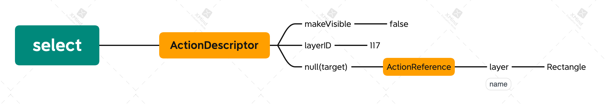](https://blog.cutterman.cn/assets/gallery/contents/select.png)

[execute action](https://blog.cutterman.cn/assets/gallery/contents/select.png)


可以很清晰的看出来，执行了动作**select**，这个动作的描述符是ActionDescriptor，这个描述符里头表示的目标对象，通过**null(target)** 属性表示，这个属性值是一个**ActionReference**，它里头设置了一个**layer**属性，它的值是**Rectangle**，意思就是图层名称是Rectangle的目标对象。

这里面有一个很关键的地方

```
var ref1 = new ActionReference();
    ref1.putName( stringIDToTypeID( "layer" ), "Rectangle" );
```

**ActionReference**是一个动作引用对象，它表示我们对某个目标对象的引用，上面的代码理解为**我要引用一个名称是Rectangle的图层**，于是ref1这个对象就包含了这个图层的引用，拿到这个引用之后，我们可以把它传给很多地方（比如前面的代码，把它传给了一个选择动作的描述符）。现在我们的目标是想要获取到这个图层的属性，于是我们需要想办法获取到这个图层的动作描述符（ActionDescriptor）。AM提供了一个方法**executeActionGet**，让我们可以通过引用拿到它的描述符

```
declare interface Application {
    executeActionGet(reference: ActionReference): ActionDescriptor;
}
```

所以我们可以这样，拿到这个图层的描述符

```
var ref1 = new ActionReference();
    ref1.putName( stringIDToTypeID( "layer" ), "Rectangle" );
var layerDescriptor = executeActionGet(ref1);
```

从输出的结果可以看到**layerDescriptor**是一个ActionDescriptor对象

[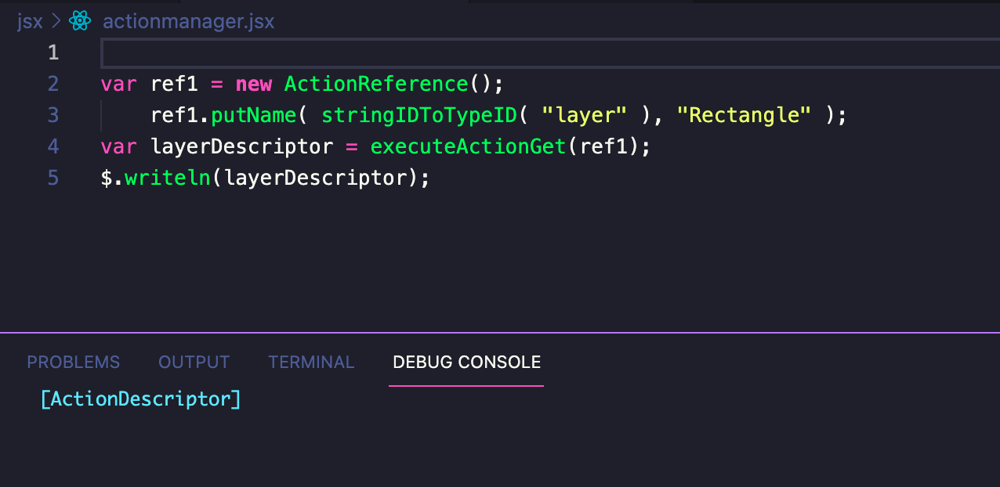](https://blog.cutterman.cn/assets/gallery/contents/Snip20211219_10.png)

[ActionDescriptor](https://blog.cutterman.cn/assets/gallery/contents/Snip20211219_10.png)


拿到这个图层的ActionDescriptor之后，我们如何去获取它的属性和值呢？它又都有哪些属性和值呢？

做过Javascript开发的小伙伴，都应该知道，我们如果拿到一个未知的JS对象，想要知道它里头包含哪些属性或者方法，可以用for去遍历它的属性，比如

```
var obj = new SomeUnknownObject();
for (var i in obj) {
    if (obj.hasOwnProperty(i)) {
        console.log(i + " => " + obj[i])
    }
}
```

同理，我们也可以想办法遍历出来那个ActionDescriptor对象里头都包含了哪些属性和值，但是方法不太一样，如果你查阅官方文档，可以看到ActionDescriptor有一个count的属性，它表示这个AD里头key的数量，于是依然可以通过遍历把这些key弄出来，这里需要注意，要把key拿出来，得通过AD的**getKey**这个方法，这些方法都在AD的官方文档api里头能找到。

[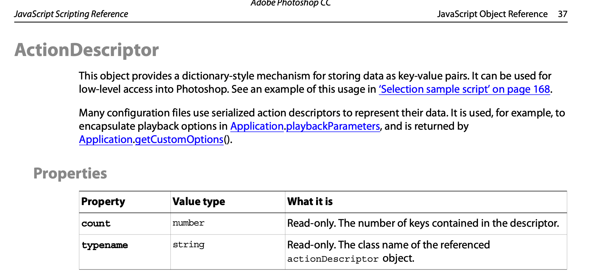](https://blog.cutterman.cn/assets/gallery/contents/Snip20211212_1.png)

[count property](https://blog.cutterman.cn/assets/gallery/contents/Snip20211212_1.png)


```
var ref1 = new ActionReference();
    ref1.putName( stringIDToTypeID( "layer" ), "Rectangle" );
var layerDescriptor = executeActionGet(ref1);
for (var i=0; i<layerDescriptor.count; i++) {
    var key = layerDescriptor.getKey(i);
    $.writeln(key);
}
```

[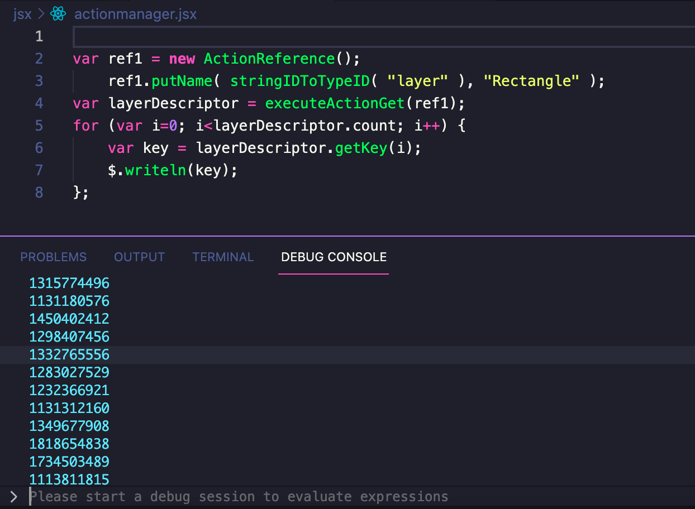](https://blog.cutterman.cn/assets/gallery/contents/Snip20211219_11.png)

[output key](https://blog.cutterman.cn/assets/gallery/contents/Snip20211219_11.png)


我们可以看到key的输出是一连串的数字，如果你还记得上一篇文章讲过的内容，说不定会想到，这个key的值，就是**charIDToTypeID**函数返回的数值，它是每个字符串key在底层引擎的数值表示，于是，我们可以通过**typeIDToStringID**这个函数将数值反射为字符串

```
var ref1 = new ActionReference();
    ref1.putName( stringIDToTypeID( "layer" ), "Rectangle" );
var layerDescriptor = executeActionGet(ref1);
for (var i=0; i<layerDescriptor.count; i++) {
    var key = layerDescriptor.getKey(i);
    var keyString = typeIDToStringID(key);
    $.writeln(keyString);
}
```

[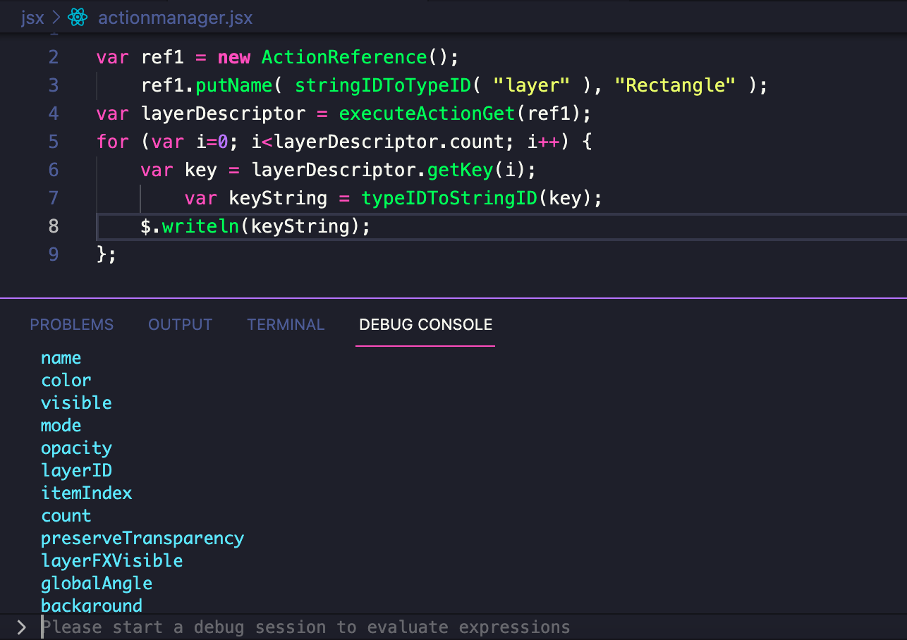](https://blog.cutterman.cn/assets/gallery/contents/Snip20211219_12.png)

[output key string](https://blog.cutterman.cn/assets/gallery/contents/Snip20211219_12.png)


哇~~ 看到了什么！ 我们成功的看到了这个图层的各种属性了！

于是我们可以确定，**getKey**函数，通过传入索引序号，可以获取到当前ActionDescriptor每个属性的char值，通过char->string的转换，就可以拿到它可读的字符串属性。这个图层的属性有很多，上图只是截取的一部分，你可以自己实际运行一下代码看看各个属性值。

现在只拿到了它的属性key，接下来就需要根据这个属性，去获取它的属性值了。在获取属性值的时候，我们需要先判断它的属性类型，比如尺寸这样的属性，它应该是数值型，图层名称，肯定是字符串型，可能还有其它比如颜色，可能是更复杂的类型，不同的类型，获取的方式是不一样的，下面我们先判断它的属性类型，类型，是通过ActionDescriptor的**getType**方法来获取的，它通过传递一个typeID作为参数，返回它的类型，该方法也在官方API里头

```
var ref1 = new ActionReference();
    ref1.putName( stringIDToTypeID( "layer" ), "Rectangle" );
var layerDescriptor = executeActionGet(ref1);
for (var i=0; i<layerDescriptor.count; i++) {
    var typeID = layerDescriptor.getKey(i);     // getKey方法返回的是一个typeID数值
    var stringID = typeIDToStringID(typeID);    // 通过反射获取到字符串的属性
    var typeString = layerDescriptor.getType(typeID);   // 把上面的typeID作为参数，拿到它的类型
    $.writeln(stringID + " => " + typeString);
}
```

[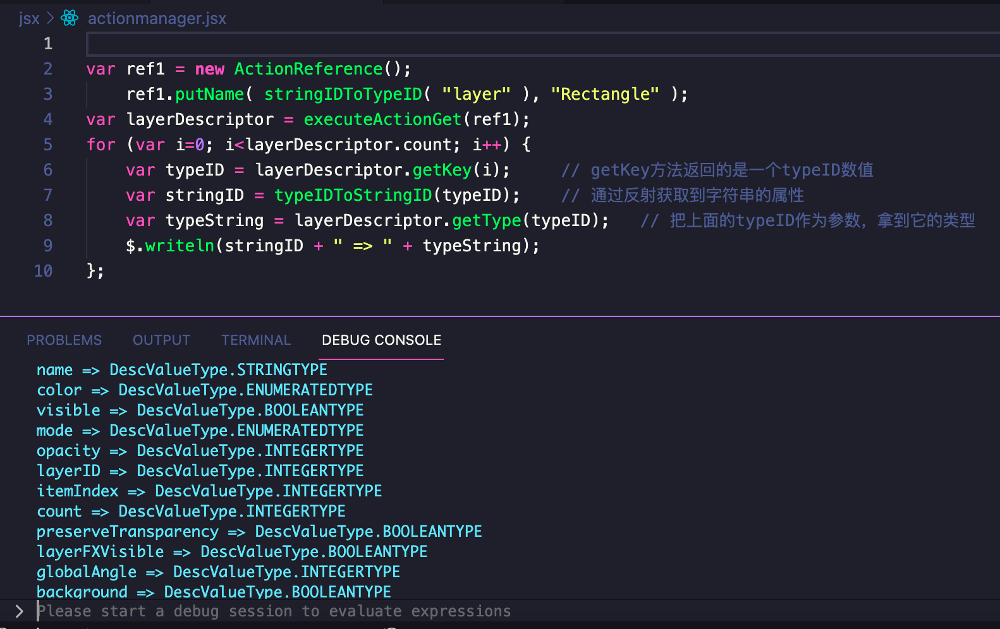](https://blog.cutterman.cn/assets/gallery/contents/Snip20211219_13.png)

[property type](https://blog.cutterman.cn/assets/gallery/contents/Snip20211219_13.png)


于是，我们就拿到了每个属性和它的属性类型了，拿到类型之后，我们就可以通过ActionDescriptor提供的getXXX方法来拿到它的属性值了，比如我们看上图**name**属性的类型是**STRINGTYPE**，我们就可以通过**getString**方法来获取它的值

```
var ref1 = new ActionReference();
    ref1.putName( stringIDToTypeID( "layer" ), "Rectangle" );
var layerDescriptor = executeActionGet(ref1);
for (var i=0; i<layerDescriptor.count; i++) {
    var typeID = layerDescriptor.getKey(i);     // getKey方法返回的是一个typeID数值
    var stringID = typeIDToStringID(typeID);    // 通过反射获取到字符串的属性
    var typeString = layerDescriptor.getType(typeID);   // 把上面的typeID作为参数，拿到它的类型
    if (stringID === "name") {
        var value = layerDescriptor.getString(typeID);
        $.writeln(stringID + " => " + value);
    }
}
```

[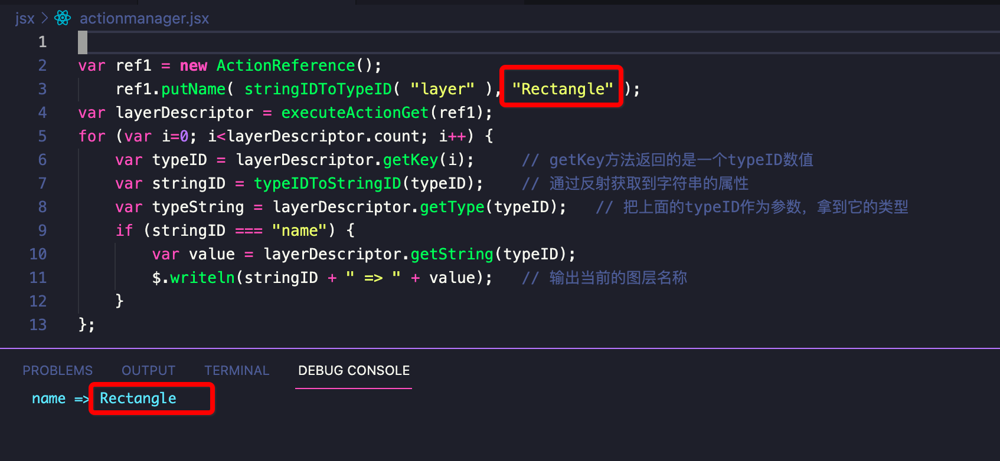](https://blog.cutterman.cn/assets/gallery/contents/Snip20211219_14.png)

[get layer name](https://blog.cutterman.cn/assets/gallery/contents/Snip20211219_14.png)


看上图，我们成功的输出了当前图层的名称，并且发现它和我们设置给**ActionReference**的名称值是一样的，说明一切都符合预期，属性的类型还有一些其它的，我们可以根据类型来做判断，挨个输出，大体是这样

[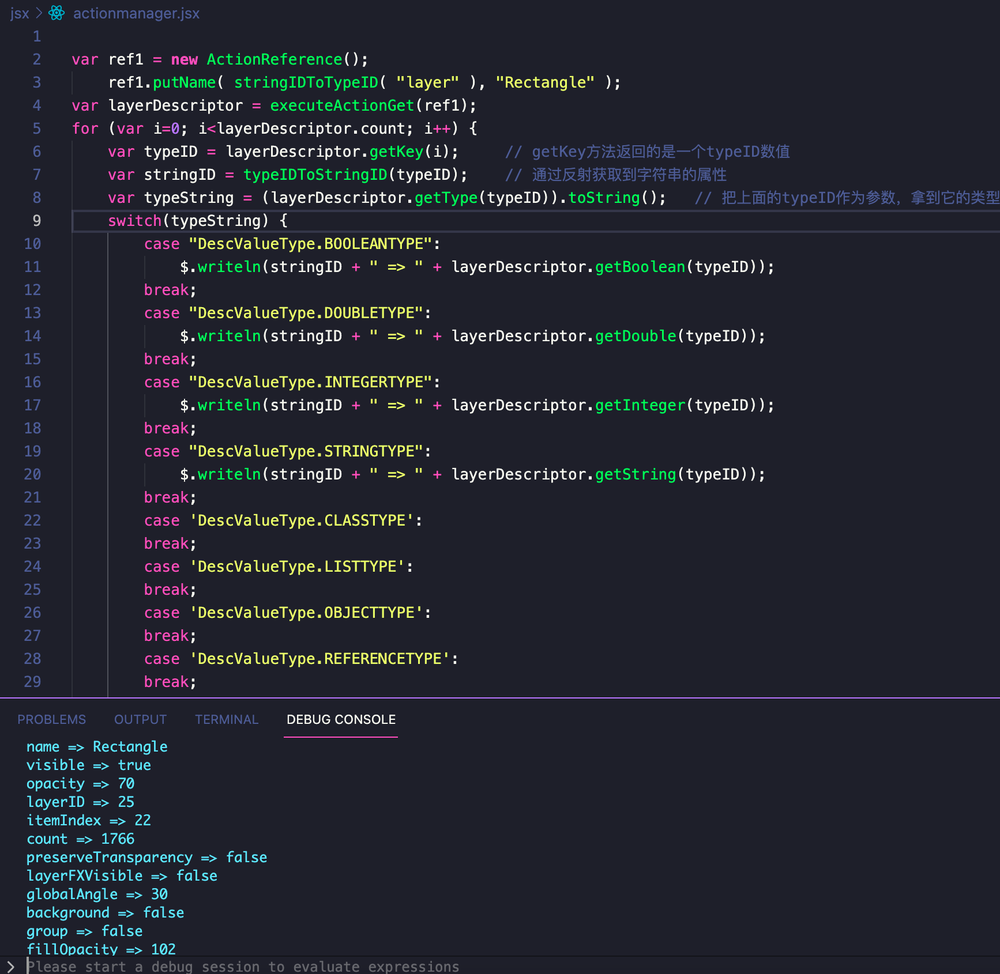](https://blog.cutterman.cn/assets/gallery/contents/Snip20211219_15.png)

[output all properties](https://blog.cutterman.cn/assets/gallery/contents/Snip20211219_15.png)


为了偷懒，我上面例子只输出了基础类型的属性值，你还能看到里面还有**class**, **list**, **object**类型等复杂类型，这些类型里面的数据结构，又都是不一样的，我们需要逐个进去分析，我们以**object**类型为例介绍一下，其它类型大家下来自己尝试，当做课后作业了。

如果属性类型是**DescValueType.OBJECTTYPE**的话，我们可以通过**getObjectValue**方法去获取它的属性值，然后发现它返回的也是一个ActionDescriptor对象，这个对象里头又有一堆属性需要我们去挖掘，聪明的你就会发现，它可能需要一个递归，所以我们可以写一个单独的函数来专门解析ActionDescriptor，我们给这个函数取名**ADToJson**吧，把一个ActionDescrptor的属性值都拿出来，转换成Json数据结构

```
/**
 * 这个函数接受一个AD的对象，返回这个对象所有属性值的JSON结构
 * @param desc [ActionDescriptor]
 * @return JSON
 */
function ADToJson(desc) {
    var json = {};
    for (var i=0; i<desc.count; i++) {
        var typeID = desc.getKey(i);
        var stringID = typeIDToStringID(typeID);
        var typeString = (desc.getType(typeID)).toString();
        switch(typeString) {
            case "DescValueType.BOOLEANTYPE":
                json[stringID] = desc.getBoolean(typeID);
                break;
            case "DescValueType.DOUBLETYPE":
                json[stringID] = desc.getDouble(typeID);
                break;
            case "DescValueType.INTEGERTYPE":
                json[stringID] = desc.getInteger(typeID);
                break;
            case "DescValueType.STRINGTYPE":
                json[stringID] = desc.getString(typeID);
                break;
            case 'DescValueType.OBJECTTYPE':
                var objectValue = desc.getObjectValue(typeID);
                json[stringID] = ADToJson(objectValue);
                break;
            case 'DescValueType.CLASSTYPE':
            case 'DescValueType.LISTTYPE':
            case 'DescValueType.REFERENCETYPE':
                // 剩下这些留给你去补充完成
                break;
            default: ; break;
        }
    }
    return json;
}


var ref1 = new ActionReference();
ref1.putName( stringIDToTypeID( "layer" ), "Rectangle" );
var layerDescriptor = executeActionGet(ref1);
var json = ADToJson(layerDescriptor);
```

这样，我们就顺利的将一个图层对象的所有属性和属性，都拿到了！通过遍历ActionDescriptor的所有属性，判断它的类型，递归遍历获取到它所有的属性值，这个是AM的核心，圈起来这块要考，通过它我们也能够更深刻的理解ActionDescriptor的内部组织结构。有了上面的**ADToJson**函数，后续当你看到一个ActionDescriptor的时候，就可以通过该函数，对它一探究竟，你就再也不用对它发怵了~~

## 2. 如何选定目标对象

上面的例子，我们通过给**ActionReference**设置了一个名称是**Recntangle**的目标对象，然后获取到了该图层的**ActionDescriptor**，就可以拿到该图层的各种属性信息了。那除了通过名称之外，还能够通过其它方式来获取到目标图层对象么？比如能不能通过图层ID，图层顺序来锁定目标图层呢？

当然可以了，我们可以通过ref1设置对应的typeID来达到目的，比如

```
var ref1 = new ActionReference();
    ref1.putIndex( stringIDToTypeID( "itemIndex" ), 22 );   // 通过设置图层顺序来定位图层
    ref1.putIdentifier(stringIDToTypeID( "layerID", 25 ));  // 通过设置图层ID来定位图层
```

> 上面ActionReference的方法**putIndex**, **putIdentifier**都在官方文档api里头，你可以去看看还有一些别的。

上面这几种方法，都指向同一个图层，通过**executeActionGet(ref1)\**，都能拿到一致的\**ActionDescriptor**，所以，如果你愿意的话，可以自己封装一些函数，比如

```
/**
 * 根据图层ID来获取图层信息
 * @param layerID
 * @return {*}
 */
function getLayerInfoByID(layerID) {
    var ref1 = new ActionReference();
        ref1.putIdentifier(stringIDToTypeID( "layerID", layerID));
    var layerDescriptor = executeActionGet(ref1);
    var json = ADToJson(layerDescriptor);   
    return json;
}

/**
 * 根据图层的顺序，来获取图层信息
 * @param index
 * @return {*}
 */
function getLayerInfoByIndex(index) {
    var ref1 = new ActionReference();
        ref1.putIndex( stringIDToTypeID( "itemIndex" ), index); 
    var layerDescriptor = executeActionGet(ref1);
    var json = ADToJson(layerDescriptor);
    return json;   
}
```

如果你想要获取当前选中的图层，而且你也不知道它的id和index，上面两个方法就用不上了，你可以通过如下方式获取到

```
var ref1 = new ActionReference();
    // 它的含义是 layer -> ordinal -> target，也就是当前选中的图层
    ref1.putEnumerated(charIDToTypeID("Lyr "), charIDToTypeID("Ordn"), charIDToTypeID("Trgt"));
var layerDescriptor = executeActionGet(ref1);
```

上面这行代码也很重要，它给ActionReference设置了一个枚举类型，指的是当前target->layer，也就是当前选中的图层，为什么说它很重要呢？它是AM给我们提供的一个相当于快捷途径，用来表示当前处于被激活状态的一些目标对象，除了**选中的图层**之外，还有当前选中的文档，选中的通道，选中的工具等等，都可以通过这种方式来获取到，比如上面我们一直都在讲图层，现在我们来把目标对象换成**当前文档**，比如我想知道当前文档的一些信息，比如名称，id，图层数量等。

来，跟着我的思路：我们创建一个ActionReference，把当前文档作为属性设置进去，然后反向获取到它的ActionDescriptor，就可以遍历出它的属性了

```
var ref1 = new ActionReference();
    // 这几个key: Dcmn, Ordn, Trgt，你就背下来就好了
    // 如果看着不习惯，也可以换成string的表达方式document, ordinal, target
    ref1.putEnumerated(charIDToTypeID('Dcmn'), charIDToTypeID('Ordn'), charIDToTypeID('Trgt'));
var docDescriptor = executeActionGet(ref1);
var json = ADToJson(docDescriptor);
$.writeln(json.title);
```

[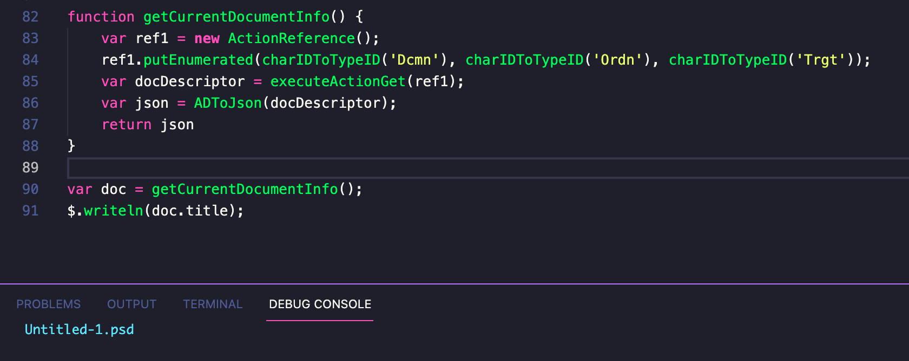](https://blog.cutterman.cn/assets/gallery/contents/Snip20211219_17.png)

[get document info](https://blog.cutterman.cn/assets/gallery/contents/Snip20211219_17.png)


你可以把整个Document的属性都dump出来，看看一个Document，都具备了哪些属性，本质上，它也是一个属性树，逐层往下挖掘，就能够找到你想要的目标对象了，比如前文我们一直提到过的一个问题：**当选中多个图层的时候，activeLayer只返回其中一个，如何能够获取到所有被选中的图层信息呢？**

我们可以从文档（document）的属性里面找到一个叫**targetLayersIDs**的属性，这个属性的值，就是当前被选中的图层的ID列表，那结合前面我们介绍的内容，我们就可以拿到选中图层列表的所有信息了，我们来试一下代码

```
var ref1 = new ActionReference();
    ref1.putEnumerated(charIDToTypeID('Dcmn'), charIDToTypeID('Ordn'), charIDToTypeID('Trgt'));
var docDescriptor = executeActionGet(ref1);
// 我们可以通过打印发现targetLayersIDs是一个list类型，通过getList拿到一个数组
var list = docDescriptor.getList(stringIDToTypeID("targetLayersIDs"));
// 遍历这个list，拿到图层ID，ActionList的数据结构和AD也差不多，数组里头的元素是ActionReference对象
for (let i=0; i<list.count; i++) {
    var ar = list.getReference(i);
    var layerId = ar.getIdentifier();
    $.writeln(layerId);
}
// 拿到这些图层ID之后，你就可以通过上面的getLayerInfoByID取拿每个图层的信息了
```

这里面有一个小问题！

当我们通过executeActionGet去获取一个目标对象的ActionDescriptor的时候，有的目标对象很大（比如Document），那这个返回的ActionDescriptor就会很大（因为包含了非常多的属性和值），这样一方面获取的时候就会有点慢，同时也非常消耗内存和性能。所以，当你如果很明确的想要获取目标对象的某个属性的时候，可以把该属性也设置到ActionReference当中，如下

```
var ref1 = new ActionReference();
    // 给AR设置一个property，表示你我只要获取targetLayersIDs属性的值，其它的不要给我返回了
    ref1.putProperty(charIDToTypeID("Prpr"), stringIDToTypeID("targetLayersIDs"));
    ref1.putEnumerated(charIDToTypeID('Dcmn'), charIDToTypeID('Ordn'), charIDToTypeID('Trgt'));
var docDescriptor = executeActionGet(ref1);
var list = docDescriptor.getList(stringIDToTypeID("targetLayersIDs"));
```

这样descriptor返回的，就只有上面那个属性和它的值，不会返回其它的属性，速度更快，内存消耗更低，再给一个例子，比如你想获取到ID为3的图层的名称，可以这样

```
var ref1 = new ActionReference();
    // 只要名称
    ref1.putProperty(charIDToTypeID("Prpr"), stringIDToTypeID("layer"));
    ref1.putIdentifier(stringIDToTypeID( "layerID", 3));
var layerDescriptor = executeActionGet(ref1);
```

## 3. Photoshop对象树

做过浏览器web开发的小伙伴，都应该用过chrome的开发者工具，里头有一个**inspector**，可以对DOM树进行查看

[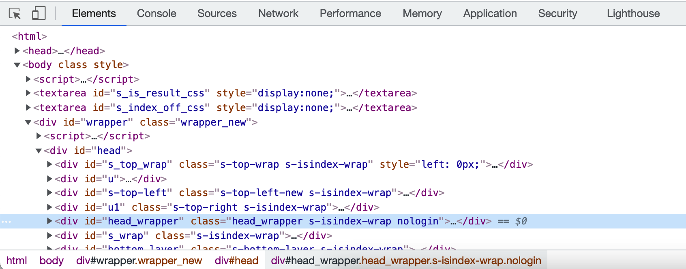](https://blog.cutterman.cn/assets/gallery/contents/Snip20211220_1.png)

[chrome dev tool](https://blog.cutterman.cn/assets/gallery/contents/Snip20211220_1.png)


通过该工具，我们可以查看网页DOM的层次结构，每个元素的上下级节点，和元素的属性以及它的值。

同样的，对于Ps这个宿主而言，它也有一个对象树，前面我们介绍的**图层**，**文档**只是这个对象树的一个分支，有些时候，我们需要操作其它目标对象，比如**通道**，**画笔**，**工具**等等，它也都是这个对象树中的一个节点/分支。于是，搞清楚整个宿主的对象树，就好比弄了一个devtool，有助于我们找到想要的目标对象。

对于Photoshop来说，所有的目标对象，都在根对象（Application）下面，我们可以从界面交互的角度去看看都有哪些，当然这个只是能看见的部分，还有许许多多看不到的子对象。

[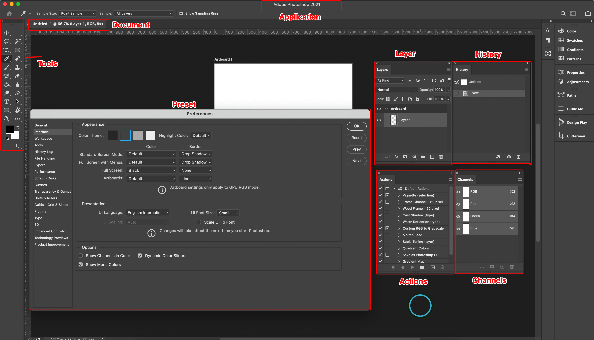](https://blog.cutterman.cn/assets/gallery/contents/Snip20211220_2.png)

[chrome dev tool](https://blog.cutterman.cn/assets/gallery/contents/Snip20211220_2.png)


[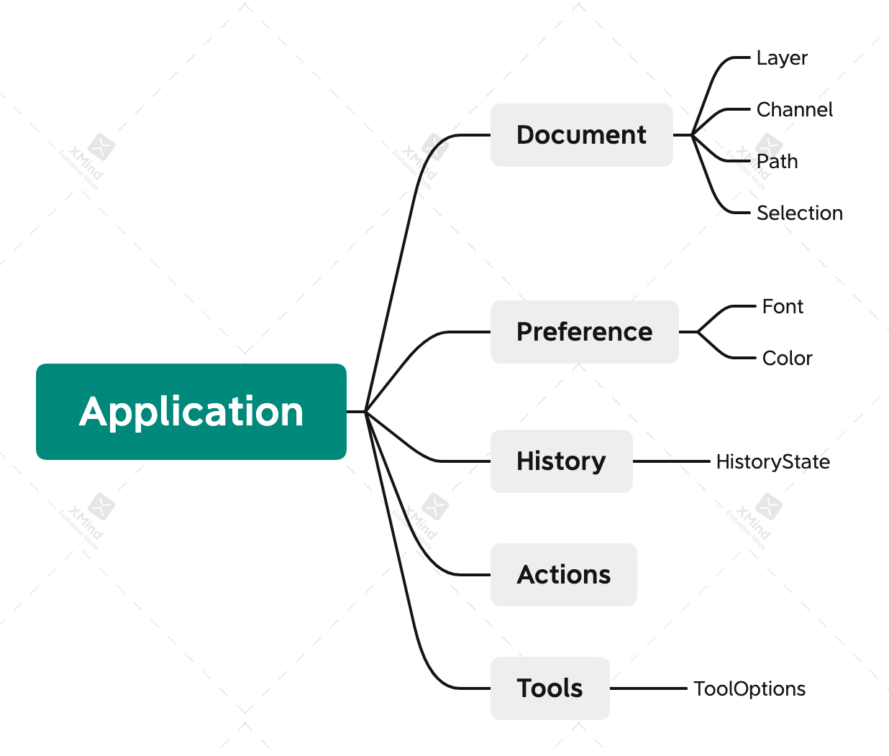](https://blog.cutterman.cn/assets/gallery/contents/Application.png)

[Application DOM](https://blog.cutterman.cn/assets/gallery/contents/Application.png)


我们可以根据上面学习到的方法，把Ps根对象**Application**的属性给dump出来，看看它都有哪些东西

```
var ref1 = new ActionReference();
    ref1.putEnumerated(stringIDToTypeID('application'), charIDToTypeID('Ordn'), charIDToTypeID('Trgt'));
var appDescriptor = executeActionGet(ref1);
var json = ADToJson(appDescriptor);
```

大家可以自己实际测试一下，看看输出，比如我dump出来的数据，可以得到Ps的各种配置项、字体列表、最近打开的文件、工具、操作历史等等信息，等待你去挖掘。

```
{
    "path": "/Applications/Adobe Photoshop 2021/Adobe Photoshop 2021.app",
    "preferencesFolder": "~/Library/Preferences/Adobe Photoshop 2021 Settings",
    "kuiBrightnessLevel": "kPanelBrightnessMediumGray",
    "controlColor": "controlColorDefault",
    "highlightColorOption": "uiDefaultHighlightColor",
    "limited": false,
    "currentToolOptions": {
        "AtSl": true,
        "ASGr": false,
        "Abbx": true
    },
    "tool": "targetEnum"
}
```

拿到这些属性之后，你可以进一步去看里头的内容，比如你想拿到当前**选中的工具**的一些选项，我们知道它是application的tool属性，通过下面的代码，就可以获取到选中工具的ActionDescriptor

```
var ref1 = new ActionReference();
    ref1.putProperty(stringIDToTypeID('property'), stringIDToTypeID("tool"));
    ref1.putEnumerated(stringIDToTypeID('application'), charIDToTypeID('Ordn'), charIDToTypeID('Trgt'));
var desc1 = executeActionGet(ref1);
// ...
```

拿到tool的ActionDescriptor之后，你可以继续遍历它，拿到其中的工具配置项，比如我当前选中的是**文字工具**，我就可以通过AD获取到当前输入文字的样式

[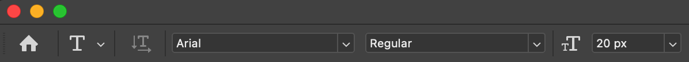](https://blog.cutterman.cn/assets/gallery/contents/Snip20211220_3.png)

[text tool options](https://blog.cutterman.cn/assets/gallery/contents/Snip20211220_3.png)


```
var ref1 = new ActionReference();
    ref1.putProperty(stringIDToTypeID('property'), stringIDToTypeID("tool"));
    ref1.putEnumerated(stringIDToTypeID('application'), charIDToTypeID('Ordn'), charIDToTypeID('Trgt'));
var desc1 = executeActionGet(ref1);
// 获取到当前工具的选项描述符
var desc2 = desc1.getObjectValue(stringIDToTypeID('currentToolOptions'));
// 拿到文本字体配置项
var textTool = desc2.getObjectValue(stringIDToTypeID("textToolCharacterOptions"));
// 获取到文字样式
var style = textTool.getObjectValue(stringIDToTypeID("textStyle"));
// 文字样式里头还有字体，颜色，大小尺寸等等信息
var fontName = style.getString(stringIDToTypeID("fontName"));
// ...
```

对于将Ps的数据dump出来这个事情，有很多前辈大佬总结过很多方法，并且还封装了一些比较好用的工具/脚本，我将这些中比较好用的也分享给大家，

#### 1. GetterDemo.jsx

[GetterDemo.jsx](https://devproducts.oss-cn-shanghai.aliyuncs.com/devtools/GetterDemo.jsx)

这是Ps script大神xbytor编写的xtools库的一部分，它提供了一个gui界面让你选择需要dump的数据对象

[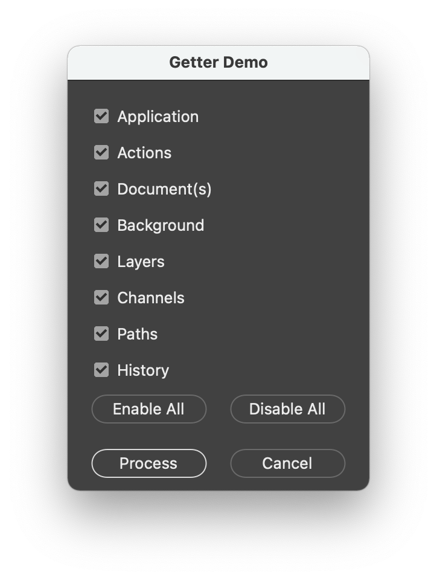](https://blog.cutterman.cn/assets/gallery/contents/Snip20211220_4.png)

[Getter Demo](https://blog.cutterman.cn/assets/gallery/contents/Snip20211220_4.png)


并将数据以xml的格式出处到你的桌面，你可以仔细观察该xml的格式结构，从中也能反应出来AD的数据结构

```
<?xml  version="1.0" encoding="iso-8859-1"  ?>
<PhotoshopInfo>
    ...
    <ActionDescriptor count="7">
        <String symname="Name" sym="Nm  " string="Untitled-1"/>
        <Integer symname="ItemIndex" sym="ItmI" integer="1"/>
        <Integer symname="Count" sym="Cnt " integer="2"/>
        <Boolean symname="Auto" sym="Auto" boolean="false"/>
        <Boolean symname="HistoryBrushSource" sym="HstB" boolean="true"/>
        <Boolean symname="CurrentHistoryState" sym="CrnH" boolean="false"/>
        <Integer symname="ID" sym="Idnt" integer="221"/>
    </ActionDescriptor>
    <ActionDescriptor count="7">
        <String symname="Name" sym="Nm  " string="New"/>
        <Integer symname="ItemIndex" sym="ItmI" integer="2"/>
        <Integer symname="Count" sym="Cnt " integer="2"/>
        <Boolean symname="Auto" sym="Auto" boolean="true"/>
        <Boolean symname="HistoryBrushSource" sym="HstB" boolean="false"/>
        <Boolean symname="CurrentHistoryState" sym="CrnH" boolean="true"/>
        <Integer symname="ID" sym="Idnt" integer="220"/>
    </ActionDescriptor>
</PhotoshopInfo>
```

#### 2. descriptor-info.jsx

[descriptor-info.jsx](https://devproducts.oss-cn-shanghai.aliyuncs.com/devtools/descriptor-info.jsx)

这是另外一个轻量级的脚本，其实就是我上面介绍的如何遍历分析ActionDescriptor对象，并将结果转化成JSON输出。代码简单清晰，原代码有几处bug，上面链接是我修复后的版本，使用方式如下：

```
#include "./descriptor-info.jsx";
#include "./JSON.jsx";

var ref = new ActionReference();
ref.putEnumerated(stringIDToTypeID("application"), charIDToTypeID("Ordn"), charIDToTypeID("Trgt"));
var desc = executeActionGet(ref);

// 把JSON数据输出到桌面文件
var descFlags = {
	reference : false,
	extended : false,
	maxRawLimit : 10000,
	maxXMPLimit : 100000,
	saveToFile: Folder.desktop.absoluteURI + '/descriptor-info-application.json' 
};

// 这个descObject就是最终的JSON结构输出
var descObject = descriptorInfo.getProperties( desc, descFlags );
// Running in ExtendScript
$.writeln(JSON.stringify(descObject, null, 4));
```

下图是它输出的数据结构的样子，相比上面的GetterDemo，它更易读一些，不过也缺少了属性类型等信息

[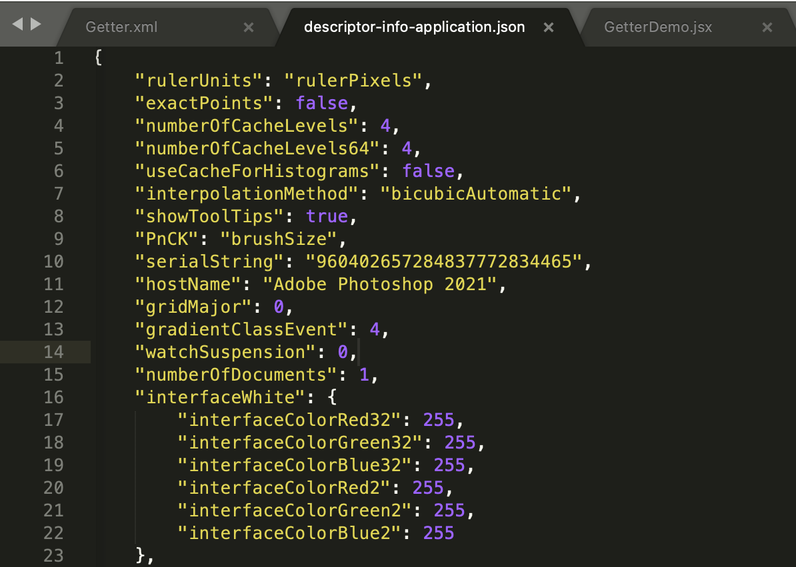](https://blog.cutterman.cn/assets/gallery/contents/Snip20211220_5.png)

[Json output](https://blog.cutterman.cn/assets/gallery/contents/Snip20211220_5.png)


#### 3. Padda

https://github.com/cutterman-cn/padda

这是我开发的一个脚本辅助工具，里头有一项功能，是可以实时输出当前图层的JSON数据结构，图层切换，它会会自动更新

[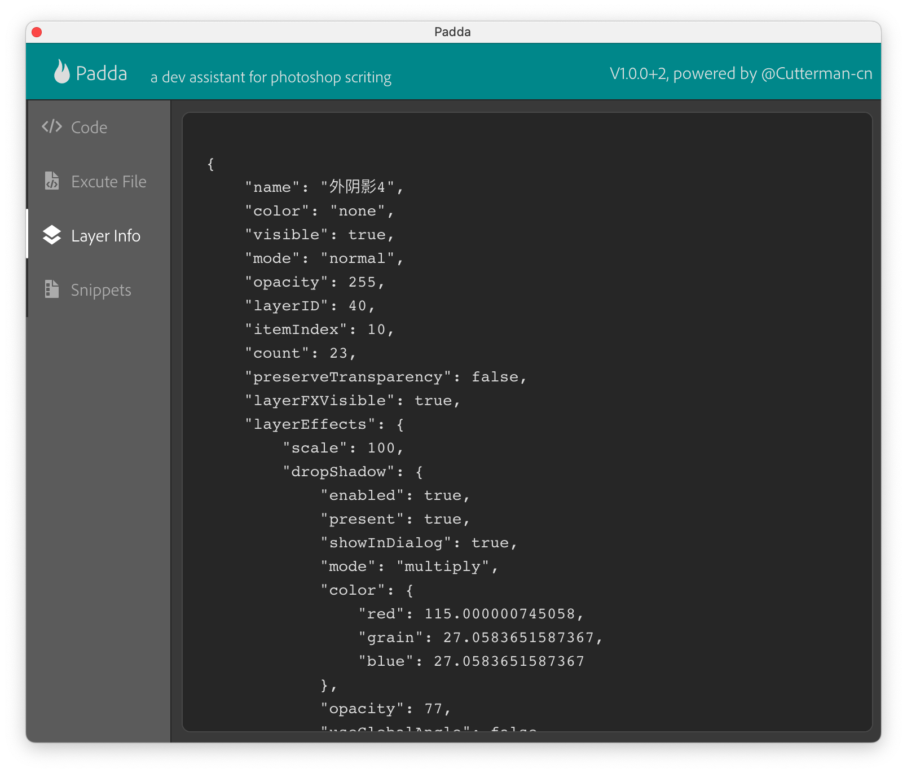](https://blog.cutterman.cn/assets/gallery/contents/Snip20210909_3.png)

[padda layer](https://blog.cutterman.cn/assets/gallery/contents/Snip20210909_3.png)


#### 4. 官方代码

CC2015之后的版本，Ps官方支持针对一些对象进行JSON输出，提供一个**json**的字符串key

```
var af = new ActionReference();
    af.putProperty(charIDToTypeID("Prpr"), stringIDToTypeID("json"));
    af.putEnumerated(stringIDToTypeID("document"), charIDToTypeID("Ordn"), charIDToTypeID("Trgt"));
var ad = new ActionDescriptor();
    ad.putReference(charIDToTypeID("null"), af);
var desc = executeAction(charIDToTypeID("getd"), ad, DialogModes.NO);
var json = desc.getString(stringIDToTypeID("json"))
```

上面这段代码，会将当前文档以json数据结构进行输出，也很方便让你进行数据检查

## 总结

通过上面介绍的诸多方法和工具之后，你会发现，ActionDescriptor才真正提供了宿主完整的信息，比DOM提供的丰富的多的多，基本上，有了AD，你几乎不太需要使用DOM的API了，比如获取选中的图层，你可以用AM代码来写，隐藏，添加，修改图层等等这些，都可以用AM代码来写，并且AM代码要比dom api性能更优，所以也推荐你尽量使用AM代码来编写插件，少用Dom api。

本文介绍的示例代码，可以在下面工程中找到

https://github.com/cutterman-cn/cep-panel-start.git

分支： actionmanager