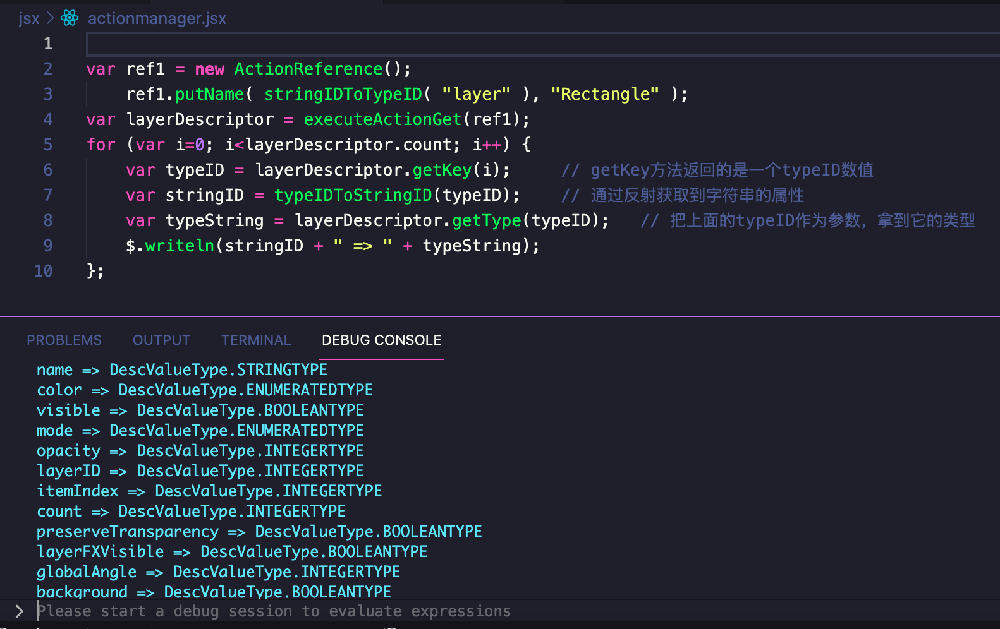

上篇文章我们介绍了如何使用Action Manager来从PS中获取数据，我们深入讲解了ActionDescriptor的组织结构和使用逻辑，本质上和JS开发没有多大区别，我们通过ActionDescriptor, ActionReference, ActionList这3个对象以及他们提供的方法，进行递归遍历，将其中的key和value打印出来，以获取我们需要的数据项。并且我还介绍了如何从宿主全局出发通过对象树分析的方法，挨个将Ps的各个对象和数据进行挖掘，这样你就不需要去猜测某个目标用什么key了，这些key都在对象树的属性当中。如果你仔细研读该文章，并且自己实际动手去尝试了，应该就能够自己尝试的去写一些AM代码了，然后会发现它的功能针对比官方提供的DOM API要丰富强大的多。

这篇文章，我们开始介绍AM三部曲的最后一篇，如何对宿主进行设置操作。把设置放在最后来讲，是因为它相比GET行为，要更难，更不好理解，也更不可预期。所以阅读本篇文章，一定要专注认真，尽量跟随我的思路往下走，我会努力将这套方法一点点剖析出来，尽管如此，也不能确保Ps所有的目标对象都是可以设置成功的，这点你要提前明白。让我们开始吧


> 本文是此系列教程中的精华，内容较长，要保持耐心。文章是我长时间思考、研究成果，内容原创，全网独一份，转载请注明出处。

## ActionDescriptor逆向操作

我们上一篇介绍的获取数据，是通过ActionDescriptor对象的**getXXX**方法来拿到目标对象的某个属性值实现的。那如果现在要修改这些值，是不是反过来去**setXXX**就可以了呢？

带着这个猜测我们去翻一下ActionDescriptor对象的API，能够发现它确实提供了设置属性值的方法，**putXXX**和**getXXX**基本是相对应的，于是我们大体可以判断，要修改目标对象的属性值，就是通过AD的put相关的方法来达成，整体是GET的一个逆向过程。

```
declare class ActionDescriptor {
    putBoolean(key: number,value: boolean): void;
    putClass(key: number,value: number):void;
    putDouble(key: number,value: number):void;
    putEnumerated(key: number,enumType: any,value: any):void
    putInteger(key: number,value: number):void;
    putList(key: number,value: any): void;
    putObject(key: number,classID: number,value: any):void;
    putPath(key: number,value: string): void;
    putReference(key: number,value: ActionReference): void;
    putString(key: number,value: string): void;
    putUnitDouble(key: number,unitID: number,value: number): void;
}
```

### 1. 简单例子

我们先通过一个简单的例子来展开：**修改选中图层名称**，通过上一篇文章，我们知道获取选中图层名称的代码大体是这样

```
var ref1 = new ActionReference();
    // 它的含义是 layer -> ordinal -> target，也就是当前选中的图层
    ref1.putEnumerated(charIDToTypeID("Lyr "), charIDToTypeID("Ordn"), charIDToTypeID("Trgt"));
var layerDescriptor = executeActionGet(ref1);
var value = layerDescriptor.getString(stringIDToTypeID("name"));
$.writeln(value);
```

那反过来，我如果要修改这个图层的名称为abc，是不是这样就行了呢？

```
var layerDescriptor = executeActionGet(ref1);
layerDescriptor.putString(stringIDToTypeID("name"), "abc");
```

我们用ScriptListener插件，手动改一下图层的名称，会输出如下代码

```
var desc1 = new ActionDescriptor();
    var ref1 = new ActionReference();
        ref1.putEnumerated( stringIDToTypeID( "layer" ), stringIDToTypeID( "ordinal" ), stringIDToTypeID( "targetEnum" ) );
desc1.putReference( stringIDToTypeID( "null" ), ref1 );
    var desc2 = new ActionDescriptor();
        desc2.putString( stringIDToTypeID( "name" ), "abc" );
desc1.putObject( stringIDToTypeID( "to" ), stringIDToTypeID( "layer" ), desc2 );
executeAction( stringIDToTypeID( "set" ), desc1, DialogModes.NO );
```

这里面很多代码我们都见过了，我们将它的层次结构图画出来

[](https://blog.cutterman.cn/assets/gallery/contents/set.png)

[set layer name](https://blog.cutterman.cn/assets/gallery/contents/set.png)


可以看到要对目标进行修改，最外层是通过调用**set**这个命令，然后给它传递一个**ActionDescriptor**，这个动作描述里头包含了一个对当前选中图层的引用，接着把一个新创建的AD赋值给整个图层，这个新创建的动作描述里头只有一个name = abc这样的属性和值，相当于把一个新的AD覆盖到图层原有的AD上。以达到更新的数据的目的。

其中第7行 **desc1.putObject( stringIDToTypeID( “to” ), stringIDToTypeID( “layer” ), desc2 );** 可以再解释一下，这里的**layer**其实可以替换成**null**,或者**target**，效果都是一样的，它的含义就是把**desc2**这个动作描述符设置到的reference的对象上。

有了修改**name**属于的经验之后，你可以继续试试修改图层的其它属性，其它属性可以通过我们之前学习的到遍历属性的方法拿到，然后通过该属性的类型，使用对应的**putXXX**方法来设置

[](https://blog.cutterman.cn/assets/gallery/contents/Snip20211219_13.png)

[property type](https://blog.cutterman.cn/assets/gallery/contents/Snip20211219_13.png)


如果你试了就会发现，有些属性是可以按照上面的代码修改的，有些是不行的，比如**layerID**, **itemIndex**，你是无法直接给**itemIndex**设置一个新的值来达到修改图层顺序的目的，因为Ps的图层顺序是有相互依赖的，它会影响到这个图层的顺序树，因此它是通过另外一个**move**命令来进行修改的。

我们继续扩展一下上面的例子，上面的例子只针对选中的图层进行操作，很多时候我们都没法先选中再操作，我们需要根据某些特定的条件来操作，比如根据图层顺序、图层ID或者图层名称来做修改操作。那它本质上就是Reference所引用的目标对象不同而已，我们来看一下

```
var desc1 = new ActionDescriptor();
    var ref1 = new ActionReference();
        ref1.putName(stringIDToTypeID("layer"), "Camera");  // 把目标引用对象修改为图层名称是Camera的图层
desc1.putReference( stringIDToTypeID( "null" ), ref1 );
var desc2 = new ActionDescriptor();
    desc2.putString( stringIDToTypeID( "name" ), "abc" );
desc1.putObject( stringIDToTypeID( "to" ), stringIDToTypeID( "layer" ), desc2 );
executeAction( stringIDToTypeID( "set" ), desc1, DialogModes.NO );
```

上面代码就不是根据选中的图层来进行修改操作了，而是根据你想要条件的目标对象，同样的，你还可以根据我们上一篇学得到的知识，修改ActionReference所引用的目标对象来进行操作。

### 2. 复杂的例子

上面是一个简单的例子，代码结构也不复杂，我们现在来看一个复杂一些的情况。这是一个真实的案例，前一阵子一个网友找我求助，他希望在选中**文字**工具的时候，能够自动设置文字的字体。这个需求用ScriptListener是找不到代码的。

[](https://blog.cutterman.cn/assets/gallery/contents/Snip20220101_3.png)

[Text Tool options](https://blog.cutterman.cn/assets/gallery/contents/Snip20220101_3.png)


思路和上面一样，总体而言，我们大概需要设置一下文字工具的一些属性项，接下来，我们按照**逆向GET**的方法来完成这个操作，首先找到这些属性的项是什么，利用我们上一篇学习的知识，我们来把文字工具的各种属性给挖掘出来，然后通过**putXXX**修改该属性的值，再设置回去。

我们可以在**application**对象的属性中找到一个叫**currentToolOptions**的key，它就是上面截图框起来的部分，表示当前选中的工具的选项部分配置，并且还能知道它是一个Object类型，所以它里头又包含了一个ActionDescriptor

[](https://blog.cutterman.cn/assets/gallery/contents/Snip20220101_4.png)

[current tool options](https://blog.cutterman.cn/assets/gallery/contents/Snip20220101_4.png)


继续挖掘，我们可以一点点的找到每个层级的属性，直到找到我们最终想要的属性，大体属性结构图如下，我们发现字体的属性在**textStyle**下面

[](https://blog.cutterman.cn/assets/gallery/contents/tooloptions.png)

[text style](https://blog.cutterman.cn/assets/gallery/contents/tooloptions.png)


整个查找属性的过程代码如下

```
var ref1 = new ActionReference();
ref1.putEnumerated(stringIDToTypeID('application'), charIDToTypeID('Ordn'), charIDToTypeID('Trgt'));
var appDesc = executeActionGet(ref1);
var currentToolOptions = appDesc.getObjectValue(stringIDToTypeID("currentToolOptions"));
var textTool = currentToolOptions.getObjectValue(stringIDToTypeID("textToolCharacterOptions"));
var style = textTool.getObjectValue(stringIDToTypeID("textStyle"))
var fontName = style.getString(stringIDToTypeID("fontName"));
var fontStyleName = style.getString(stringIDToTypeID("fontStyleName"));
var fontPostScriptName = style.getString(stringIDToTypeID("fontPostScriptName"));
$.writeln(fontName + " - " + fontStyleName + " - " + fontPostScriptName);
```

找到这个字体的属性之后，我们开始逆向设置它，从上面简单例子的对照，我们大体可以将反向设置的树形图画出来

[](https://blog.cutterman.cn/assets/gallery/contents/settextstyle.png)

[set text style](https://blog.cutterman.cn/assets/gallery/contents/settextstyle.png)


有了这个树形图之后，我们就可以按照这个树形结构来编写AM代码了，我们先最底层开始，然后逐级往上，最后到Application。但是！最终的options不是直接修改application的currentToolOptions属性值，而是要修改当前选择的文字工具的属性，它不是对application生效的，因为你选中不同的工具，它的选项是不一样的，currentToolOptions相当于只是一个只读的快捷方式，在设置属性的时候，需要设置到对应工具这个目标对象上。

```
// 创建一个textStyle的AD，给它重新赋值
var textStyle = new ActionDescriptor();
    textStyle.putString(stringIDToTypeID("fontName"), "Consolas");      // 你想要的字体
    textStyle.putString(stringIDToTypeID("fontStyleName"), "Regular");
    textStyle.putString(stringIDToTypeID("fontPostScriptName"), "Consolas");

// 创建一个textToolCharacterOptions的AD，将textStyle赋值给它
var textToolCharacterOptions = new ActionDescriptor();
    textToolCharacterOptions.putObject(stringIDToTypeID("textStyle"), stringIDToTypeID("textStyle"), textStyle);

// 创建一个currentToolOptions的AD，将textToolCharacterOptions赋值给它
var currentToolOptions = new ActionDescriptor();
    currentToolOptions.putObject(stringIDToTypeID("textToolCharacterOptions"), stringIDToTypeID("textToolCharacterOptions"), textToolCharacterOptions);

// 将currentToolOptions赋值给文字工具
var desc1 = new ActionDescriptor();
    var ref1 = new ActionReference();
        ref1.putClass(stringIDToTypeID('typeCreateOrEditTool'));    // 文字工具这个目标对象
    desc1.putReference( stringIDToTypeID( "null" ), ref1 );
    desc1.putObject( stringIDToTypeID( "to" ), stringIDToTypeID( "null" ), currentToolOptions);
executeAction( stringIDToTypeID( "set" ), desc1, DialogModes.NO );
```

这个案例还是相对复杂的，但是原理是一致的，只是涉及到的层级比较多，同时多了一个有效目标对象的概念，有了这个例子之后，你可以自己尝试着去设置其它不同工具的不同选项值，看能不能成功，如果能成功，说明你已经理解并掌握了这个技能了，这权当是留给大家的作业。

### 3. 其它命令

上面的例子我们介绍的是修改某个目标对象的属性，它通过**set**命令来完成，本质上是修改目标对象的ActionDescriptor。除此之外，Ps的很多设置动作，是有自己单独的命令来完成的，比如修改图层顺序是**move**命令，新建图层是**make**，关闭文档是**close**等等，这些命令，基本上你都可以从ScriptListener中获取到。

这是一个选中多个图层的代码输出

```
var desc1 = new ActionDescriptor();
var ref1 = new ActionReference();
ref1.putName( stringIDToTypeID( "layer" ), "Color" );
desc1.putReference( stringIDToTypeID( "null" ), ref1 );
desc1.putEnumerated( stringIDToTypeID( "selectionModifier" ), stringIDToTypeID( "selectionModifierType" ), stringIDToTypeID( "addToSelectionContinuous" ) );
desc1.putBoolean( stringIDToTypeID( "makeVisible" ), false );
var list1 = new ActionList();
list1.putInteger( 246 );
list1.putInteger( 264 );
list1.putInteger( 248 );
list1.putInteger( 249 );
desc1.putList( stringIDToTypeID( "layerID" ), list1 );
executeAction( stringIDToTypeID( "select" ), desc1, DialogModes.NO );
```

你可以从中看到它通过传递多个**layerID**来完成选中的多图层的操作，于是你可以自己将上面的代码进行封装成函数，把图层ID传进去，就可以为自己所用了。

## 总结

本篇文章的主要内容就结束了，这篇文章的核心内容是向你介绍了**逆向法**来修改Ps的特性属性值，它的前提是你要对AD的正向属性获取有足够的熟悉，也就是上一篇文章的内容。这三篇文章是逐渐递进，少一节都无法全部掌握，所以想要学习的小伙伴，一定记得从**上篇**开始阅读。

Action Manager由于缺乏官方文档，也没有系统性的资料，所以不管是我，还是国外的各种大佬，都是从各种角落、前人的研究成果、官方代码碎片等地方进行参考，同时结合了**大量**，**大量**自己的研究和摸索，才对这种黑暗魔法有一丁点了解和沉淀，所以，如果你想要学习的话，光靠网上的资料，是永远无法满足述求的，核心还是需要自己不断去猜测、尝试、验证，然后总结，才能真正掌握这个技能。这三篇文章的内容，就是我长时间的摸索总结下来的**可复制**，**可操作**，**实用性强**的一套逻辑方法，希望你可以学会这套方法来探索更多的内容。

关于AM的系统性介绍就这三篇内容，但是关于它的知识点并没有结束，后续的篇章里头，我们还会经常涉及到这块的知识，并且都以实战为主，敬请期待~~