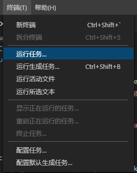
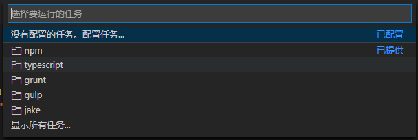
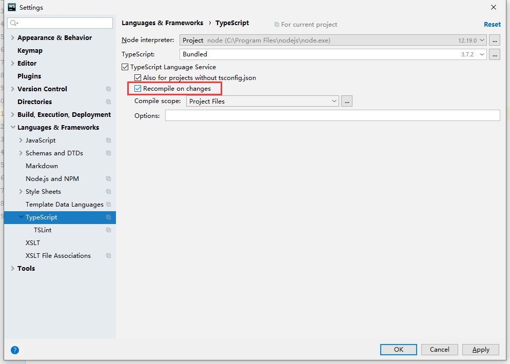

## 安装

```bash
npm install -g typescript
```

## 命令

```bash
查看版本
tsc -v
```

## 配置tsconfig.json

### 生成tsconfig.json文件

```bash
tsc --init
```

### 配置详解

```json
{
  "compilerOptions": {
    "allowUnreachableCode": true, // 不报告执行不到的代码错误。
    "allowUnusedLabels": false,	// 不报告未使用的标签错误
    "alwaysStrict": false, // 以严格模式解析并为每个源文件生成 "use strict"语句
    "baseUrl": ".", // 工作根目录
    "experimentalDecorators": true, // 启用实验性的ES装饰器
    "jsx": "react", // 在 .tsx文件里支持JSX
    "sourceMap": true, // 是否生成map文件
    "module": "commonjs", // 指定生成哪个模块系统代码
    "noImplicitAny": false, // 是否默认禁用 any
    "removeComments": true, // 是否移除注释
    "types": [ //指定引入的类型声明文件，默认是自动引入所有声明文件，一旦指定该选项，则会禁用自动引入，改为只引入指定的类型声明文件，如果指定空数组[]则不引用任何文件
      "node", // 引入 node 的类型声明
    ],
    "paths": { // 指定模块的路径，和baseUrl有关联，和webpack中resolve.alias配置一样
      "src": [ //指定后可以在文件之直接 import * from 'src';
        "./src"
      ],
    },
    "target": "ESNext", // 编译的目标是什么版本的
    "outDir": "./dist", // 输出目录
    "declaration": true, // 是否自动创建类型声明文件
    "declarationDir": "./lib", // 类型声明文件的输出目录
    "allowJs": true, // 允许编译javascript文件。
    "lib": [ // 编译过程中需要引入的库文件的列表
      "es5",
      "es2015",
      "es2016",
      "es2017",
      "es2018",
      "dom"
    ]
  },
  // 指定一个匹配列表（属于自动指定该路径下的所有ts相关文件）
  "include": [
    "src/**/*"
  ],
  // 指定一个排除列表（include的反向操作）
  "exclude": [
    "demo.ts"
  ],
  // 指定哪些文件使用该配置（属于手动一个个指定文件）
  "files": [
    "demo.ts"
  ]
}
```

## 编译

```bash
tsc  //编译(一次性编译)
tsc xxx.ts
tsc -watch  //编译并监视(每次保存待编译文件都会自动更新编译文件)
```


## 配置自动编译ts文件

+ **VSCode配置**

1. 点击终端 -> 运行任务



2. 点击typescript



3. 点击监视


+ **webstorm配置**

