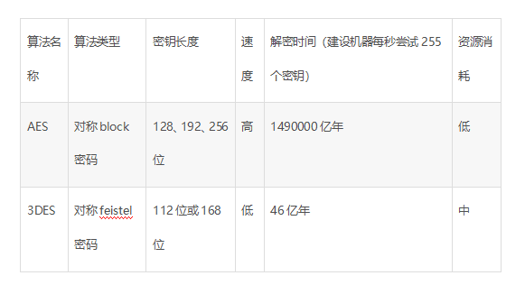

# 几种常见的加密技术介绍

## 对称加密

### DES  

数据加密标准，速度较快，适用于加密大量数据的场合

以64位为分组对数据加密，它的密钥长度是56位，加密解密用同一算法。DES加密算法是对密钥进行保密，而公开算法，包括加密和解密算法。这样，只有掌握了和发送方相同密钥的人才能解读由DES加密算法]加密的密文数据。因此，破译DES加密算法实际上就是搜索密钥的编码。对于56位长度的密钥来说，如果用穷举法来进行搜索的话，其运算次数为256

### 3DES

基于DES，对一块数据用三个不同的密钥进行三次加密，强度更高

### AES

高级加密标准，是下一代的加密算法标准，速度快，安全级别高

该加密算法采用对称分组密码体制，密钥长度的最少支持为128、192、256，分组长度128位，算法应易于各种硬件和软件实现。这种加密算法是美国联邦政府采用的区块加密标准，这个标准用来替代原先的DES，已经被多方分析且广为全世界所使用。

+ AES与3DES的比较

  

## 非对称加密

### RSA

由 RSA 公司发明，是一个支持变长密钥的公共密钥算法，需要加密的文件块的长度也是可变的

### DSA

数字签名算法，是一种标准的 DSS（数字签名标准）

### ECC

椭圆曲线密码编码学

## 散列算法

散列是信息的提炼，通常其长度要比信息小得多，且为一个固定长度。加密性强的散列一定是不可逆的，这就意味着通过散列结果，无法推出任何部分的原始信息。任何输入信息的变化，哪怕仅一位，都将导致散列结果的明显变化，这称之为雪崩效应。散列还应该是防冲突的，即找不出具有相同散列结果的两条信息。具有这些特性的散列结果就可以用于验证信息是否被修改。
单向散列函数一般用于产生消息摘要，密钥加密等

### MD5

是RSA数据安全公司开发的一种单向散列算法，非可逆，相同的明文产生相同的密文

### SHA

可以对任意长度的数据运算生成一个160位的数值

## 总结

如果是 RSA建议采用1024位的数字，ECC建议采用160位，AES采用128为即可