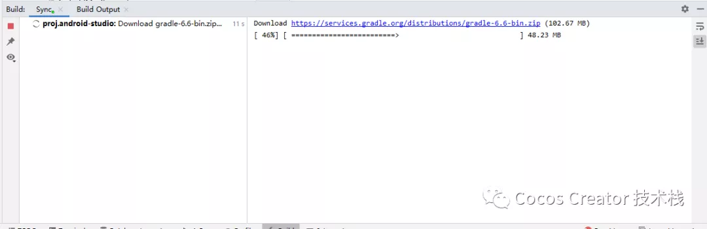

### **版本信息**

Cocos Creator：2.4.5

Android Studio：4.1.3


### **升级 Gradle**

项目中经常会接入一些 SDK，而 SDK 基本都是基于原生平台开发，迭代速度比较快，其依赖的 Gradle 版本比较高

而通过 Cocos 构建的项目，Android 的 Gradle 版本是跟随 Creator 版本的，所以在接入 SDK 的时候，如果 Creator 版本中设置的 Gradle 版本低于 SDK 中需要的 Gradle 版本，就会编译报错

这时候需要我们自己手动修改

好在随着 Creator 版本的迭代，很多功能也越来越完善

比如现在升级 Gradle，只需要很简单的几步就可以完成


1**构建**

在 Creator 构建面板中按照自己的需求构建 Android




**·** **APP ABI：**

ABI 全称：Application Binary Interface

不同的 Android 设备使用不同的 CPU，而不同的 CPU 支持不同的指令集。CPU 与指令集的每种组合都有专属的应用二进制接口 (ABI)

主流的 ABI 架构

1. armeabiv-v7a：第7代及以上的 ARM 处理器，2011年以后的生产的大部分 Android 设备使用该架构
2. arm64-v8a：第8代64位 ARM 处理器，目前主流的 Android 设备使用该架构
3. armeabi：第5代、第6代的 ARM 处理器，早期的手机使用的比较多
4. x86：平板、模拟器使用得比较多
5. x86_64：64位的平板


通过 adb 命令可以查看手机的 CPU 架构

- 

```
adb shell getprop ro.product.cpu.abi
```


2**更改gradle版本**

Gradle 插件版本和 Gradle 版本一定要对应

其对应关系：

https://developer.android.google.cn/studio/releases/gradle-plugin


**· Android Studio 更改**


选择版本，依然是要注意对应关系


通过 Android Studio 更改后，下面的几个地方会自动更新，同样也可以手动更改


**· 手动更改**


构建后默认的 Gradle 插件版本为 3.2.0，更改为 4.1.3


Gradle 版本为 4.10.3，更改为 6.6


通过 Android Studio 更改后，会显示下载状态


3编译

下载完成后，编译报错：


game 用于构建 Google Instant App，可以直接删除


在 setting.gradle 中删除 ,**':game'**, **':instantapp'**

```

```


重新编译，就可以正常运行了

>https://mp.weixin.qq.com/s/duWokZsIRyJW8HhrSY04JA