去年，古风模拟经营类手游《江南百景图》成功破圈，成为年度现象级爆款。 **如何将它搬到小游戏平台？是转换还是重写？使用哪些技术方案，能在包体大小仅为原版 1/20 的同时，达到与 App 版相当的游戏体验？** 椰岛小游戏研发负责人 **大城小胖** ，带着他近 300 页的 PPT，在 Cocos 的两次线下活动中做了全面的技术分享。

[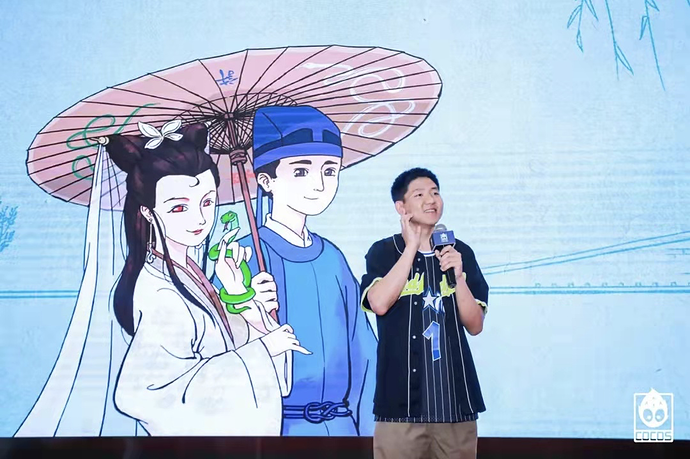game1080×720 838 KB](https://forum.cocos.org/uploads/default/original/3X/9/8/9883303807d49355ff8a6dd7d2aaa2f49a2fefe7.png)

## 转换 or 重写

《江南百景图》App 版游戏包大小有 **600+M** ，上线前期还有部分用户反映游戏运行时手机发热严重。而小游戏版在经过立项选型后，决定使用 **Cocos Creator** 重写，仅用了 1 天就做出了 Demo。经过 4 个月的优化，我们最后将包体压缩到 **30M** 左右，同时保证游戏体验与 App 版相当。

[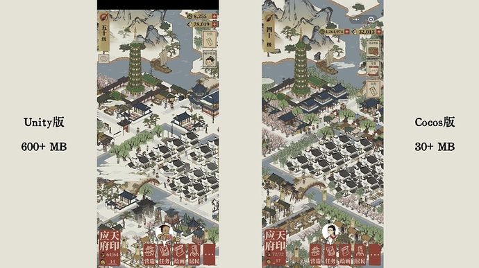B095A344-0AB8-4ACF-94BA-013CA3E08EE11352×760 243 KB](https://forum.cocos.org/uploads/default/original/3X/f/2/f2bfc91809d669dadfeb16e796cec5c89d25f83c.jpeg)

优化的过程中，我们做了以下工作，其中 代码 部分需要重新设计和编写。

[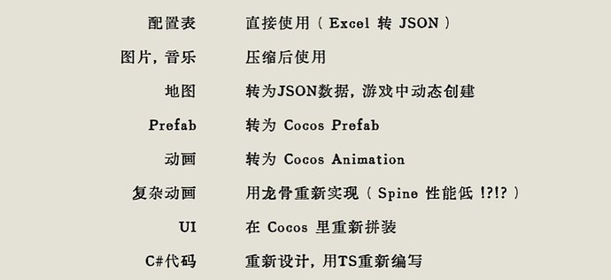WeChat53065d81487f52e0255e074c84201dc31000×460 60.2 KB](https://forum.cocos.org/uploads/default/original/3X/5/3/53aab9f244d81a91e1b51ff39e8dcaa13fba467b.jpeg)

## 渲染优化

原生版本的《江南百景图》移植到小游戏首先需要解决的就是 **耗电高、易发烫、Draw Call 高** 等问题。

### 合批

合批是降低 Draw Call 最快也是最有效的方式。优化同样的 Texture，将多张的图片合并到一张图集上，这样不论要生成多少张不同的图片，都不会打断合批渲染，Draw Call 也就降低下来了。

但是《江南百景图》的资源非常多，每个玩家使用资源的顺序也不尽相同，如果玩家使用的资源分别在不同的图集上，还是会导致合批渲染被打断，产生 Draw Call。因此，针对这一情况，我们采用了 **Multi-Texture** 的方式进行了优化，其原理是将传统的判断是否在同一张图集，转换为判断是否在 **同一批图集**，这样就大大减少了 Draw Call 产生。

[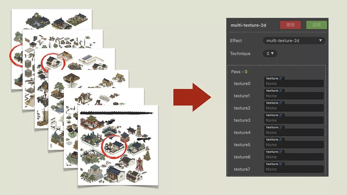WeChatfcf178e3cfb6af9dc743dd61503c0a0f1000×562 123 KB](https://forum.cocos.org/uploads/default/original/3X/0/b/0b02e9c4bdfd13e7fd07b60379cc7136e6c41e84.jpeg)

另外，通过 gl.getParameter(gl.MAX_TEXTURE_IMAGE_UNITS) 这个指令，可以知道在一台设备中 Shader 最多支持几张图集。测试发现目前 90% 以上的手机至少支持8张，因此我们将批图集的数量设置为8张。因为一个批次有 8 张图集，所以我们是通过这个 idx 判断某张图用的哪个图集，代码也很简单。

[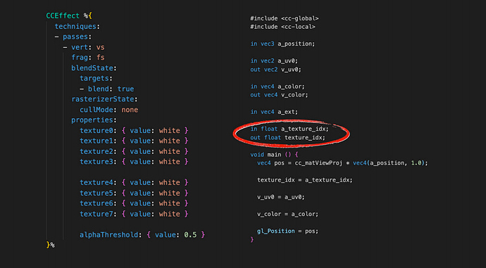drawcall1052×582 129 KB](https://forum.cocos.org/uploads/default/original/3X/8/8/88bdcf1f9172895d4c831523cdce9f6a662543e5.jpeg)

### 动态合图

小游戏版本采用了 Cocos 的动态合图机制，这样在 CDN 下载的图片也能进行合图。而为了提高合图的效率，避免浪费空间，我们会将长度或者宽度特别大的图片进行裁剪。

[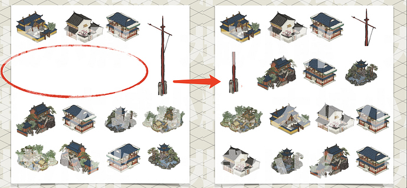all01438×666 311 KB](https://forum.cocos.org/uploads/default/original/3X/b/4/b446cecc364dfeea8d93a43883e10306d3e8e47b.jpeg)

例如左图中的旗杆，由于图片太长，在动态合图时会导致空间浪费，因此我们将这张旗杆的图片裁剪成两张，如右图所示，再在项目中进行拼接处理。

### 采用同一个材质资源

在《江南百景图》中，玩家移动地图时，原本在显示范围外的图片将从水墨色变为彩色。

[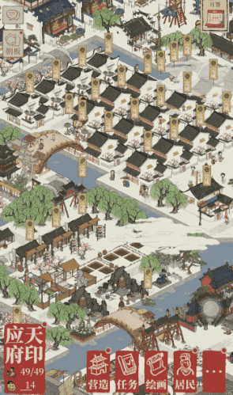__3350×592 1.71 MB](https://forum.cocos.org/uploads/default/original/3X/e/9/e9e61ec6f1fb8d99cfaac1dccebdc7ded886f4f7.gif)

传统的方案是改变图片材质，当地图移动到要显示的节点时，节点一个一个地进行材质的切换，达到一个 “淡入淡出” 的效果。但是在项目中尝试之后，我们发现这样会导致 Draw Call 上升，而且拖拽地图又是一个很频繁的操作，游戏中实际效果较差。

因此在这里我们将所有城市物体资源，无论是人物还是建筑、常态还是淡入状态，都用统一的 Material、并使用顶点数据传递“时间参数”，以此节约性能消耗，最终达到所有建筑和人物的创建、移动、销毁等全都只需要一个材质就能够完成。

[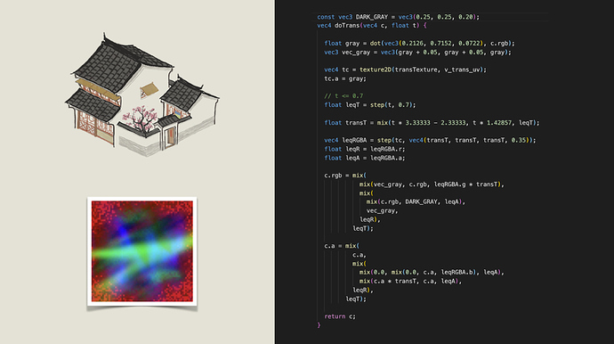material1358×760 157 KB](https://forum.cocos.org/uploads/default/original/3X/4/1/416e46414a4d15eae7ac81a72c01edac69690d1e.jpeg)

很多人会觉得一个普通的图片也用这么复杂的方案，会影响性能，导致性能变差。但是实际测试效果并不差，这也告诉我们，在游戏开发中还是要以实践为准，不能想当然。

### 优化 Shader 的输入数据

由于《江南百景图》的图片资源中不会用到 Color 这个属性，因此在材质中，我们将原有的 Color 数据去除掉。

[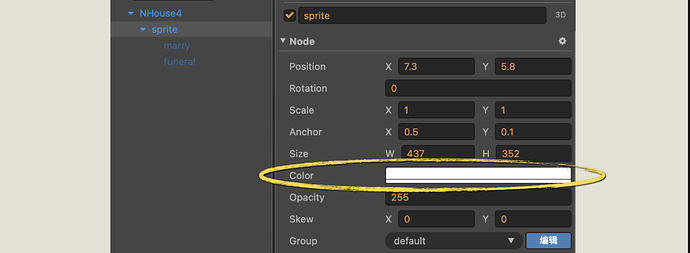nodeColor1360×500 78.3 KB](https://forum.cocos.org/uploads/default/original/3X/4/4/444c32fc675866f9ce63e0f191ad468e88d82fee.jpeg)

下图是一个正常的顶点数据：

[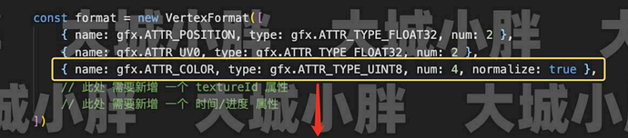vertex2256×498 234 KB](https://forum.cocos.org/uploads/default/original/3X/7/d/7d4e0447ab4b4645e570003873dd8896cea7dcee.jpeg)

接下来就是将原有的 Color 数据去除掉。用来存放项目中所需要的其它信息，这样做可以减少 CPU 与 GPU 互相传输的数据量。

[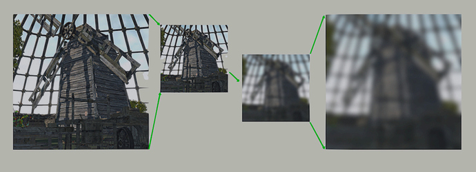scaleVague1840×668 240 KB](https://forum.cocos.org/uploads/default/original/3X/0/e/0e1827996c8dbaf1132e7078c1c7db4eecb0963f.jpeg)

### 层级规划

我们将不同的类型的资源，分别放置在对应的层级中。《江南百景图》共分了13个层级，下图只展示了部分比较重要的层级：

[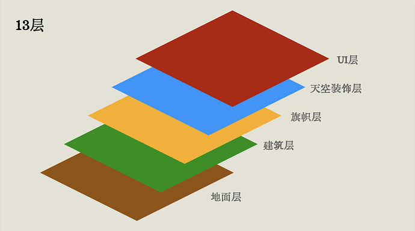hierarchy1360×760 84 KB](https://forum.cocos.org/uploads/default/original/3X/5/1/51d6e795bb268ea8d541c757ac4cc5e515d4f37f.jpeg)

其中比较有意思的是 **旗帜层** 。旗帜是《江南百景图》中的一个常见元素，但因为项目实际技术限制，无法将一个旗帜制作在一个完整龙骨动画中，如果强行放在一起，就会导致在渲染到旗帜的时候出现断批。我们采用了 **动态组织层级关系** 的方式来解决这个问题。例如这是一个原来的旗帜预制体：

[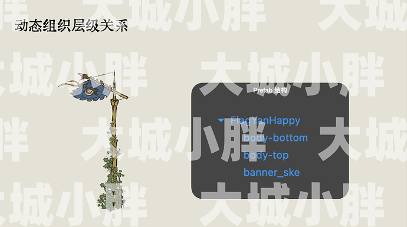flag1358×758 139 KB](https://forum.cocos.org/uploads/default/original/3X/9/6/96db2b554c83da8000fcf3fc1d32b5bf39584bec.jpeg)

采用 **动态组织层级关系** 的方式，将旗杆与旗面拆开，旗杆放在下面的普通建筑物层，旗面则单独分为一层旗帜层放在上层，这样就很好地避免了渲染时一直被打断合批的情况。

[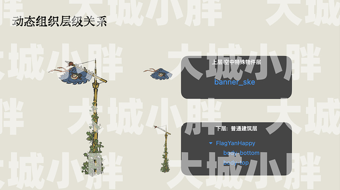changeFlag1358×760 148 KB](https://forum.cocos.org/uploads/default/original/3X/7/3/73357d7754a9edb6b962b63ff7be05f28a54a6a2.jpeg)

### UI 渲染优化

UI 部分我们没有使用动态合图或者 MultiTexture，动态合图我们留给了游戏中的人物和建筑、而没有使用 MultiTexture 主要是开发成本的原因。但在我们的优化下，现在游戏的 Draw Call 可以降得很低。

[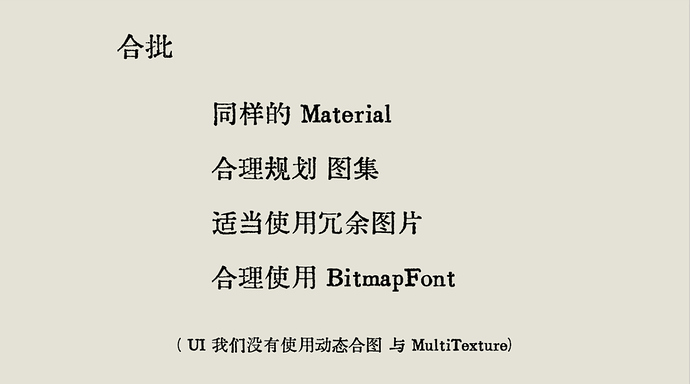UIShader1360×758 85.4 KB](https://forum.cocos.org/uploads/default/original/3X/b/9/b919b3fe7a5a3efc2e9e3e2c0a1b23eecdd16058.jpeg)

UI 方面我们也是做了分层，比如下面左边的图上我们的 button 层，里面都是按钮部分，右边是我们的标签牌层级。这样我们就可以根据功能区去划分图集，然后和游戏里的层级对应起来，而不会打断合批。

[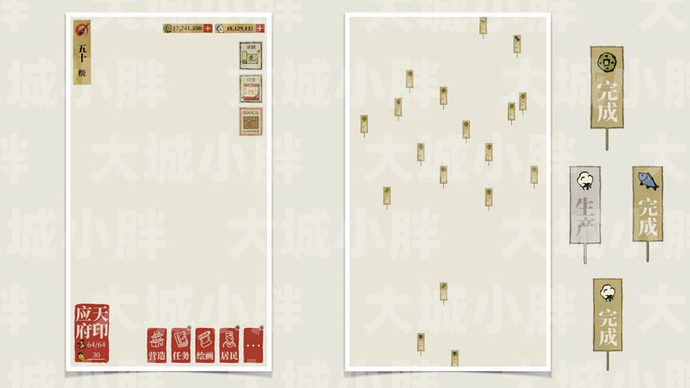Layered2130×1198 305 KB](https://forum.cocos.org/uploads/default/original/3X/4/5/45e15b10834e01180dca1cd5ba91ae83c9c5f03c.jpeg)

## 自定义引擎

Cocos 是个开源引擎，我们可以根据项目的实际需要，对引擎进行定制、修改，从而达到更好的效果。

### 增强 TiledMap

我们在 Cocos Creator 原有的 TiledMap 组件的基础上，拓展了新的功能，下图是 Cocos 自带的组件。

[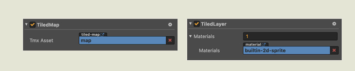tiledmap2262×456 69.2 KB](https://forum.cocos.org/uploads/default/original/3X/1/a/1ac039278ceb8147895fce5d9233c155933a48d1.jpeg)

这里就不详细说了，有兴趣的可以去官方文档查阅，我们主要来说一下经过拓展的新功能。

[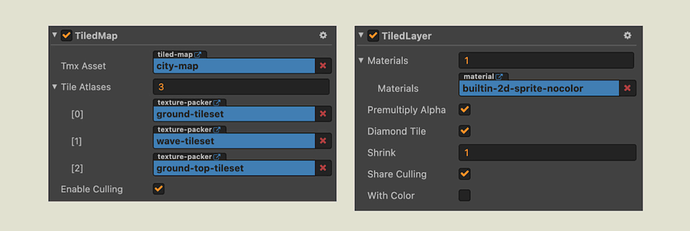tiledmap21178×396 90.5 KB](https://forum.cocos.org/uploads/default/original/3X/7/8/78d6e6874ac20ca36c91fa423f2239e2bca130c8.png)

**1. Diamond Tile：** 游戏中使用了很多 TiledMap 中的图块菱形方块， 但是引擎默认的传递方式是矩形，这样就会造成数据浪费和冗余。

[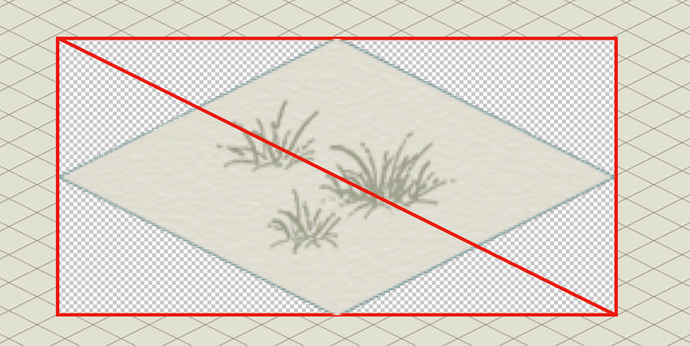tiledmap3934×469 167 KB](https://forum.cocos.org/uploads/default/original/3X/6/5/652ca553ed4da04afc760cc879eeacbf9f117a41.jpeg)

这些图片首先都是 **规则的菱形** ，所以很简单，直接 **根据宽高进行进行计算。**

[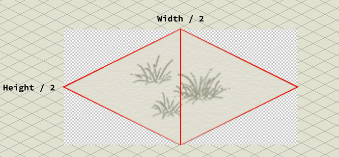tiledmap41098×510 201 KB](https://forum.cocos.org/uploads/default/original/3X/d/f/df07655bd851f5989e509deaa1b0b15b214e41e0.jpeg)

将菱形周围多余的部分切割，这样很明显图片大小减少了一半.这里注意一下非标准图形就不能这么用了。

**2. Share Culling：** 《江南百景图》共有三层 TiledMap 地图层， **勾选时** 将只对 TiledMap 的第一个地图层进行处理判断可视区域的范围，而其他的地图层将直接照搬第一个地图层的处理结果，这样能够节约不少性能。

[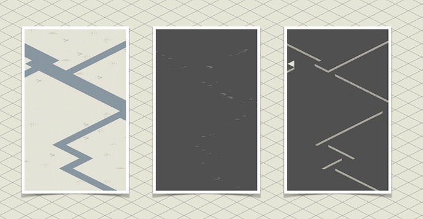tiledmap52434×1262 424 KB](https://forum.cocos.org/uploads/default/original/3X/a/1/a116b10ce07631408863f7c9315e2ad6fcdb6242.jpeg)

**3. With Color：** 如果不需要颜色数据就可以勾选，减少数据量的传输。

### 将道路转为 Tile

游戏中的道路是不需要进行淡入淡出效果的，如果当作普通建筑物资源来用之前的材质进行渲染，会消耗相当多的性能。因此我们将道路作为 Tile Map 地图的一部分，让道路不需要用之前提到的材质进行渲染。

还有一个小细节，在 Tiled Map Editor 中设置的宽高，与实际项目中使用是无关的，因此在生成的时候可以将地图块按照实际项目需求进行缩小，减少资源使用。

[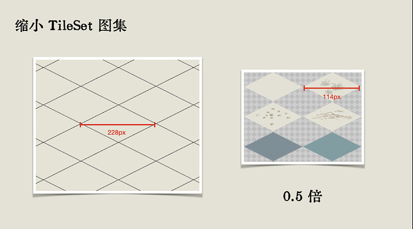tileSet1360×758 114 KB](https://forum.cocos.org/uploads/default/original/3X/f/9/f9eebd4b483586f731f11eadb8633f041792fd18.jpeg)

## 资源压缩

将一个原版 600+M 的游戏压缩到最终的 30M 左右，资源的压缩工作必不可少。我们需要将游戏资源进行合理的压缩，使其更加适合小游戏运行，并且不影响游戏最终的显示效果。

### 图片缩放

对不同类型、不同清晰度的资源，我们可以设置不同的缩放比例。我们将大部分的建筑缩放到原来的 0.65 倍，背景中的山川则被缩放到原来的 0.3 倍。另外，就算是相同位置上使用的人物立绘，由于每个人物的自身和背景的颜色、精度不同，也都可以给它们设置不同的缩放比例。

[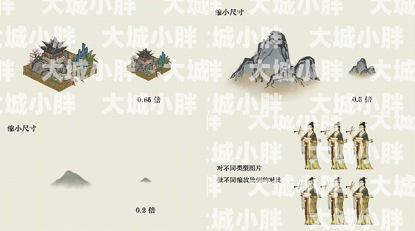smallSpr1540×861 429 KB](https://forum.cocos.org/uploads/default/original/3X/e/e/eedb9fee93991333f882f2a21a383cc2ab909fe0.jpeg)

于是我们将所有 Sprite 组件采用 **Custom** 模式，可以自由控制比例。不同的图片使用差异化配置，设置不同的缩放比例，用脚本控制缩放比例，这样便可以打包出任意画质和体积的各种版本，并且还提升了动态合图的利用率和部分性能。

[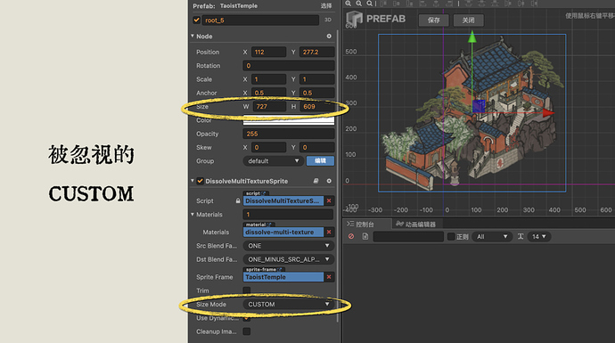custom1358×758 202 KB](https://forum.cocos.org/uploads/default/original/3X/3/5/35924e503fef6f01afb3d0d7ff5789a7b066a3c7.jpeg)

[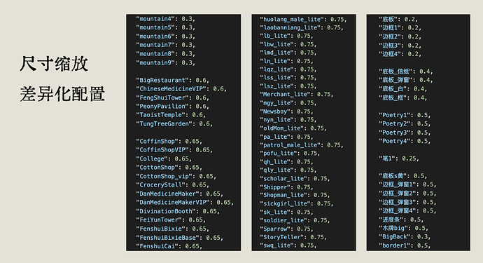scale1348×734 283 KB](https://forum.cocos.org/uploads/default/original/3X/0/1/0192f906bf946f3ef74213b7ca422f0f95cff574.jpeg)

### 图片减色

综合比较了大家比较熟知的 tinypng 和 pngquant 两种工具之后，项目最终选择使用 **pngquant** 对 PNG 图片进行批量压缩。pngquant 可以自定义压缩品质，而且 pngquant 开源，容易维护，风险可控。pngquant 也提供像 ImageAlpha 这样的工具，可以实时查看图片减色后的效果，方便调整参数。

[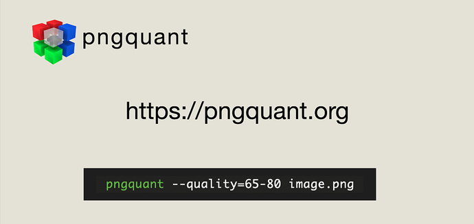pngquant1358×644 66.9 KB](https://forum.cocos.org/uploads/default/original/3X/b/9/b97c2d261047898f59c898b462eeb4a3e1ba08a5.jpeg)

需要注意的是，由于 Cocos 会进行合图处理，如果对 Build 前的图片做压缩，合图时前期的一些压缩工作可能就此无效化，所以我们要对 **Build 后的图片** 做压缩处理。

另外我们也建议程序多了解一下图片格式以及其原理。不是所有图片都要使用 PNG 格式，也会有使用 JPG 的情况。

## 场景剔除

这部分我们的需求是 **只渲染可视物体** 。那么用什么方法确定哪些物体是可见的呢？最开始我们使用了四叉树，但是在 JS 语言中的效果并不好。所以我们给地图划分格子，Grid 的单元格大小要适中，但单元格的边长应为 **2的整次幂** ，便于利用 **位运算** 提升性能。

如下图所示，红框就是镜头，所以需要渲染的也就是这个红框里出现的格子。然后我们再根据建筑物的坐标、大小去进行计算，判断建筑在哪一行哪一列的格子里，从而确定该建筑物是否是需要被渲染的物体。

[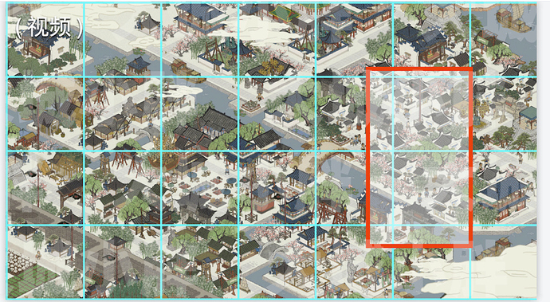clear1077×592 443 KB](https://forum.cocos.org/uploads/default/original/3X/c/e/ce2c592c6d7d5ee09951a360eb25b80a408e2e13.jpeg)

[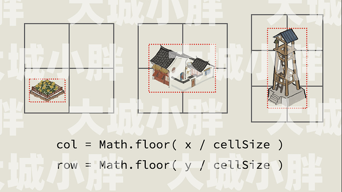test1812×1018 283 KB](https://forum.cocos.org/uploads/default/original/3X/b/a/ba11d1e8c208c7b93da3f2a788b942e1025296a5.jpeg)

这是一段简单的检测函数 大家可以根据自己的项目需求去进行扩展。

[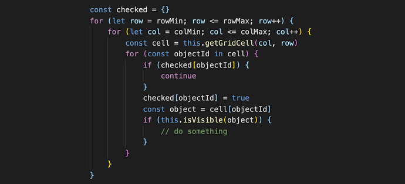testTs1786×814 139 KB](https://forum.cocos.org/uploads/default/original/3X/c/8/c8581b727739ce77d7f034970b12b916757925b6.jpeg)

除此之外，为了防止特殊情况出现，判断的可视范围需要比实际范围更大一些。

[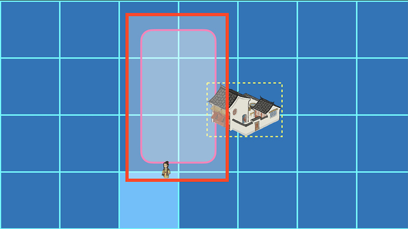range1812×1020 184 KB](https://forum.cocos.org/uploads/default/original/3X/0/4/041307027f02bc2cbf06483906c8db5ef9b16704.jpeg)

## 寻路

《江南百景图》使用的寻路算法，有针对单源单点的 **A*** 和单源多点的 **Dijkstra** 。但这里我们要讲的不是寻路算法，而是在游戏中的用法优化。

针对地图很大、建筑物和人物都很多的情况下，这些算法一起执行就会很损耗性能。所以我们用了 **分时寻路** ，就是把寻路过程由一帧分到若干帧去进行计算，这样就不会在某一个时间段集中进行大量运算，对游戏性能也不会有太大的影响。

[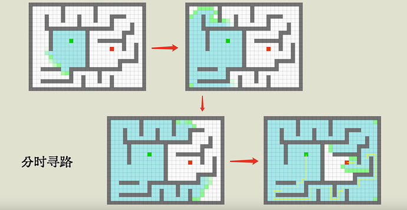pathfinding2040×1056 343 KB](https://forum.cocos.org/uploads/default/original/3X/5/7/57a5e095c4b3d385b579b5883fea038ac28e7ed8.jpeg)

除此之外我们还在游戏里做了一个大胆的优化，就是统一管理寻路任务，同一时间只为一个角色服务。也许有人会问，那岂不是一个角色在哪里走、其他对象都在那边等着？其实真正在游戏里不会有这种奇怪的表现。首先每个角色寻路的起始和结束时间都不一样，再者这个同一时间是非常短的，就等于把角色寻路分配到了不同帧里，交替进行执行。

## 再谈性能

### 模糊特效

玩家在打开《江南百景图》的任意界面时，游戏的背景需要做模糊处理，而背景中的人物动画等仍需要正常播放。

[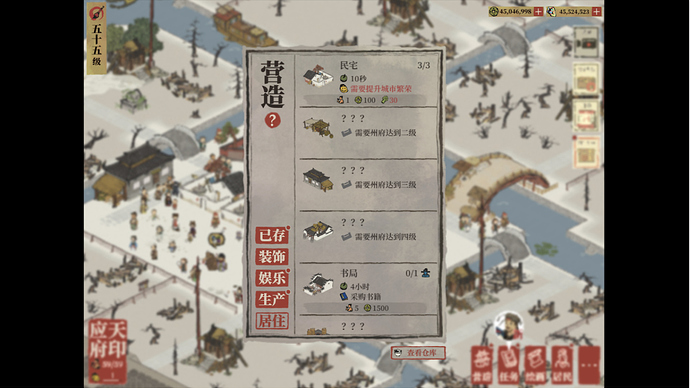vague1360×766 250 KB](https://forum.cocos.org/uploads/default/original/3X/8/2/82b3320e16f41e3b31728a26788a3084fd74a128.jpeg)

模糊效果我们最常见的就是高斯模糊。高斯模糊的效果很好，但是性能却较为一般。下图是常见的一些模糊算法：

[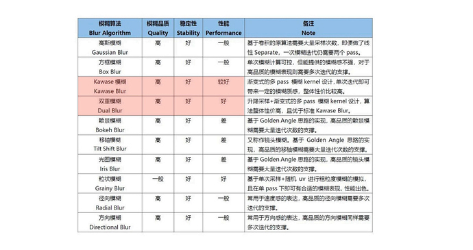blur1360×720 211 KB](https://forum.cocos.org/uploads/default/original/3X/3/8/38ca5e09bee396b55d889a07d4d5dc750eddb8ae.jpeg)

经过综合的考虑，在江南百景图项目中，最终采用了 **Kawase 模糊**，具有较高的效果的同时又具有较好的性能。关于更多的各种模糊的详细介绍，可以参考 [十种图像模糊算法的总结](https://zhuanlan.zhihu.com/p/125744132)。

下面的是对于传统的高斯模糊与 Kawase 模糊的效果对比：

[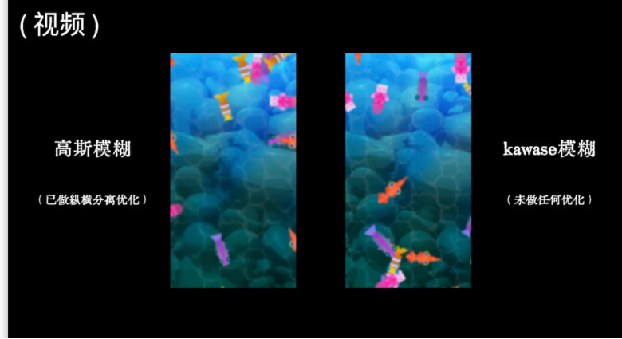blurCompare780×425 61.4 KB](https://forum.cocos.org/uploads/default/original/3X/2/7/2755dec0d7ebf82818923e895866d52a41a8e4b2.jpeg)

运用了高斯模糊的的画面很卡大概是每秒 **十几帧** 的样子。而采用了 **Kawase 模糊** 的画面是可以流畅运行的，可以跑满 **60 帧**。

另外，还有一个可以适配任何模糊算法的方法，可以将要模糊的图片先渲染到一个小的 RenderTexture 上，然后将其 **模糊后再放大** 显示，这样做可以增加模糊算法的 **处理速度**。如下图所示:

[scaleVague1840×668 240 KB](https://forum.cocos.org/uploads/default/original/3X/0/e/0e1827996c8dbaf1132e7078c1c7db4eecb0963f.jpeg)

### RenderTexture 池

在小游戏或 Web 端 **创建 RenderTexture** 时，比较损耗性能。所以我们在游戏中使用完 RenderTexture 后，不是直接销毁，而是将其放在一个 **缓存池** 中，下次从缓存池中调用符合要求的 RenderTexture 即可。

### 点击检测

《江南百景图》中有很多建筑物，而在用户点击时，并非简单地通过地形上的块做判断，而是给每个建筑物画了一个 **多边形检测区域** 。但是建筑物是移动的，如果 **多边形检测区域** 也随之移动，从性能和逻辑上都不是好的处理方式。

[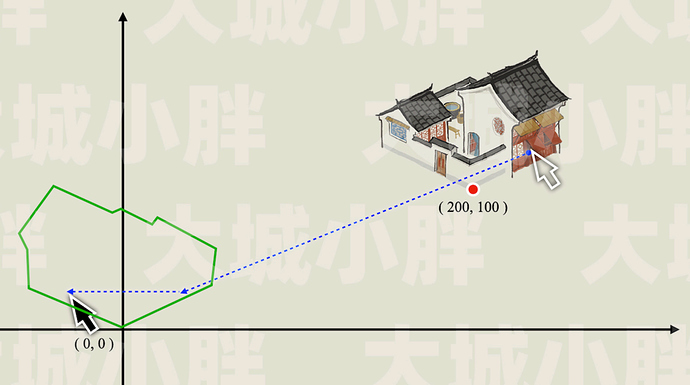click1910×1066 234 KB](https://forum.cocos.org/uploads/default/original/3X/4/7/4709dad4d7e0fe59d6045f1ad58a307bc3d78dfc.jpeg)

于是在实际操作中，我们让建筑物移动，而对应的 **多边形检测区域** 不做移动，并将其设置在原点坐标上。用户点击操作时，将点击的坐标减去建筑物相对原点的坐标，就可以进行点击检测了。同理如果建筑物是反转状态，可以将点击坐标进行镜像，而 **多边形检测区域** 仍然可以不做调整。类似还有其他情况，大家也可以去了解一下各情况下对多边形的处理方式。

### 数组排序

数组排序是大家容易忽略的一个优化模块，很多开发者在开发中都直接使用 **Array.sort()** 这样的 **快速排序** 算法，但是其实每种排序算法其实他都有一个擅长的场景。在开发中应该针对实际的项目情况采用合适的排序算法。例如 **Array.sort()** 排序更适用于混乱无章的数据，而在江南百景图项目中 **每一帧** 都会对这些人物建筑物进行排序，而这一帧对于上一帧来说差异不会很大，也就是相对 **有序的数据**。因此，它更适合使用像下图这样的 **插入排序** 算法。能更好的提升运算的效率。

[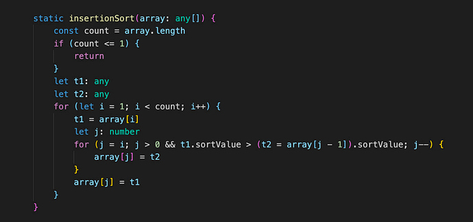sort1814×852 135 KB](https://forum.cocos.org/uploads/default/original/3X/6/0/60cbc1c86d0c2600261dc810515e29c666d3efc1.jpeg)

## 其他优化

### 「阅后即焚」

游戏中存在一些低频显示的大图，例如进入游戏时的公告、抽到的卡片等，玩家在游戏中看一遍就不会再出现了，对于这一类我们用了“阅后即焚”的思路。

[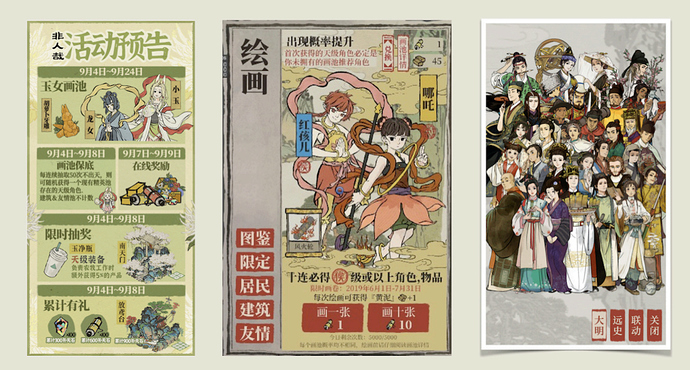image1197×642 358 KB](https://forum.cocos.org/uploads/default/original/3X/0/5/05516a09041b5d5a5f7f4d37e0eac2b19e87485a.jpeg)

像这些大图，我们通常先从远程服务器下载到本地缓存，产生 **Image** 对象，还有 **cc.Texture2D、renderer.Texture2D**。

[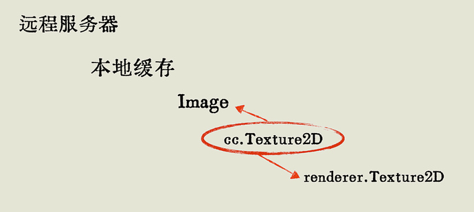download1145×513 55.7 KB](https://forum.cocos.org/uploads/default/original/3X/0/d/0d4d0b2867a7aa66add303b9f3d14bf5b0ef34d0.jpeg)

我们通过伪代码来简单讲解一下，加载图片时，将图片添加到我们自己创建的回收用工具类 TextureRecycle 中。

[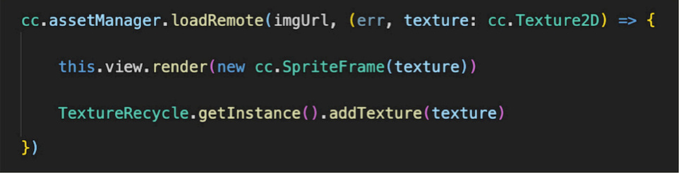destoryTs962×246 50.7 KB](https://forum.cocos.org/uploads/default/original/3X/6/4/64a6e7d3273f82fe5e4846aa5b92951c1cf55b0a.jpeg)

视图关闭时，通过工具类回收这些图片。

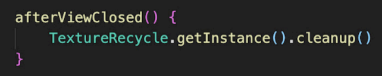

在图片的回收阶段中，就可以将以上所有用到的对象都清理干净了。

[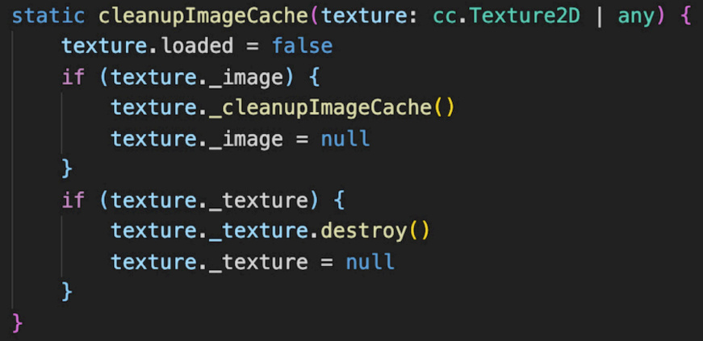cache871×423 79.5 KB](https://forum.cocos.org/uploads/default/original/3X/8/1/81a0be4e054d69873793209af73cc4770755d693.jpeg)

### 构建优化

在构建发布流程中，江南百景图项目使用了大量的自动化脚本来优化构建流程。包括 **全平台构建、上传游戏平台、资源预处理和后处理、CDN 同步和版本控制和二次混淆加密** 等。但成也脚本败也脚本，过长的构建时间也造成了不少困扰，因此我们也需要做一些额外优化。

Cocos 新版本添加了一个第三方开源压缩工具 **Sharp**，压缩级别是 0-9，数值越大压缩越久，而 Cocos 的默认参数是 **6**。由于我们已经进行过 **图片减色** 处理，因此我们将参数改为 **0**，这样就能减少很多构建的时间。

[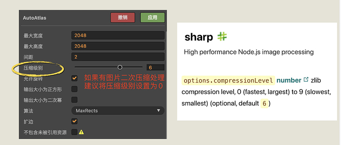buildVage1704×724 168 KB](https://forum.cocos.org/uploads/default/original/3X/a/1/a13f0931b92fb8e9532426c3eb7d8dd374d3c460.jpeg)

而在各平台构建时，总是格外漫长，原因是每次平台构建时，Creator 都要重新生成对应的平台图集。找到原因后，我们在每次构建前，将对应目录中的 **info.json** 中的 **actualPlatform** 参数先修改为 **对应的平台名称** 再打包，这个改动使我们的构建时间由之前的 15 分钟缩短到 10 分钟左右，提升了 30% 效率。

[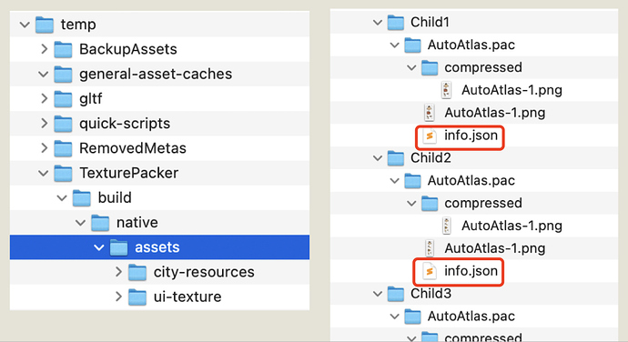route1328×724 144 KB](https://forum.cocos.org/uploads/default/original/3X/3/a/3a70c612895b461318927da0be3b2ec0ccd5483c.jpeg)

[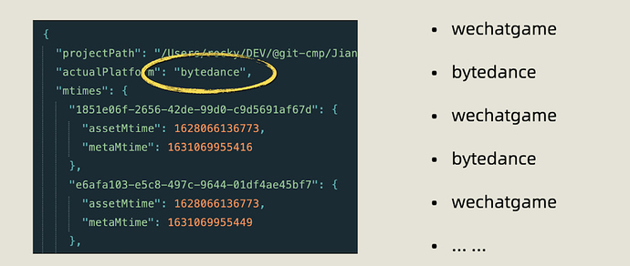routeScripts1666×706 185 KB](https://forum.cocos.org/uploads/default/original/3X/4/f/4f8d4e95ee9c113f0c88b9de17c06f0949b039b5.jpeg)

## 结语

在不懈的优化下，我们看到在现场演示时，这个用于官方演示游戏的高级账号，在游戏场景人物都很丰富的情况下，仍然只有 6 个 Draw Call。