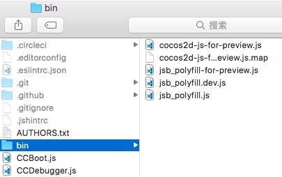
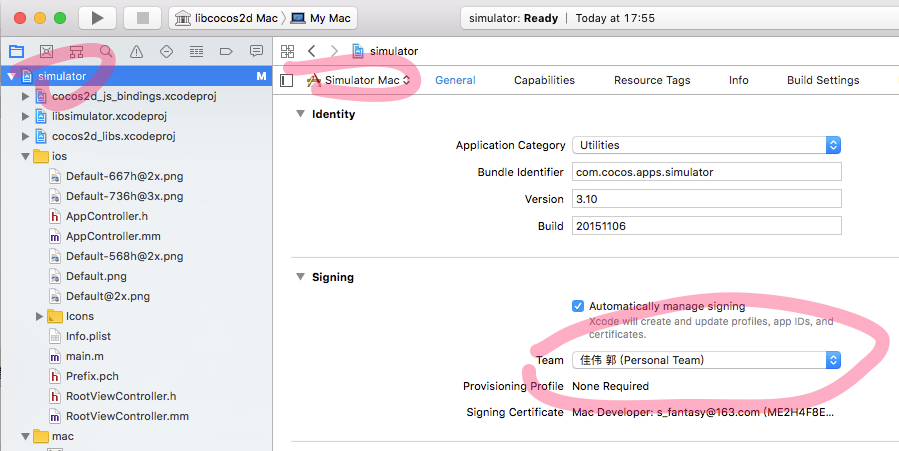

Cocos Creator 的引擎部分包括 JavaScript、Cocos2d-x 和 adapter 三个部分。全部都在 GitHub 上开源。地址在：

- **JavaScript 引擎**：[GitHub](https://github.com/lmb0989/cocos-engine)
- **Cocos2d-x 引擎**：[GitHub](https://github.com/lmb0989/engine-native)

Adapter 地址分别在：

- `jsb-adapter`：[GitHub](https://github.com/lmb0989/jsb-adapter)
- `Mini-game-adapters`：[GitHub](https://github.com/lmb0989/adapters)
- `runtime-adapters`：[GitHub](https://github.com/lmb0989/runtime-adapters)

建议通过 GitHub 的 fork 工作流程来维护自己定制的代码，以便在将来引擎升级时，可以方便地将定制的部分更新上去，具体操作方式请阅读 [Fork a repo](https://help.github.com/articles/fork-a-repo)。如果你愿意帮助 Cocos 越做越好，欢迎在 GitHub 提交你的修改，请参考 [如何向 Cocos 提交代码](https://docs.cocos.com/creator/2.4/manual/zh/submit-pr/submit-pr.html)。关于更多 GitHub 相关工作流程请参考 [GitHub Help](https://help.github.com/)。

另外，根据不同的 Creator 版本，还需要切换不同的引擎分支，例如：

- **master/develop** 分支：当前最新版本所用分支
- **vX.Y-release** 分支：对应 X.Y 版本所用分支
- **vX.Y** 分支：和 vX.Y-release 分支相同，主要用于版本发布之前的研发工作
- **next** 分支：大型重构所用分支

通常建议使用和所用 Creator 相同版本的 vX.Y-release 分支，如果找不到的话，则使用 master 分支。


## 定制 JavaScript 引擎

如果您只需要定制 Web 版游戏的引擎功能，或只需要修改纯 JavaScript 层逻辑（如 UI 系统，动画系统），那么您只要按照下面的流程修改 JS 引擎就可以了

1. ##### 首先您需要从 GitHub 上 fork 或者克隆 JavaScript 引擎的原始版本（地址见上文

   JavaScript 引擎在使用前请根据 Creator 版本切换相对应的分支。

2. ##### 修改 JS 引擎路径

   通过 **项目 -> 项目设置** 面板的 **自定义引擎** 选项卡，设置需要定制的 JavaScript 引擎路径。

3. ##### 安装编译依赖

   ```bash
   # node使用11.15.0版本
   
   cd E:/engine				# 在命令行中进入引擎路径
   npm install -g gulp			# 安装 gulp 构建工具
   npm install					# 安装依赖的模块
   ```

4. ##### 进行修改然后编译

   接下来您可以定制引擎修改了，修改之后请在命令行中继续执行：

   ```bash
   gulp build-dev
   ```

   该命令会在引擎目录下生成一个 `bin` 文件夹，并将引擎源码编译到 `bin` 目录下。

   

   > **注意**：如果在编译过程中出现 `JavaScript heap out of memory` 的报错，可执行以下命令解决：

   ```bash
   gulp build-dev --max-old-space-size=8192
   ```

##  定制 Cocos2d-x 引擎

如果您需要定制和原生平台相关的引擎功能，在修改 JS 引擎的基础上，可能还需要同步修改 Cocos2d-x 引擎。

1. ##### 获取 Cocos2d-x 引擎

   从上文中指定的 GitHub 仓库下载或者克隆。和 JS 引擎类似，Cocos2d-x 引擎在使用前也请确认当前所在分支

2. ##### 初始化

   下载或者克隆好 Cocos2d-x 引擎仓库后，在命令行进入引擎路径然后执行以下命令。

   > **注意**：如果是从编辑器拷贝出来的内置 **cocos2d-x** 目录，可以跳过该步骤。

   ```bash
   # node使用11.15.0版本
   
   cd E:/cocos2d-x  				# 在命令行进入 Cocos2d-x 引擎路径
   npm install						# 安装编译依赖
   npm install -g gulp				# 安装 gulp 构建工具
   gulp init						# 初始化仓库
   ```

   - 如果遇到类似下方这样的报错，请手动下载该 zip 文件。出错原因是您的 python 自带的一个库版本太低，但是不太好升级，比较简单一些的方法是下载该 zip 文件，手动放到 Cocos2d-x 引擎仓库下并重命名为 `v3-deps-54.zip`（不需要解压该 zip 文件），再重新运行 `gulp init`。

     ```bash
     > ==> Ready to download 'v3-deps-54.zip' from
     > 'https://github.com/cocos/cocos-engine-external/archive/v3-deps-54.zip'
     > Traceback (most recent call last):
     > ...
     > URLError: <urlopen error [SSL: TLSV1_ALERT_PROTOCOL_VERSION] tlsv1 alert protocol version (_ssl.c:590)>
     ```

   - 若遇到类似下方这样的报错，请手动下载该 zip 文件。手动放到 Cocos2d-x 引擎仓库 `tools/cocos2d-console` 目录下并重命名为 `creator-console-2.zip`（不需要解压该 zip 文件），再重新运行 `gulp init`。

     ```bash
     > ==> Ready to download 'creator-console-2.zip' from
     > 'https://github.com/cocos2d/console-binary/archive/creator-console-2.zip'
     > Traceback (most recent call last):
     > ...
     > URLError: <urlopen error [SSL: TLSV1_ALERT_PROTOCOL_VERSION] tlsv1 alert protocol version (_ssl.c:590)>
     ```

   - 若遇到类似下方这样的报错，通常是因为该 Cocos2d-x 引擎仓库是直接从 GitHub 下载而不是克隆下来的。可以执行 `git init`，然后再重新运行 `gulp init` 即可。

     ```bash
     fatal: not a git repository (or any of the parent directories): .git
     ```

3. ##### 修改引擎

   接下来可以对 Cocos2d-x 引擎进行定制修改了，由于只有在 **构建发布** 过程中才会编译代码，所以修改引擎后可以直接打开 **构建发布** 面板，选择 `default` 或者 `link` 模板进行构建和编译。

4. ##### 编译模拟器

   要在模拟器中预览您的引擎修改，需要执行以下命令来重新编译模拟器

   bash

   ```bash
   # node使用11.15.0版本
   # 通过 cocos console 生成模拟器
   gulp gen-simulator
   gulp update-simulator-config
   ```

   > **注意**：如果需要在 Mac 上通过 Safari 来调试模拟器中的 JavaScript 代码，则需要在生成自定义模拟器之前先在 Xcode 中随便设置一个签名。详见 [Build simulator](https://github.com/cocos/engine-native/blob/develop/README.md#git-user-attention)。

   

## 定制jsb-adapter

**jsb-adapter**的代码位于`resources/builtin` 目录下的 `jsb-adapter`

在 `jsb-adapter` 目录下，主要包括以下两个目录结构：

- `builtin`：适配原生平台的 runtime
- `engine`：适配引擎层面的一些 api

`builtin` 部分除了适配 BOM 和 DOM 运行环境，还包括了一些相关的 jsb 接口，如 openGL、audioEngine 等。

> 在 v2.0.7 之后，jsb-adapter 废弃了繁琐的手动编译的操作。可以直接修改 **builtin** 和 **engine** 目录下的源码。修改完成后打开编辑器，编辑器会在启动时自动编译这部分源码。

## 定制Mini-game-adapters

**小游戏** 的适配层代码位于 `resources/builtin` 目录下的 `adapters`。

- 这部分代码的定制，不需要任何编译操作。
- 引擎层面的适配工作，请在相应的 engine 目录下完成。

## 定制runtime-adapters

**runtime-adapters**的代码位于`resources/builtin` 目录下的 `runtime-adapters`

修改完成后，重新打开creator即可
