作者：洛小易
链接：https://www.zhihu.com/question/25984324/answer/727952266
来源：知乎
著作权归作者所有。商业转载请联系作者获得授权，非商业转载请注明出处。

**1.纪念碑谷**

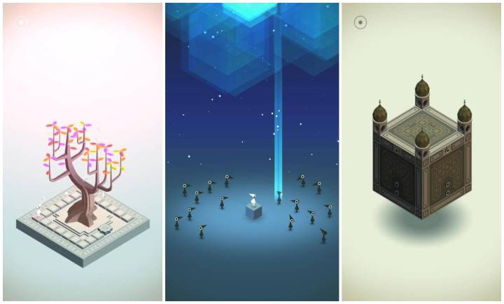

艾达公主的救赎之旅。

游戏以艾达公主归还神圣几何为解谜动机，利用视觉错位为我们编织了一个个唯美关卡。「纪念碑谷1」由原作加「艾达的梦」加「被遗忘的海岸」共计19章构成（10+1+8）。初玩游戏，从令人眼前一亮的视觉错位设定开始，再到乌鸦人、图腾等元素的出现，游戏逐渐变复杂，但更有趣。每帧都可用作壁纸的唯美画风配上灵动的音乐，与利用视觉错位和矛盾空间的操作交互成这部被玩家们吹爆多年的经典之作。

**2.纪念碑谷2**

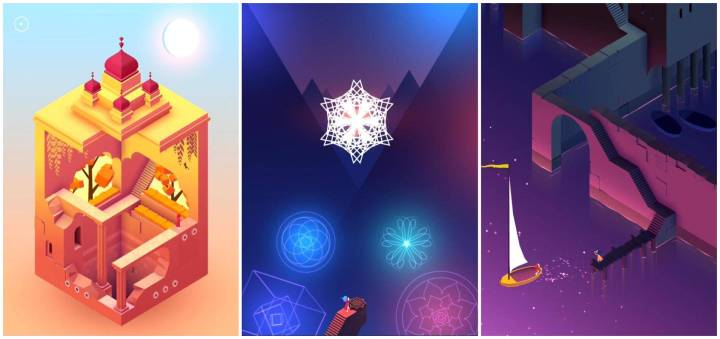

引领、爱、与成长。

相比「纪念碑谷1」，2作的声势明显小了些。原因在于2作并没有像玩家们期待的那样在玩法等方面增添新元素，整个游戏倒像是1作的大号DLC。不过2作也有值得赞叹的地方，游戏以全新的剧情出现在玩家们眼前，带我们展示了一个小女孩的蜕变之路。由一开始的跟随，到最后独自前行，探究神圣几何之谜的旅途促进了小女孩的成长。等等，我现在只想知道那个爱说鸡汤话的NPC和变蓝的门腾哥后来怎么样了……

[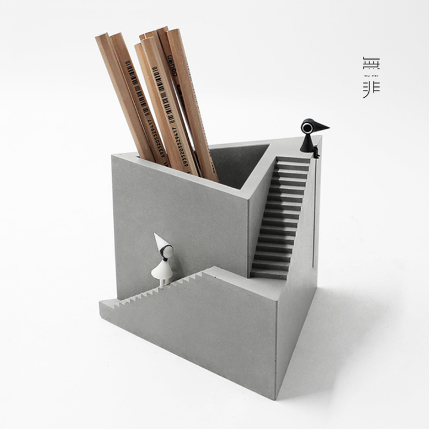無非\纪念碑谷周边 创意个性笔筒多功能水泥收纳盒办公淘宝¥ 89.00去购买](https://uland.taobao.com/ccoupon/edetail?e=E%2FS4Qtxv1VQGQASttHIRqYIeKmj0FAzqTPrPuyl8kYHq0569gqWHbNdVl2K1dJt4SGWLFeRs%2BAab21E%2BTf%2F7SD4z%2BtfB4glK9h0V5GdJyUh3vKSNKgrXNtq%2Fl1kYvV8PY2hDopkb155kIV%2BMDUY0Mn4xzDU8bGCkMSEmlRStydi9iSOy0jAsqhzPo%2BZxmGPYdj3Hchy1wJYuynEbLfMGNjwh43yW%2BFEDaXOtHj5%2BtxurH6TpTiumXMP8FCp3c9qpcW0FAk4P4CJ5lE90MSNLJA%3D%3D&traceId=0b5206f616064360191013872eb039&union_lens=lensId:TAPI@1606436020@0b5819c0_8fd5_176070c6142_0e49@01)

**3.未上锁的房间1**

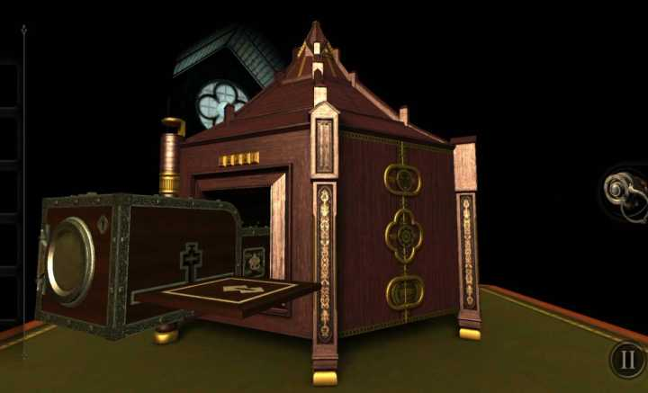

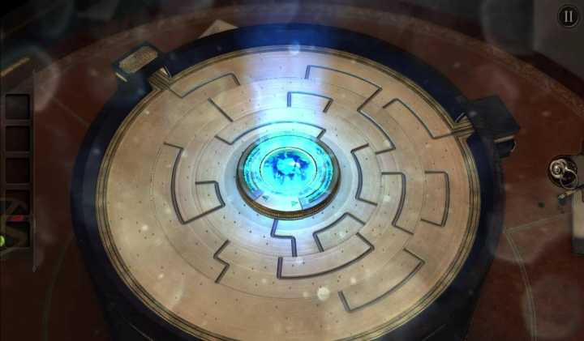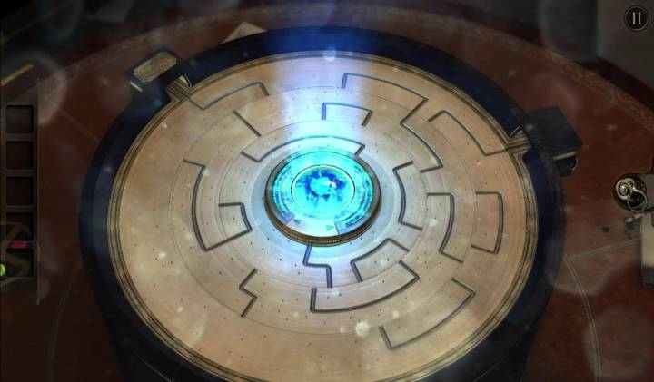

充满魔幻的盒子。

同样是个被广大玩家们吹爆的经典解谜之作，孤静诡异的音乐，稍具年代感的画风让人顿时身临其境。精密高深的盒子机关与目镜的搭配更是让我佩服设计者们的脑洞。尤其是一环扣一环的道具和线索没有提供任何多余无用的元素。当然，最想让我吹爆的还是解谜的逻辑性，每一个关键步骤都有或多或少的暗示和引导，不像其他解谜游戏会给人某种莫名其妙感。再次强推！

**4.未上锁的房间2**

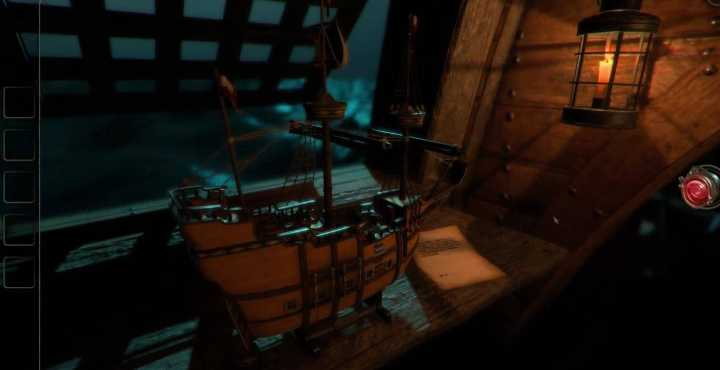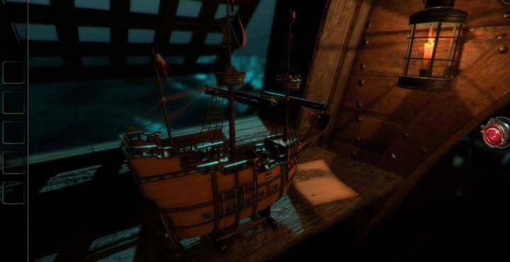

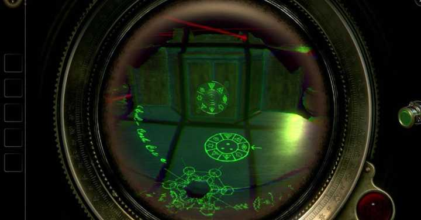

诡秘奇怪的房间。

个人认为2作仍然保持或者说提高了前一部的水准。它让我们把眼光从单纯的盒子解谜移到了整个房间，解谜所考虑的元素散播得更广了，不过解谜格局的开阔让人更舒适了。同时，2作的画面比1作更精致，音效也比1作更诡异，目镜比1作用得更频繁，剧情更让人健忘2333。好在最后终于离开了那座诡异的房子。赶紧让主人公找点吃的吧，放现实中以我的解谜速度他早饿死了~

[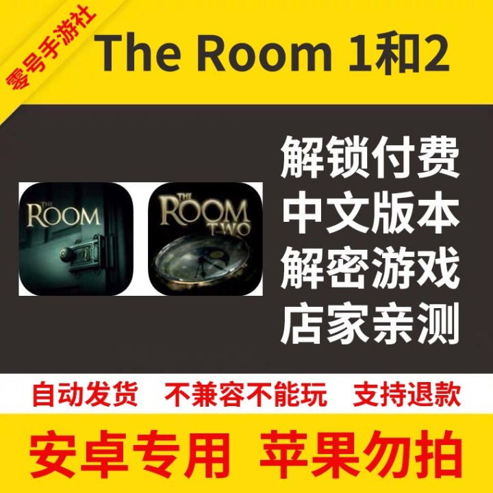The Room 1和2 未上锁的房间1 2 安卓完整版淘宝¥ 1.58去购买](https://s.click.taobao.com/t?e=m%3D2%26s%3DnUBK5yxkS%2BVw4vFB6t2Z2ueEDrYVVa64XoO8tOebS%2BdRAdhuF14FMRbJJ45GNATQt4hWD5k2kjMAtbf9FqI%2BxAaXQZijrFYGBih3Oft2s0pMIkUPZyjWyp3YXO2CkBYVIPBGd8BnON5DISwPSPhhPz7FOSPF5bQ7pDqxmnuA0ubmtVFQLzdyxpaYzSMEwlxT%2FufIeaShmLvWGPPZ03CRxOFU31q5DhUP4MAnT7hCx070MrbhEk%2B62TycZjAPhPKVz8YFe5%2BWp5pfzNmQ3EAS89zmZSGq9ptbzgq8wFaQkp3GDF1NzTQoPw%3D%3D&unid=1z2t7a1YQZW0&union_lens=lensId:TAPI@1605975373@0bba9815_99a5_175eb9777de_4e6d@01)

**5.未上锁的房间3**

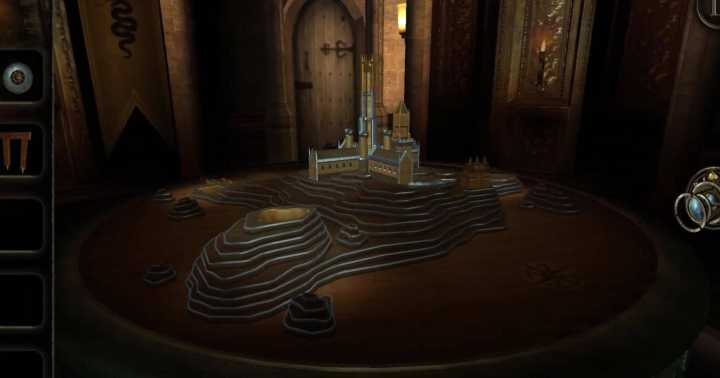

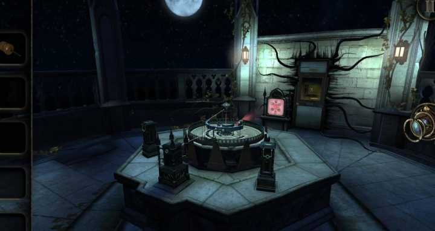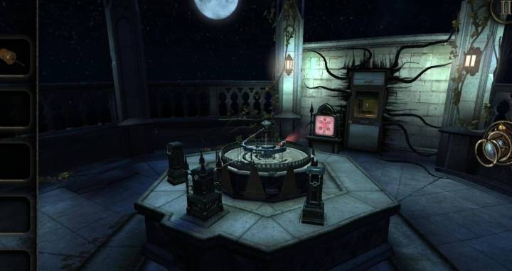

从列车到密室。

3作继承了前两部的水准，还是一如既往的优秀。解谜的格局越来越大，房间楼层间的来回穿梭，最后都跑室外解谜了，终于不觉得闷得慌了。画面更加精细，终章的多线索解谜更是增大了游戏难度，结尾4个结局也让整个游戏升华得更加诡异，是一部游戏性很强的解谜作品。

**6.机械迷城**

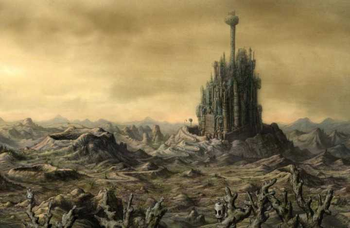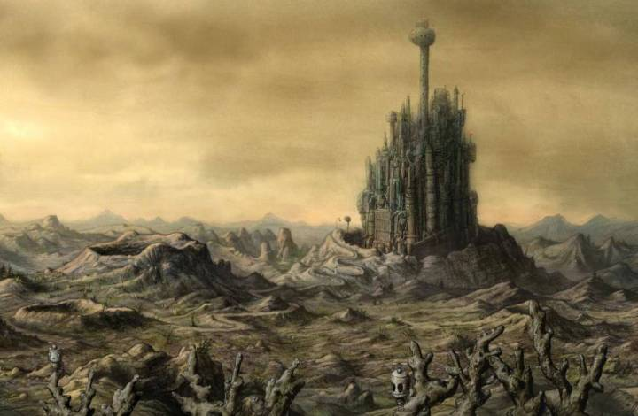

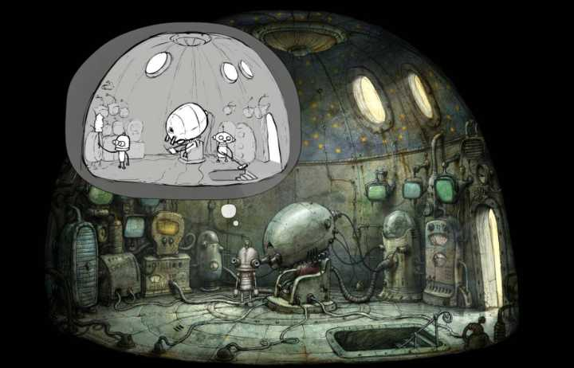

一个崭新的机械世界。

一部自由度很高的解谜游戏。整部具有机械制造感的画风和音效一下子就吸引住了我，简直就是设计者们为我们构造了一个全新的世界模型。而剧情方面也是通俗易懂，整部游戏不靠任何文字，单独借用主人公的回忆就能完整理解发生了什么以及自己的目标是什么。结尾的小情节让我一度认为还会出续作，不过可能希望不大了。

[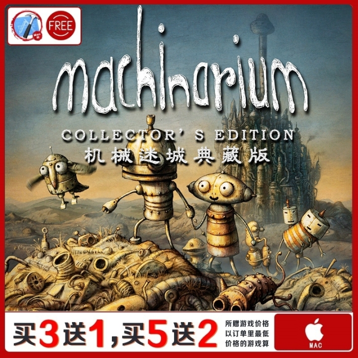机械迷城 for mac 支持苹果全系统 苹果电脑原生游戏淘宝¥ 3.00去购买](https://s.click.taobao.com/t?e=m%3D2%26s%3DnsWTn91x%2BDxw4vFB6t2Z2ueEDrYVVa64XoO8tOebS%2BdRAdhuF14FMcx2PQYCXQHtJ1gyddu7kN8Atbf9FqI%2BxAaXQZijrFYGBih3Oft2s0pMIkUPZyjWyp3YXO2CkBYV7%2FLmO3S9L5jDisvFHXiowKLWMw3EOEsyGtHDED2isd2uC6Cqkw7dOL6zEaqj93wEA13NwUW6D5tdBj80QSzHzooj1KpMYnuH5y9H62gxU5xpXUp9YHbrRmPSfpRcCAXe%2Fb61N8SVhvxEUNGDOFSD5KMmcB%2FnTtS%2FG%2BtfjzlEE%2FfGJe8N%2FwNpGw%3D%3D&union_lens=lensId:TAPI@1606436020@0b5819c0_8fd5_176070c6142_0e4d@01)

**7.地狱边境**

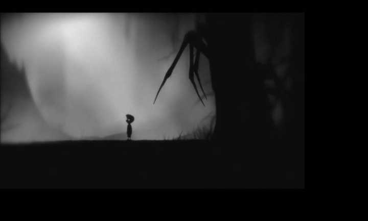

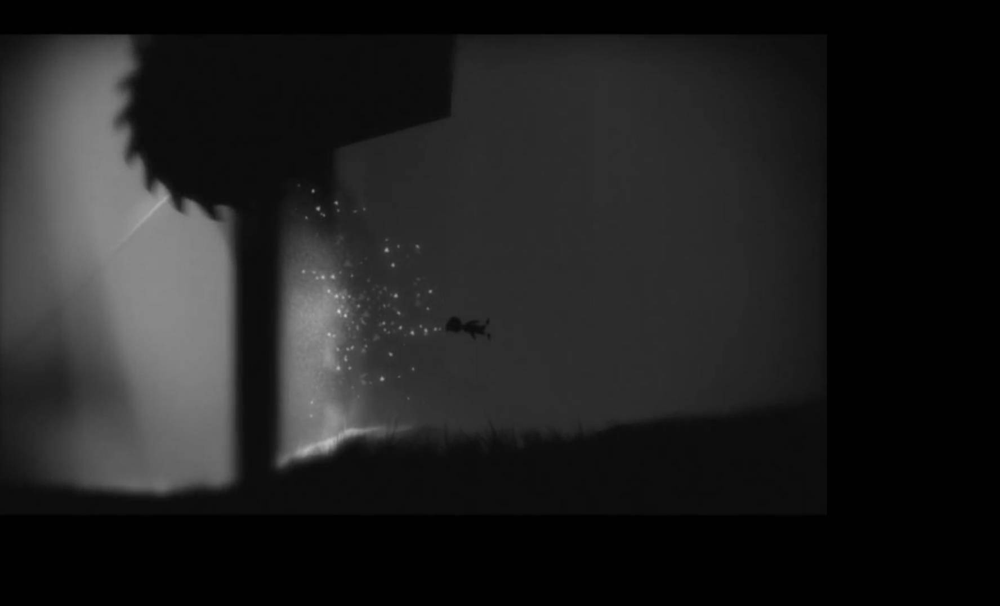

在地狱边缘寻求希望。

这是一部能让你内心发出无数“woc”的游戏。你需要扮演一个小男孩，克服路上的种种陷阱和阻碍，在地狱边境寻找自己的姐姐。游戏采用黑白色调，配合昏暗的谜雾，使得全屏唯一明亮的就是小男孩坚定的眼睛。再结合逼真诡异的音效，以及路上各种会让你挂掉的陷阱与生物，让这款游戏名副其实地成为一部恐怖类型的经典解谜作品。

[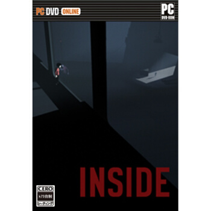Inside中文版 地狱边境 内部LIMBOⅡ京东¥ 18.00去购买](https://union-click.jd.com/jdc?e=jdext-1313637312208277504-0&p=AyIGZRtSEAMWB10ZXRUyEgZUGF4UBxMCUhJbFQAiQwpDBUoyS0IQWhkeHAxfEE8HCllHGAdFBwsCEwZWHloQAxcAXBtbFx1LQglGawtJYg4GRxsUZ1VhJk5ZV0RWYg9mGFMOHjdVElsXChMGVRxYJQITBlUfXhYBFAZlK1sQMlNpVRpbEQAWAFIrWiUCFQZRE10RBhcHUBJTJQIaA2XN9YHXmriMq%2F7DqLzS2KuOnKnGudMrayUBIlwATxJQHhIFVRlcFwQQB1YYWhwBFAFRGl4JAyIHVBpYHAcVBVESNRADEwZVHFkRBBtpVxpaFgEUAVAYWCUCIgRlRTUUUREOBUtcRmxIXhZdDkFaUWlXElgdCxsFZRlaFAAQ)

**8.王国保卫战**

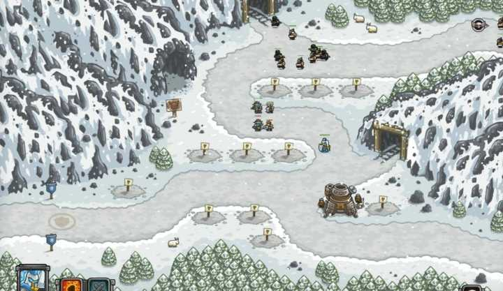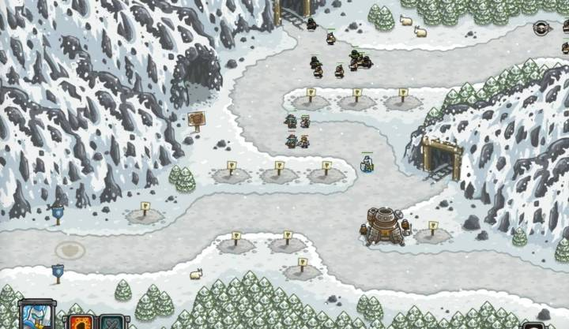

玩得停不下来的经典塔防。

如果说推荐的前几款游戏都是解谜经典，那这款就是一部当之无愧的塔防经典。游戏改变了传统塔防游戏的模式，新增了兵营、英雄、援军、科技树等元素，混合防御塔和法术，为我们带来了一部混合多种角度制作的突破性塔防游戏。多种不同类型的防御单位与属性多样的敌军，加上许多不同的游戏场景，为游戏赋予了高趣味性与高可玩性等特点。

**9.王国保卫战：前线**

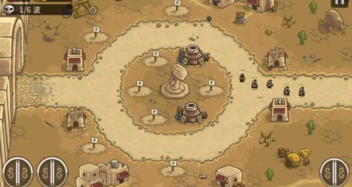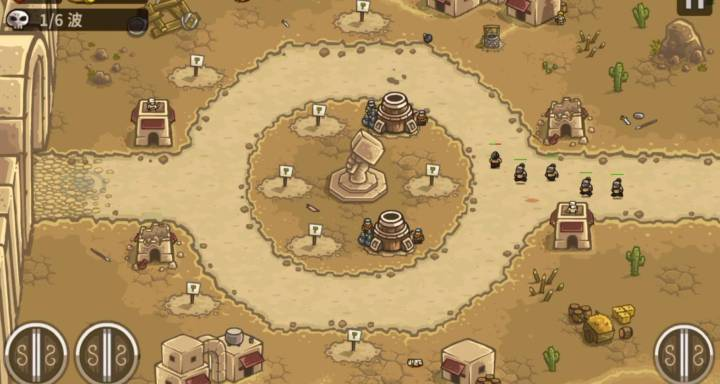

倍受喜爱的二代作品。

游戏比上代作品新增了全新的特殊炮塔与英雄，玩法变得更加丰富多样。一如既往的漫画手绘风格和应景的音乐与喊叫声把我们带入了这场紧张的战斗。40种不同属性、特性的敌人使得防御元素之间的配合依然重要。整体上讲，游戏确是一部保持原作水准的作品。

**10.王国保卫战：起源**

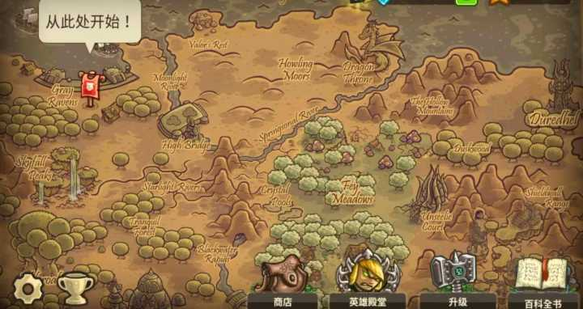

黑暗森林中的较量。

游戏继承了上部作品的游戏元素，又比上部作品新增了很多有趣的细节，能交互多种画面中与战斗无关紧要的元素。游戏画风依然是整部系列中统一的漫画风格，不过这部的主题变为了森林或自然，也是为了映照精灵族与怪物们对立的场景。在策略上游戏更加偏向于对友军利用上的把握，也加大了英雄的存在感。总体来说，依然是部有趣而漫长的作品。

**11.王国保卫战：复仇**

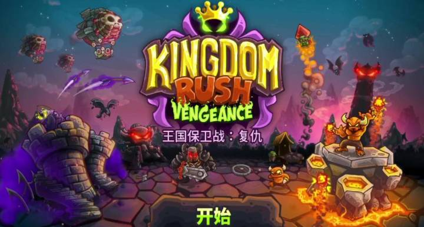

维兹南再临。

依然是熟悉的风格，多种类型的防御塔与敌人保持了系列一贯的丰富多样。本作游戏画面比前作更加精细，让人忍不住仔细欣赏每个人物与防御塔的卡通模型。不过在界面设计上又少了某些细节。塔收费的设定也让一些玩家不爽，然而游戏的防御塔个数比前作增加了许多，在这一点上游戏趣味性、可玩性反而增加，这可能也是四代作品保持了一如既往高分的原因吧。

**12.纸境**

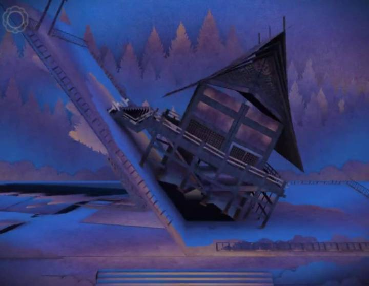

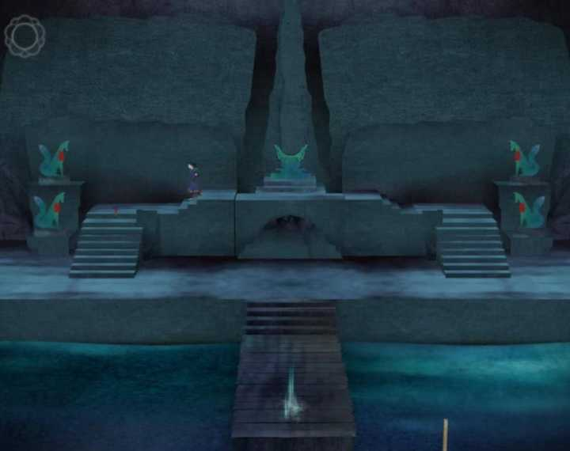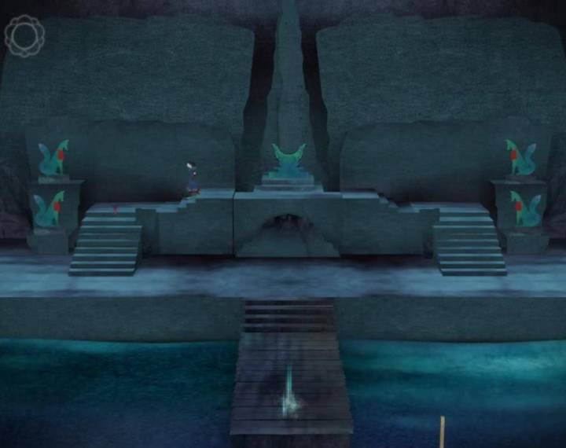

樱花还能再次盛开吗？

这款画风简约的解谜游戏讲述了一个武士独自寻找内心春天的故事。游戏音乐缓和平淡，所有场景全部由折纸构成，带给人一种唯美的意境。游戏内最熟悉的生物只有狼，没有过多的元素。结局时，武士又坐在了游戏一开始的位置，而后摘下一朵美丽的樱花。结尾处一句“怀拥自身之丧逝”，让我们不自觉猜测那位武士藏匿着的、隐隐作痛的伤感往事。

**13.Cytus**

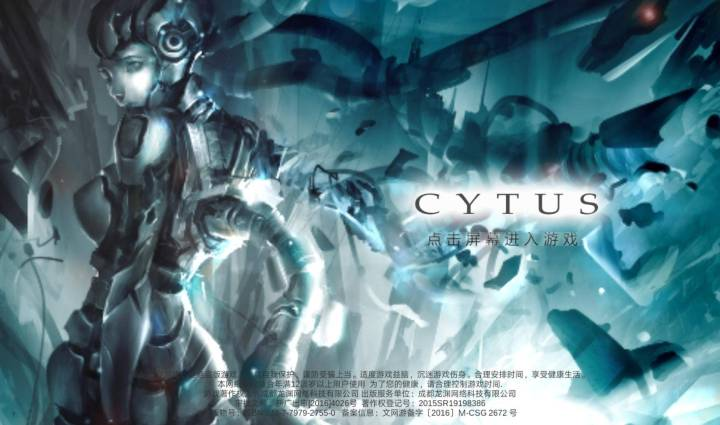

全屏幕的敲敲划划。

这是一款全屏点触式的音乐游戏。玩家需要通过屏幕中移动黑色线的指引，完成屏幕中出现的3种不同音符的操作（点击，锁链，长按）。超现实的电子风格画风，动感十足的原创乐曲让玩家们沉浸其中。与之对应的、覆盖全屏幕的手指操作也提高了游戏本身难度的底线。

[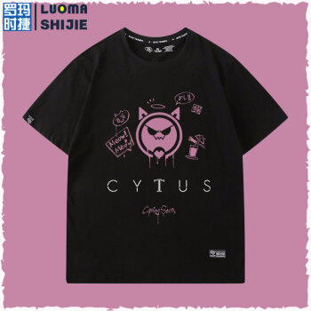【二次元】音乐 Cytus II 赛特斯2 音乐游戏 短袖T恤男京东¥ 119.68去购买](https://union-click.jd.com/jdc?e=jdext-1313638371832004608-0&p=AyIGZRheFAcTAlYbXxAyEgZUGFoWBhABVxJbFgMiQwpDBUoyS0IQWhkeHAxfEE8HCllHGAdFBwsCEwZWGlgRABQFXBtYFB1LQglGa3xyGkcOejhmYU1fMR4lHGITGQlNCVMOHjdVElsXChMGVRxYJQITBlUfXhYBFAZlK1sQMlNpVRpbFQEbBFArWiUCFQZRE10RBBoCVBNSJQIaA2XN9YHXmriMq%2F7DqLzS2KuOnKnGudMrayUBIlwATxJQHhIFVRlcFwsQAVUSWRYDEwJSGlIJAyIHVBpYHAcVBVESNRADEwZVHFkRBBtpVxpaFgEUAVAYWCUCIgRlRTUUUkJQVk8PHGxIXhZdA1BUQGlXHV0VARIPZRlaFAAQ)

**14.Cytus2**

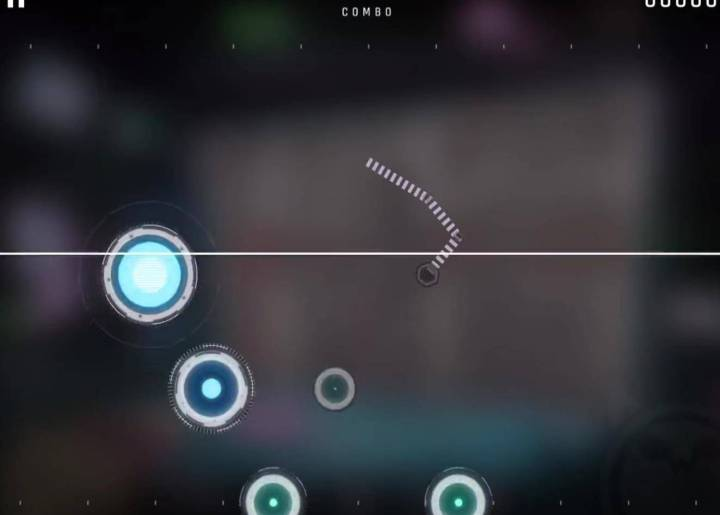

沉浸式爆炸特效。

游戏继承了前作的玩法，提高了操作特效的水准，让手与屏幕的接触迸发出动力十足的爆炸感。配合更复杂的曲目与屏幕中突然变速的扫描线，让大神玩家的粉丝们不禁连连感慨：“妈妈问我为什么跪着看视频。”此外，华丽的游戏角色、多首隐藏音乐、和趋于完善的剧情也增强了玩家们对此款游戏的粘性。

[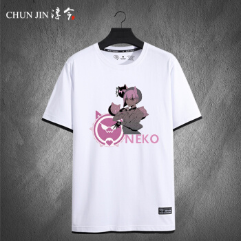NEKO电子音乐手游音乐世界Cytus II周边T恤短袖男女全京东¥ 127.24去购买](https://union-click.jd.com/jdc?e=jdext-1313638441771831296-0&p=AyIGZRhbHQoWBFESWhcyEgZUGFoWAhQOVRpeHQYiQwpDBUoyS0IQWhkeHAxfEE8HCllHGAdFBwsCEwZWGlgVBBsHVB5TER1LQglGa10KEl0BRQ1QZ2lbU3lTXVdGBSdbBGUOHjdVElsXChMGVRxYJQITBlUfXhYBFAZlK1sQMlNpVRpaFwcSBFwrWiUCFQZRE10RCxIGUxxfJQIaA2XN9YHXmriMq%2F7DqLzS2KuOnKnGudMrayUBIlwATxJQHhIFVRlcFwsXAlUdXRULEAdWE1wJAyIHVBpYHAcVBVESNRADEwZVHFkRBBtpVxpaFgEUAVAYWCUCIgRlRTUUUkFQBk4JHWxIXhZdABJRSGlXHV0VBhEHZRlaFAAQ)

**15.致命框架1**

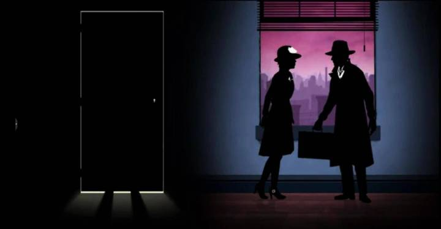

一部可编辑的连环画。  

游戏以创新性的方格连环画设计，通过改变框架的顺序来给主人公引路，以推动剧情发展。游戏中人物采用黑白对比的形式来表现人物，使得人物更加诡秘，同时画风也更加简洁。在游戏中后期，框架的循环使用稍稍增大了游戏难度。看着小黑人来回穿梭于由自己塑造的漫画之间，倒也是一种乐趣。

**16.致命框架2**

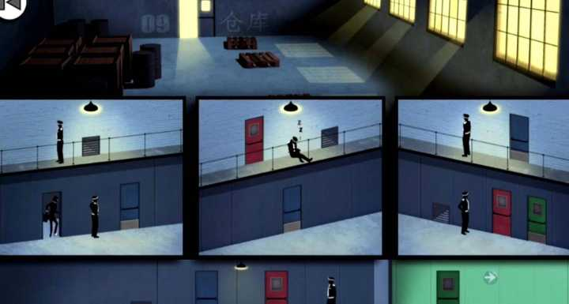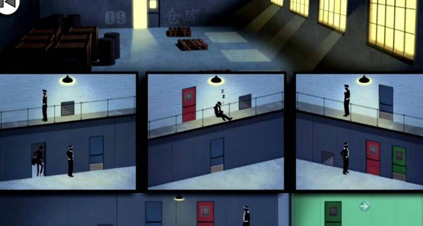

游戏也可由自己“导演”。 

2作延续了1作的设计和基本操作，不过框架的旋转与反复使用频率的提高使得2作比1作要更难一些。同样的黑白人物风格与爵士乐配音，以及没有文字描述却依然展现得淋漓尽致的剧情，使得2作完好保持了前作的水准，依然是一部给予玩家们与游戏独一无二交互机会的优秀作品。

**17.瘟疫公司**

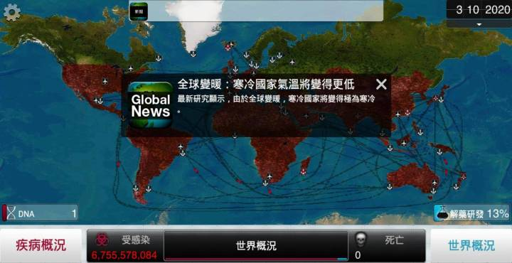

来自上帝的泯灭。

一款题材新颖的休闲策略类游戏。玩家需要自己创造出一种瘟疫类型，通过收集屏幕中出现的基因，不断新增或强化瘟疫的症状和特性，直到杀死或控制全人类以完成任务。游戏画面和音乐虽不足称为亮点，不过相互配合也达到了渲染主题的作用。关键在于游戏新颖的题材激发了玩家们的兴趣，7种常规与4种特殊的瘟疫类型对应着不同的基因树，使得游戏可玩性大大增加。

[瘟疫公司物竞天择进化纯棉假两件卫衣游戏周边男女宽松淘宝¥ 78.00去购买](https://s.click.taobao.com/t?e=m%3D2%26s%3DJJsammn7U2xw4vFB6t2Z2ueEDrYVVa64yK8Cckff7TVRAdhuF14FMcx2PQYCXQHtJ1gyddu7kN8Atbf9FqI%2BxAaXQZijrFYGBih3Oft2s0pMIkUPZyjWyp3YXO2CkBYVIPBGd8BnON7fnvQh3553f9RMHE3IWBDapDqxmnuA0ubmtVFQLzdyxpaYzSMEwlxT%2FufIeaShmLvWGPPZ03CRxCkFqUTekAdBpZJu6bmHolP0MrbhEk%2B62TycZjAPhPKVz8YFe5%2BWp5pfzNmQ3EAS89zmZSGq9ptbzgq8wFaQkp3GDF1NzTQoPw%3D%3D&union_lens=lensId:TAPI@1606436020@0b5819c0_8fd5_176070c6142_0e55@01)

**18.逃离方块、锈湖系列**

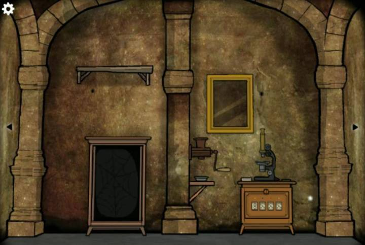

兼顾数量与质量的优秀解谜作品。

整个游戏系列以解谜、剧情、略带惊悚的标签问世，玩家需要在不同的时间线，扮演不同的人物，解开一个个谜题，当然也有好坏结局之分。系列共13部曲，TapTap上这13款游戏的平均得分高达9.75，可见设计者们对游戏的用心制作深受玩家们爱戴。推荐游玩顺序：「Cube Escape: The Seasons 」、「Cube Escape: Lake 」、「Cube Escape: Arles 」、「Cube Escape: Harvey's Box 」、「Cube Escape: Case 23」、「Cube Escape: The Mill 」、「锈湖：旅馆」、「Cube Escape: Birthday 」、「Cube Escape: Theatre」、「锈湖：追溯」、「Cube Escape: The Cave」、「锈湖：天堂岛」、「Cube Escape: Paradox」。

**19.生命线系列**

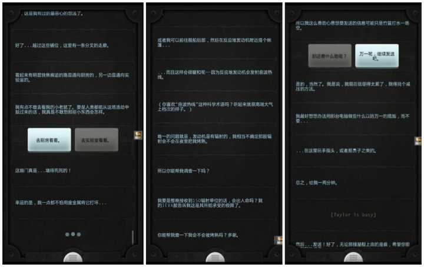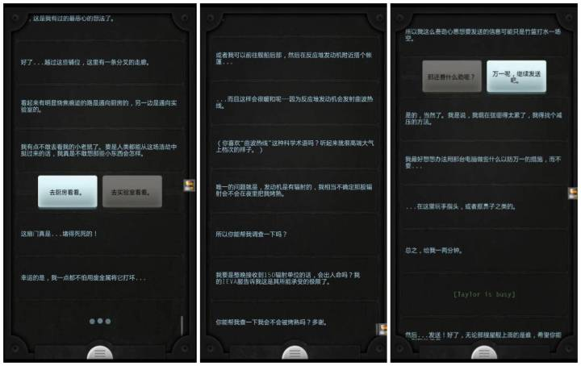

沉浸式小说游戏。

在众多游戏厂商以游戏画面为卖点的今天，像生命线系列这种纯文字通讯类游戏还能让玩家们青睐，可想而知设计者们需要将剧情刻画的多么精彩。在游戏中，你需要不停的帮助主人公做出选择，你的每一个选择都直接影响剧情的发展甚至游戏的成败。此外，游戏的实时性特点也是整个系列的亮点。有时主角的下线还需要你在现实生活中等待一些时间，有时你在现实生活中还能接到主角的弹窗消息，这极大增强了游戏的真实体验感。「生命线」、「生命线：静夜」、「生命线：涅槃」为泰勒小天使系列，不建议跳着玩，容易引起剧情断层。「生命线：冰天穴地」、「生命线：冰天穴地2」（可在「生命线：图书馆」中体验）为亚当斯系列。其余的诸如魔法少女、刑警都为独立的系列，无游戏顺序要求。对了，自称泰勒还会有意外彩蛋。

**20.古树旋律**

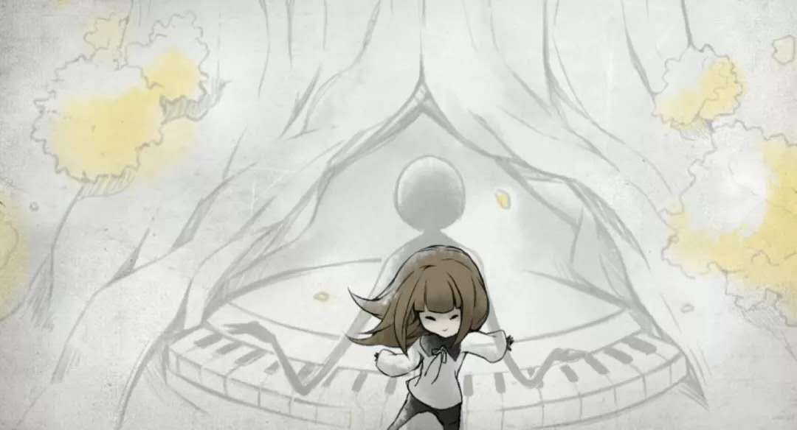

原来我一直在试图回到那个没有你的世界。

如果你玩过「节奏大师」，那你玩这款游戏就非常容易上手。与「节奏大师」不同的是它那柔和稍带阴郁的画风与让人泪目的剧情。游戏讲述了小黑Deemo用钢琴音符的力量让大树长大，以帮助一个小女孩回到她自己世界的故事。初入游戏，也许你会觉得简单，但很多曲子疯狂数量的音符降落依然能让你双指/四指抽搐，算是一部技术与艺术并重的游戏。

[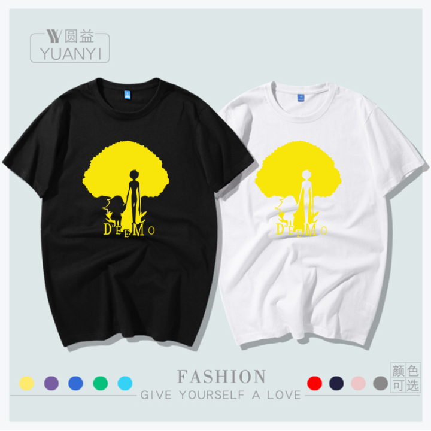圆益古树旋律deemo周边圆领T恤男女游戏衣服宽松打底衫淘宝¥ 49.00去购买](https://s.click.taobao.com/t?e=m%3D2%26s%3DSUMt0AjdFG5w4vFB6t2Z2ueEDrYVVa64yK8Cckff7TVRAdhuF14FMcx2PQYCXQHtJ1gyddu7kN8Atbf9FqI%2BxAaXQZijrFYGBih3Oft2s0pMIkUPZyjWyp3YXO2CkBYVymWjO0b3utLi%2BOFCKqZXsbJJseZIjvA615%2F%2BuhipGV0uyRHckDmQEFcG41fWwUiB04bt%2FCh0HCZ0%2BUW1830SA9%2B0TLhEPjl2wkOWJ32xfhORCUms4757Av61MgKCuzV3IXo9Hpa%2Ffj5o%2BI8ssrVDqUTkTm3o5eKOToc1vbQZVKjGDmntuH4VtA%3D%3D&union_lens=lensId:TAPI@1606436020@0b5819c0_8fd5_176070c6142_0e57@01)

**21.爷爷的城市**

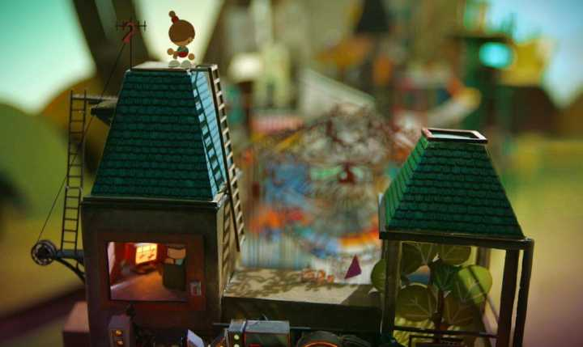

建模技术大背景下的手工艺术品。

在游戏建模广为传播的今天，竟还有人愿意花费3年时间，利用折纸、微型灯等现实元素构建城市纸模，使得这款最真实的解谜游戏成为名副其实的艺术品。因为爷爷被神秘人掳走，孙女开始了寻找爷爷之旅。在旅途中你需要不断解决谜题，有的谜题还需要你打破常规思维定式。可以说场景的手工制作、童话般的谜题以及剧情的首尾呼应都是游戏的亮点。

**22.这是我的战争**

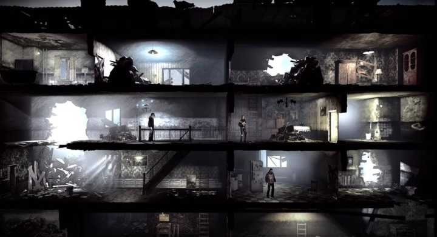

我只想活下去。

因为战乱，城市中的人们与外界隔绝了。面对有限的资源，玩家需要控制三个平民合作（后面变成四个），竭尽全力让他们存活下去。在自救的过程中，没有任何规则，你可以对陌生人做任何不人道的事，唯一能阻挡你的只有自己内心的道德准则。游戏以阴暗的画风与阴郁、充满危险感的背景音乐结合，让我们深深体会到战争为人们带来的国破家亡，流离失所的惨状。

[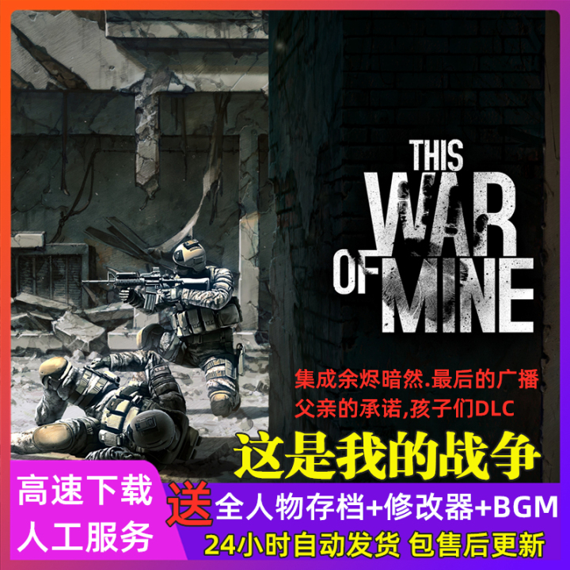单机游戏 这是我的战争淘宝¥ 5.66去购买](https://s.click.taobao.com/t?e=m%3D2%26s%3Dy%2B8fOgKVBuZw4vFB6t2Z2ueEDrYVVa64XoO8tOebS%2BdRAdhuF14FMVXRWWZwiQqDlovu%2FCElQOsAtbf9FqI%2BxAaXQZijrFYGBih3Oft2s0pMIkUPZyjWyp3YXO2CkBYVZYLkdUWchvlF9ZUbioxsPqLWMw3EOEsyGtHDED2isd2uC6Cqkw7dOL6zEaqj93wEA13NwUW6D5tWkLOXAYGwGtBnZdHvpOOPNZWBhAbsulZpXUp9YHbrRmPSfpRcCAXe%2Fb61N8SVhvxEUNGDOFSD5KMmcB%2FnTtS%2FG%2BtfjzlEE%2FfGJe8N%2FwNpGw%3D%3D&union_lens=lensId:TAPI@1606263327@2105e19d_aea8_175fcc14b78_a559@01)

**23.勇敢的心：伟大战争**

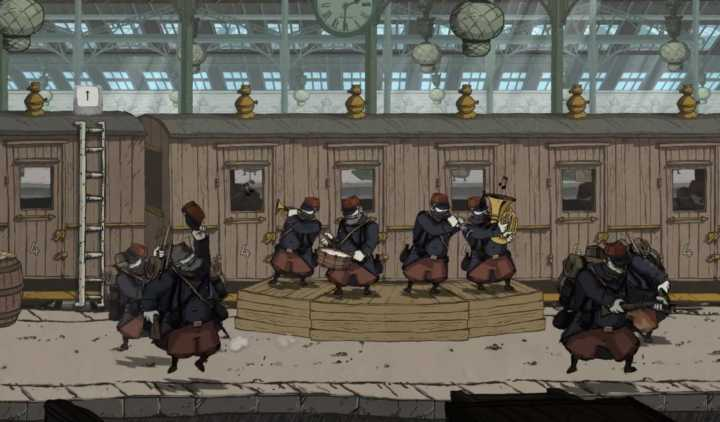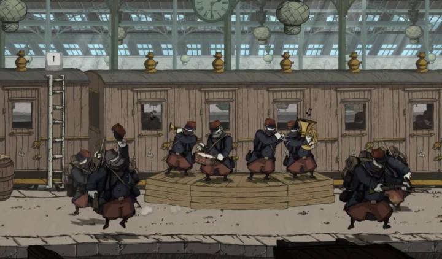

一部可游玩的漫画。

游戏将冒险、动作、解谜的元素融合起来，以4名角色各自的故事为我们展示了战争中友情、爱情和亲情的交互作用。漫画风格的画面，逗比的NPC增强了游戏的趣味性，也消除了玩家对于战争题材游戏的紧张感。结尾处喜剧与悲剧结合的设定也将这场战争上升为人性的伟大，也可成为现实战争中一种人性的缩影。

**24.植物精灵**

保护最后一颗“家园”。

一款超级唯美、自然的解谜游戏，丰富的生物造型与自然灵动的音乐增强了游戏本身唯美的意境。游戏讲述了一颗大树上住着5个小精灵，因为它们的家园（大树）被寄生虫侵蚀，所以它们要找到母树上最后一颗还未被吸干的种子，以重建它们的家园。玩家需要不断尝试5个小精灵不同的作用，才能完成某一个谜题，这使得游戏具有足够的可玩性。此外，游戏中的某个画面还会跳出一些小彩蛋以致敬同厂商的其他作品，这倒是个增强趣味性的小惊喜。

**25.去月球**

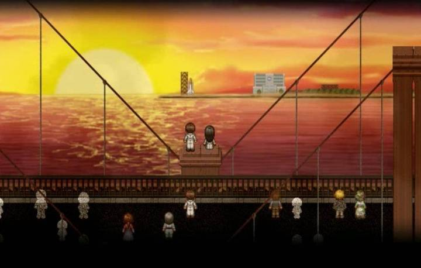

拥有可拍成电影的催泪剧情。

这是一款特殊的像素风RPG游戏，特殊在游戏完全剧情向，没有包含经验、技能、武器等元素在内的打斗系统。整部游戏预计花费3-4小时通关，讲述了两位医生帮助一个濒临死亡的病人通过改变他记忆的方式满足他愿望的故事，而他的愿望竟然是……去月球。建议一个人晚上玩，玩完游戏，然后做个好梦。

PS:我最喜欢的还是游戏那些唯美长情的bgm，可在「网易云音乐」中搜到。

**26.破碎大陆1、2**

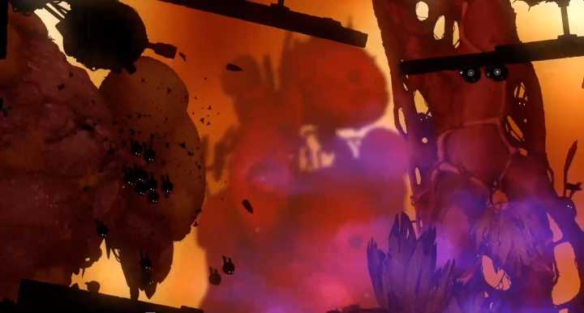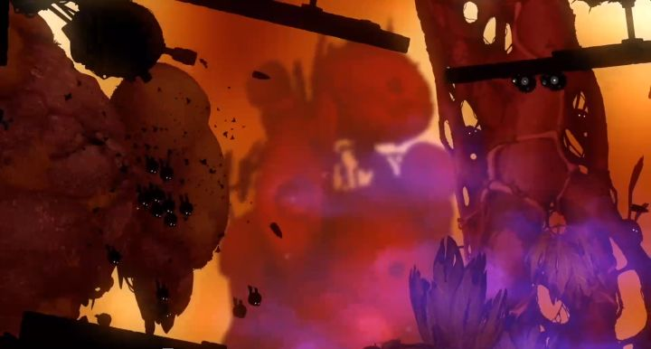

守住最后一个生命。

「破碎大陆Badland」，更多翻译为「迷失之地」。玩家需要控制一个黑色不知名飞行物，吃掉各种道具，冲过各种陷阱机关，直到终点存活下来。游戏不像想象的这么简单，比如有些变大变小的道具不能乱吃，太大容易卡死自己，太小障碍物又撞不开。此外，你还可以和朋友们较量，还是怀念小时候和同学玩双人的时光。

**27.迷失岛1、2**

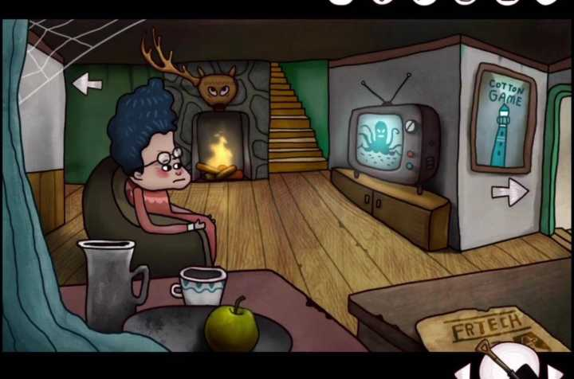

我是谁？从哪来？到哪去？

「迷失岛」系列为点触式益智解谜游戏，对新手解谜玩家很友好。两作都是通过解开一个个小谜题，带着主人公探索孤岛从而发现秘密。手绘漫画风格的画面、幽静平和的音乐、丰富有趣的谜题让玩家可以身心放松享受解谜乐趣。

[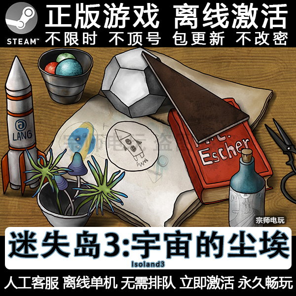迷失岛3:宇宙的尘埃 Isoland3淘宝¥ 3.00去购买](https://s.click.taobao.com/t?e=m%3D2%26s%3DeQVJCvDL0sBw4vFB6t2Z2ueEDrYVVa64XoO8tOebS%2BdRAdhuF14FMZ%2FPvukU8F3J1aH1Hk3GeOgAtbf9FqI%2BxAaXQZijrFYGBih3Oft2s0pMIkUPZyjWyp3YXO2CkBYVEAAR%2FRiPlX0uNZbvolSMbbJJseZIjvA615%2F%2BuhipGV0uyRHckDmQEFcG41fWwUiB04bt%2FCh0HCZ0%2BUW1830SA%2FnyfNTHoXdNS6uhd0sZLQGRCUms4757Av61MgKCuzV3IXo9Hpa%2Ffj5o%2BI8ssrVDqUTkTm3o5eKOToc1vbQZVKjGDmntuH4VtA%3D%3D&union_lens=lensId:TAPI@1606090436@2105dd63_cf1b_175f2733093_df26@01)

**28.饥荒**

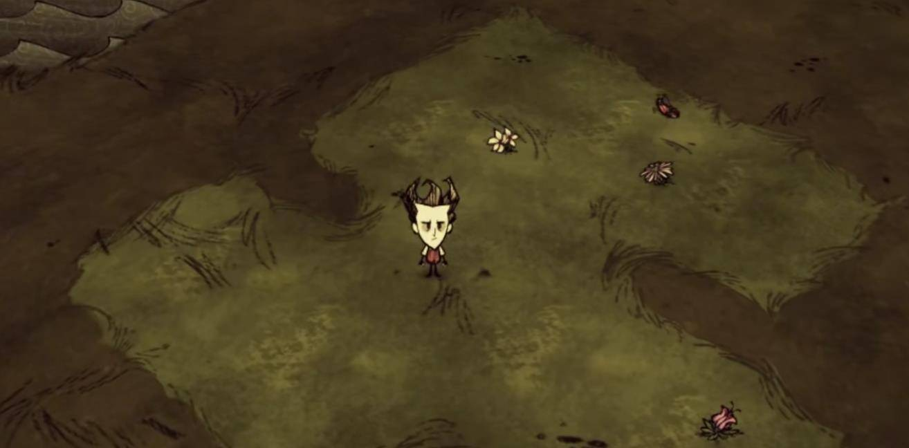

异世界的生存法则。

游戏讲述一名科学家被恶魔带到了异世界，而我们需要控制他在资源有限，怪物横生的荒野中尽力生存下去。作为一款沙盒游戏，种类丰富的角色、小怪、boss、日用品及武器装备与高自由度特点给予玩家们更多创造、想象与突破极限的机会。之前就在b站上看到大神玩家竟将「饥荒」玩成了“胀肚”……

[饥荒Don'tStarve淘宝¥ 3.00去购买](https://s.click.taobao.com/t?e=m%3D2%26s%3D5kmpwyMusB1w4vFB6t2Z2ueEDrYVVa64XoO8tOebS%2BdRAdhuF14FMZ%2FPvukU8F3J1aH1Hk3GeOgAtbf9FqI%2BxAaXQZijrFYGBih3Oft2s0pMIkUPZyjWyp3YXO2CkBYVJbLwa1RSTnSsE5vYne6UObJJseZIjvA615%2F%2BuhipGV0uyRHckDmQEFcG41fWwUiB04bt%2FCh0HCZ0%2BUW1830SA3qBpjEIs%2BVvHnAEJ%2B0uL%2BiRCUms4757Av61MgKCuzV3IXo9Hpa%2Ffj5o%2BI8ssrVDqUTkTm3o5eKOToc1vbQZVKjGDmntuH4VtA%3D%3D&union_lens=lensId:TAPI@1606090436@2105dd63_cf1b_175f2733093_df27@01)

**29.聚爆**

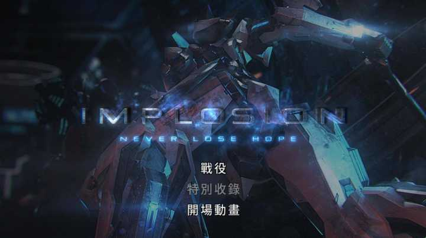

砍！砍！砍！

一款打击感超强的ARPG手游，玩这个游戏时内心不住呐喊“砍！砍！砍！”！游戏大背景设定在22世纪，地球被外星生物侵占，而人类要夺回这片家园。这款大型科幻游戏以超现实的游戏特效与磅礴大气的配乐再加上惊艳的CG动画，迅速俘获了一批玩家。不过这么绚丽的游戏1.5G的大小还是不能少的。

**30.辐射：避难所**

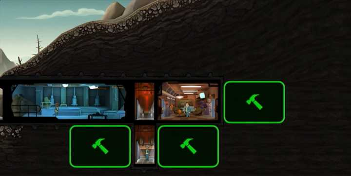

情怀与卡机的对立。

一款足够耐玩却很肝的模拟经营类游戏。在核战的大背景下，人们预先建立的避难所派上了用场，而你将作为避难所的管理者让居民们健康安全的存活下去。游戏中你将按照居民不同属性分配适合他们的任务以及工作与休息时间，生产资源并抵御外患。不过随着居民人数上升，挂机被强拆、退游耗资源等设定让这个游戏的玩家有些累，游戏卡机的现象也让游戏掉了分。

[辐射4避难所纯棉短袖t恤游戏周边衣服男女哔哔小子情侣淘宝¥ 68.00去购买](https://s.click.taobao.com/t?e=m%3D2%26s%3Dq6oLO1xV19Fw4vFB6t2Z2ueEDrYVVa64yK8Cckff7TVRAdhuF14FMcx2PQYCXQHtJ1gyddu7kN8Atbf9FqI%2BxAaXQZijrFYGBih3Oft2s0pMIkUPZyjWyp3YXO2CkBYVIPBGd8BnON7fnvQh3553f9RMHE3IWBDapDqxmnuA0ubmtVFQLzdyxpaYzSMEwlxT%2FufIeaShmLvWGPPZ03CRxCMElwDuvDzhibAYjcWmB0n0MrbhEk%2B62TycZjAPhPKVz8YFe5%2BWp5pfzNmQ3EAS89zmZSGq9ptbzgq8wFaQkp3GDF1NzTQoPw%3D%3D&union_lens=lensId:TAPI@1606436020@0b5819c0_8fd5_176070c6142_0e59@01)

**31.神之折纸1、2**

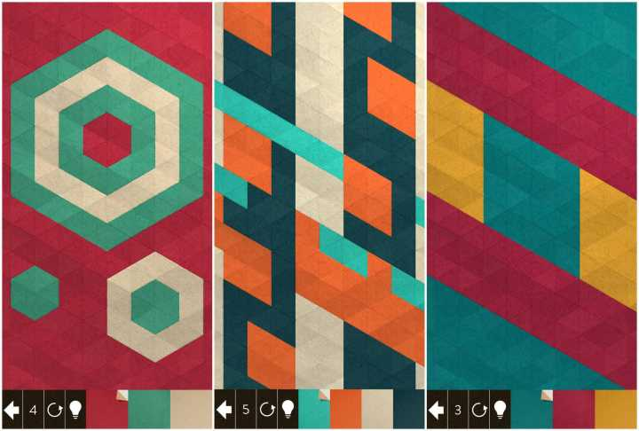

时间杀手……

「神之折纸」系列是一部规则简单却容易烧脑的休闲益智类游戏。游戏规定你需要将纸面上杂乱的颜色用最少或预定的步数统一为一种颜色。在「神之折纸1」中，你需要进行尽量少的步骤来完成任务，以获得“Perfect!”、“OK”或“Fail!”等评价。而在「神之折纸2」中，超过步数要求则会直接失败重来。此外，2作相较1作拥有更精致的画面与更丰富的关卡，给予玩家更多沉浸感与解谜乐趣。

**32.战斗之心1、2**

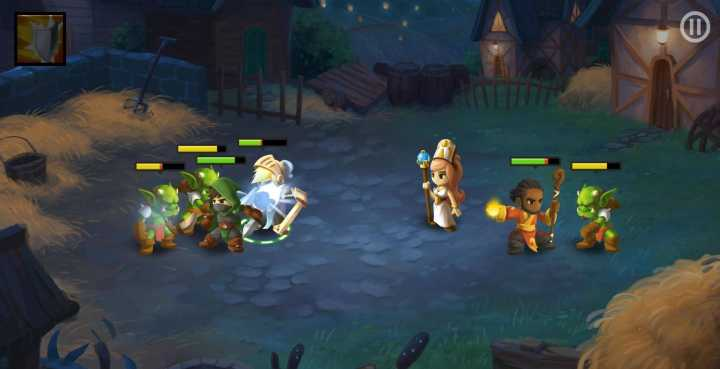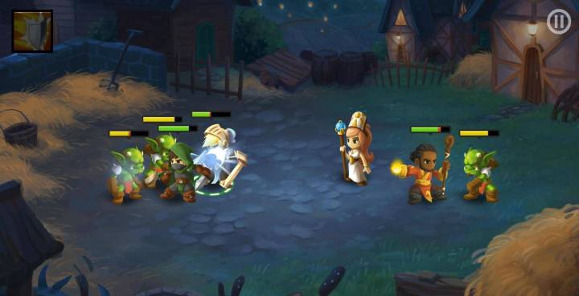

简单与复杂交融。

一款混合ARPG与RTS类型元素的游戏。庞大复杂的职业选择与技能搭配，配合丰富的关卡让这款游戏非常耐玩；萌萌的简易Q版画风与横向操作又透露着简单。简单与复杂的交融，促成了这部经典。要能再加强一下剧情的设计，就真的经典神作了。

**33.投影寻真/shadowmatic**

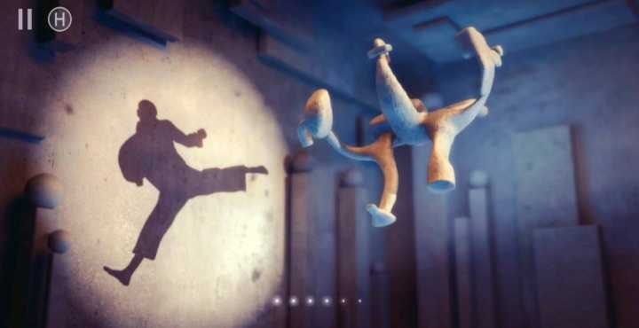

在表象中探求真实。

这是一款脑洞大开的休闲神作。玩家需要在一个个毫无规则的悬浮模型中通过投影的方式找到本体。有时你会同时遇到多个悬浮模型，通过单一模型的旋转及多模型的配合才能找到本体，所以这可能也是个很容易摔手机的游戏，不过刻画精细的模型与优美空灵的音乐倒是也能提高玩家们的耐心。

**34.永不言弃1、2、3**

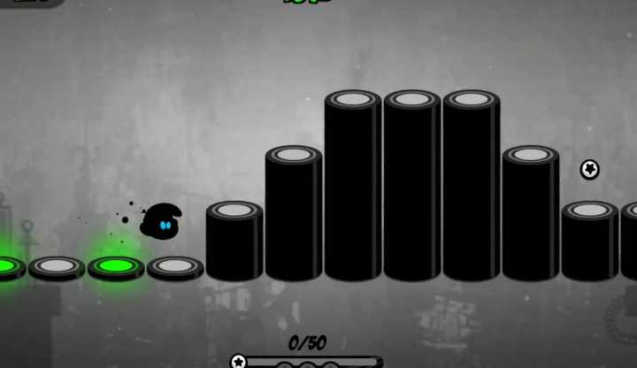

对耐性、脑力与熟练度的综合考验。

第一次接触这个游戏，你会感到非常“魔性”；深入了解之后，你会感到不仅“魔性”，还很“虐心”……这部节奏感超强的跑酷作品向我们生动展示了一款手残党噩梦的游戏应该长什么样子。在游戏中，你需要不断躲开红光并跳上突出的木桩，否则宣告游戏结束。

在1作中，会纵向移动的柱子和横向移动的触台增大了游戏难度；2作中，游戏路径逐渐由一维向二维发展，可跌落的空中触台与红光同色路径的干扰使得此作比1作难度更大；3代360°全角度覆盖的游戏路径替换了我们原先熟悉的从左到右的路径，使得游戏更具挑战性。

**35.信任的进化-合作无私的基因**

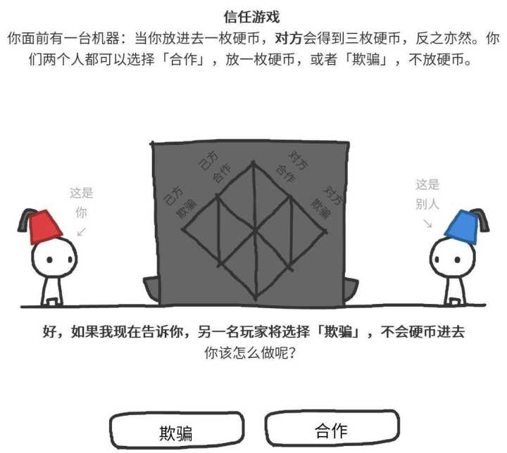

我们该如何看待信任以在社会立足？

这款简洁的小游戏唤起了我们对人际关系中信任与欺骗权衡的思考。游戏分为几个不同的场景，以寓教于乐的图文互动方式让我们接触到经济学博弈论的内容。那么在当今社会，我们究竟该扮演游戏中的哪个人物呢？

**36.劳拉GO/Lara Croft GO**

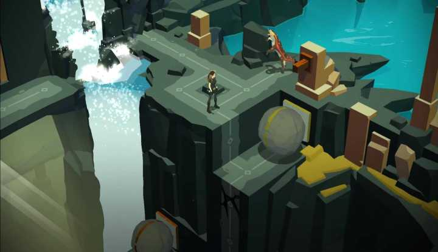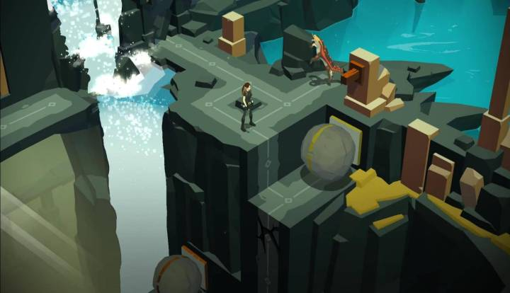

集多种游戏类型于一身。

游戏集成策略、冒险、解谜等多种游戏类型元素，以棋格回合制的玩法和手指滑动的操作方式让我们控制劳拉，展开一段冒险之旅。游戏包含大量关卡与丰富的解谜元素供玩家们欣赏游玩。配合清新的画风，出色的配乐与细腻的生物音效，仿佛我们也踏入了这异域遗迹之中。

**37.晶体管**

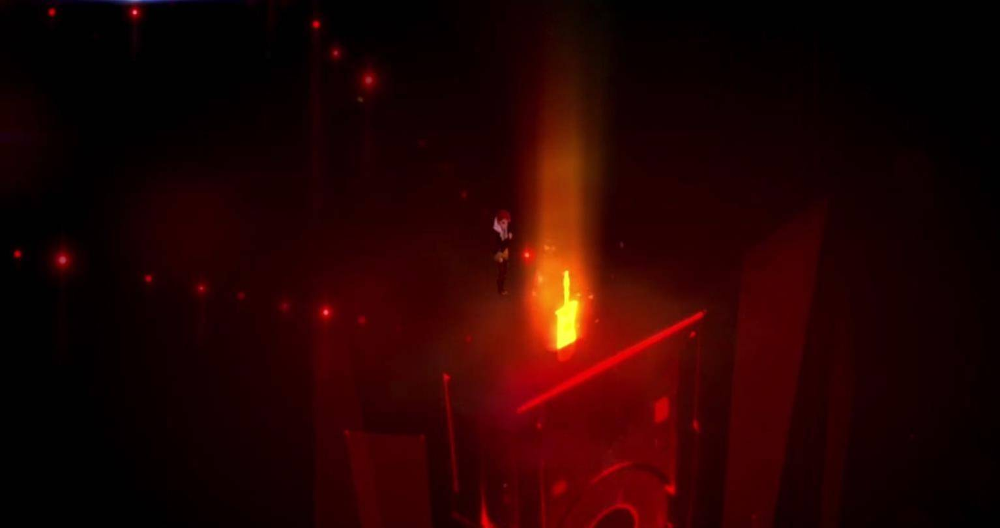

待完成使命，我将与你同生共死。

因为游戏一开始就在埋伏笔，所以这就不介绍剧情了。这款ARPG游戏最大的特点是将传统实时对战模式与新加入的计划式格斗模式相结合，让我们体会到技能衔接的流畅与酷炫；此外，精致复杂的画面、迷人的配声、复杂感人的剧情都可成为游戏卖点，是一款综合水平很高的游戏。

**38.回声探路**

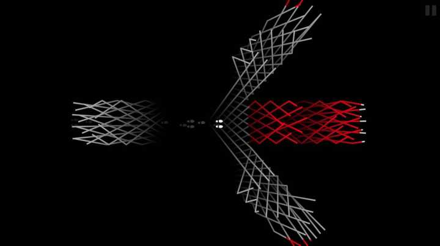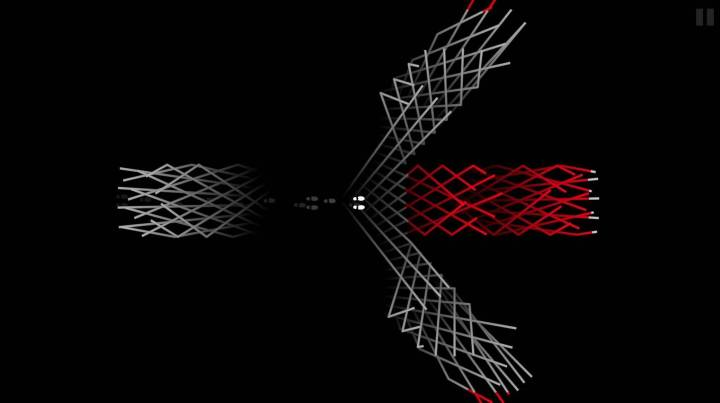

听声辨位。

多年前很有创意的小游戏。游戏全程盲人状态，你需要依靠自己的脚步制造的回声线判断该如何走出密室。其中，白色线代表安全，红色代表陷阱，黄色代表机关，蓝色代表水潭。只要找到并走到加粗的白色线条密集处即可过关。

**39.二重奏**

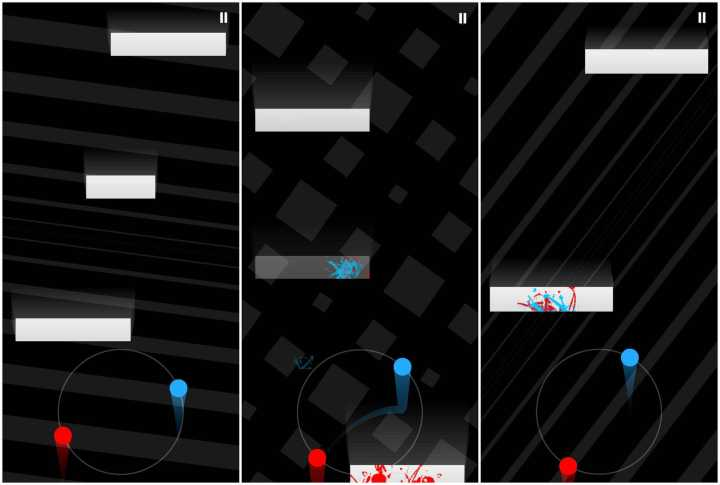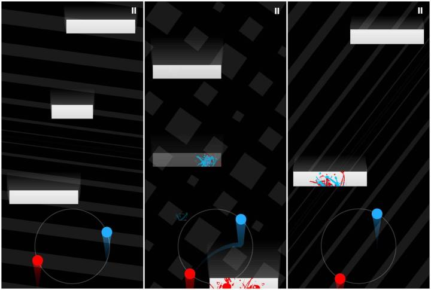

眼花缭乱。

一款节奏很快、玩法简单的虐心小游戏。玩家需用两只手指不断旋转小球以躲避从天而降的障碍物。玩到中后期，旋转、变速、渐变的障碍物使得游戏有一些虐心。不过好在路程简短，强节奏感的鼓点与梦幻柔和的配音女声也让玩家们更耐得住性子。虽然我并听不懂每局开头的话都有什么含义……

**40.蠢蠢的死法1、2、3**

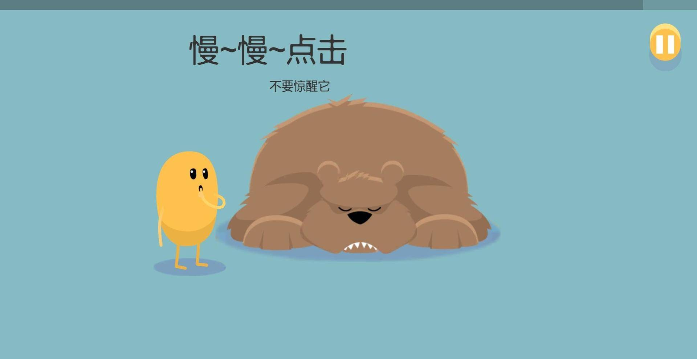

原来还能这么死……

一款画风简易的休闲小游戏，游戏氛围血腥又呆萌。三代游戏的目标是一致的，玩家需要通过完成各种有趣的小游戏来阻止豆子们的疯狂作死。前两代游戏中的操作都有时间倒计时，且越到后面时间消耗得越快。而第三代算是无尽模式，越往后游戏越难。不过只有你死了，才算游戏结束。

**41.沉默年代**

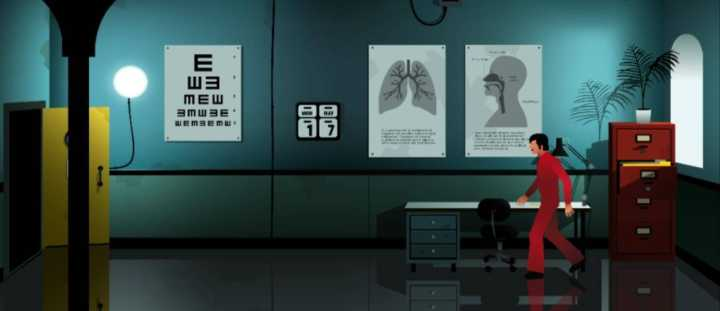

时空悖论。

一种未来病毒穿越到现代，这个病毒足以摧毁当今所有人类，而男主的任务就是通过不断穿越过去和未来破解谜题，发现病毒穿越的原因，以阻止人类悲剧的发生。当然，不仅剧情，我还喜欢游戏的插画式画风，而且过去未来的切换，造成的场景对比也非常出彩。

**42.超级兄弟：剑与巫术**

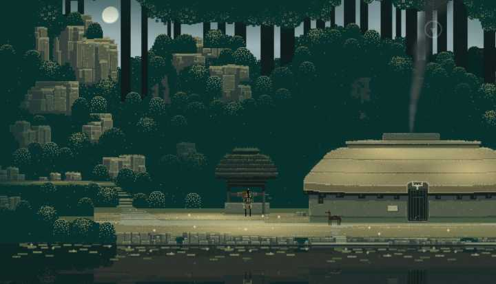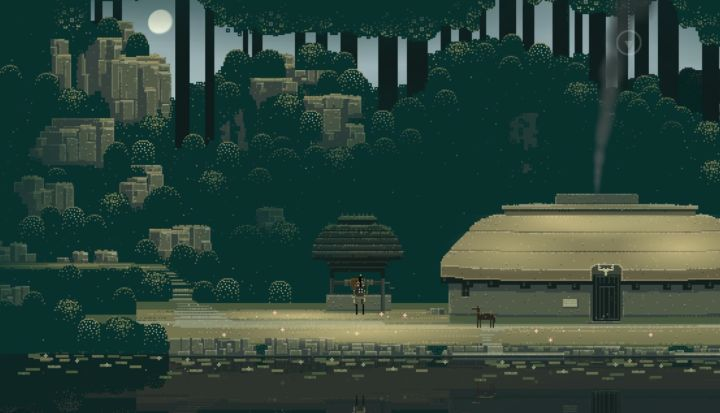

总有人愿意牺牲自己，以换取一方和平安宁。

这是一款像素风冒险游戏。玩家扮演一名旅行的剑客，解开诅咒以拯救村庄。在游戏过程中，你需要不断点触，利用剑盾击杀敌人，利用巫术破解谜题。游戏丰富的细节刻画增强游戏趣味性。不过最让我欣赏的还是那些bgm，有时欢快灵动，有时又恢宏大气，仿佛在渲染英雄使命的神圣感。

**43.崩溃大陆**

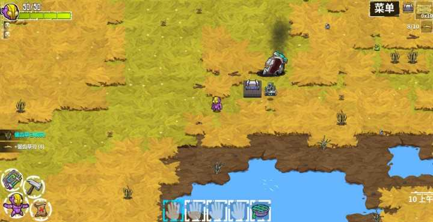

剧情向「饥荒」。

玩家的宇宙飞船被怪物击落，逃生到一个陌生的星球上。玩家需要不断收集素材原料制造装备以抵御星球上各种奇特生物的袭击，并找到逃离星球的方法。沙盒游戏自带的高自由度特点与非线性剧情设计，再加上主角与NPC逗比风格的对话，提高了这款游戏的耐玩性与趣味性。如果你想找一款耐玩的游戏，放心，它真的能让你肝很久。

**44.直到晨曦来临**

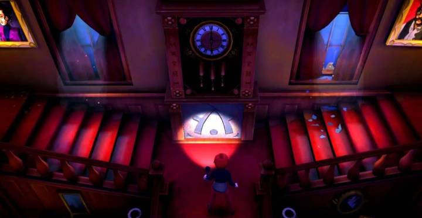

成长只在一夜之间。

因为被两个好友关在一个阴暗的大别墅里，女主不得不在屋内通过各种解谜意图逃出来，这款3D动作解谜游戏就在演绎一个“密屋逃脱”的故事。游戏战斗过程像是在玩简单的音乐游戏，很难死掉。高颜值的画面与只靠手指点触或滑动即可打怪的设定，让这款游戏非常适合女生体验。

**45.元气骑士**

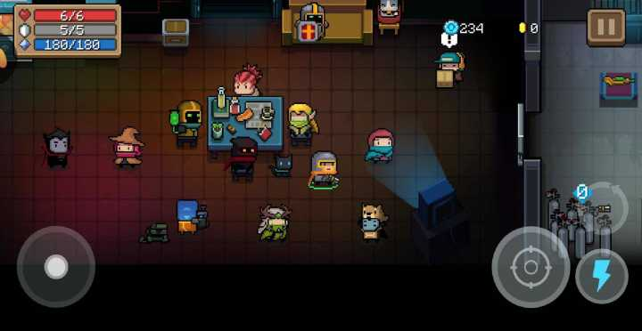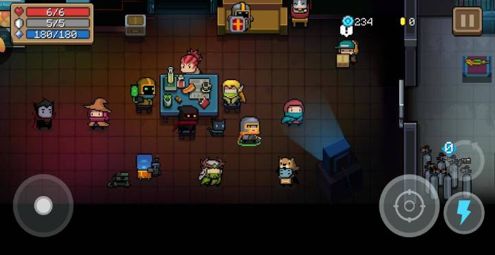

玩得我元气不足……

一款像素风闯关冒险游戏，剧情可以忽略，不过玩着真爽呀！流畅的操作，配合欢快动感的音乐，让你玩得根本停不下来。10多种角色与游戏中随机武器和雕像也大大增加游戏耐玩性。而且此游戏还支持云存档与4人联机，可以和小伙伴们放心肝了！

[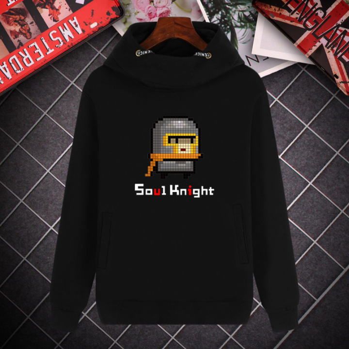元气骑士动漫游戏周边衣服男女春秋装高领连帽卫衣韩版淘宝¥ 79.00去购买](https://uland.taobao.com/ccoupon/edetail?e=abFuKkxOFKwE%2BdAb1JoOOsNG%2BGs6Wf2DlCJM4HDqEbvq0569gqWHbNdVl2K1dJt4SGWLFeRs%2BAab21E%2BTf%2F7SD4z%2BtfB4glK9h0V5GdJyUh3vKSNKgrXNtq%2Fl1kYvV8PY2hDopkb155kIV%2BMDUY0Mn4xzDU8bGCkMSEmlRStydi9iSOy0jAsqhzPo%2BZxmGPYdj3Hchy1wJYuynEbLfMGNjwh43yW%2BFEDaXOtHj5%2BtxurH6TpTiumXMP8FCp3c9qpcW0FAk4P4CIb2MCkbKQybA%3D%3D&traceId=0b5206f616064360191013872eb039&union_lens=lensId:TAPI@1606436020@0b5819c0_8fd5_176070c6142_0e5a@01)

**46.永不孤单**

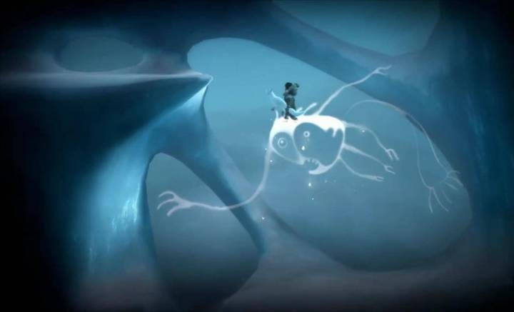

面对暴雪，我永不孤单。

因为莫名的暴风雪，导致小女孩所在部落的粮食几乎中断供给，所以小女孩要和一只白狐一起寻找暴风雪的源头，以解决这次灾难。这款冒险与益智相结合的游戏从纯洁唯美的画风到暴雪凛冽的音效，无时无刻不散发着真实感。尤其是小女孩面对暴风雪的俯身动作，站不稳的摇晃动作等细节刻画更让玩家沉浸其中。

**47.里奥的财富**

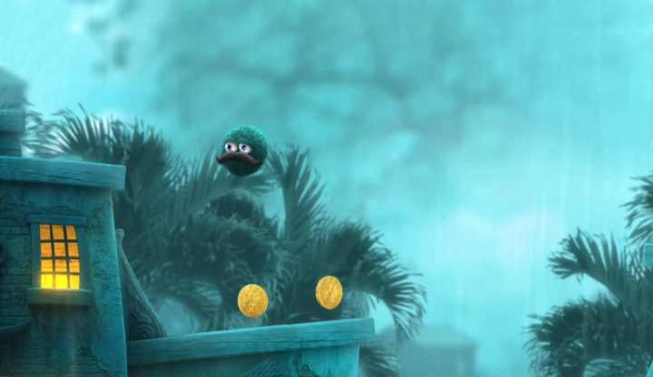

为了钱，你丢过几次命？

为了找回丢失的金币，里奥开启了一段充满危险与汗水的旅程。这款冒险类游戏以真实细腻的模型刻画、丰富的机关设计、多样的场景切换与简易流畅的操作体验深受玩家们吹捧。跨越重重虐心机关的里奥，生动地向我们演示了什么叫“为了钱，命都可以不要”……

**48.进化之地1、2**

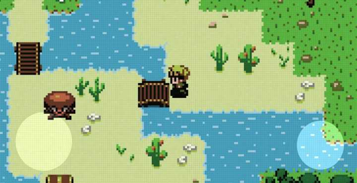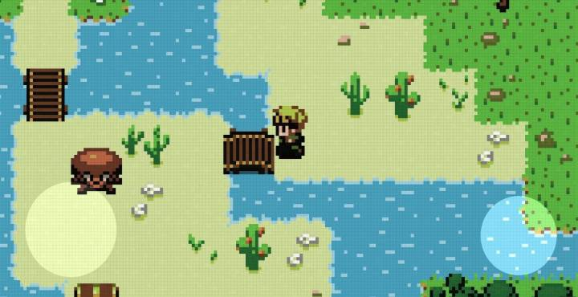

致敬RPG游戏发展史。

此游戏完全以创意制胜。众多经典游戏画风与对战风格混合于一款游戏，让我们一览20多年RPG游戏的发展变革。画风与游戏模式的快速切换，不断勾起我小时候玩游戏的种种回忆，仿佛这款游戏也是我们每个人的成长史，让人泪目。

1作纯靠创意取胜，而2作不仅继承了1作的创意，还特意注重游戏不同类别元素的融入，如格斗、卡牌、射击等。此外，2作对剧情的重视也弥补的1作的缺陷。

**49.阿尔托的冒险**

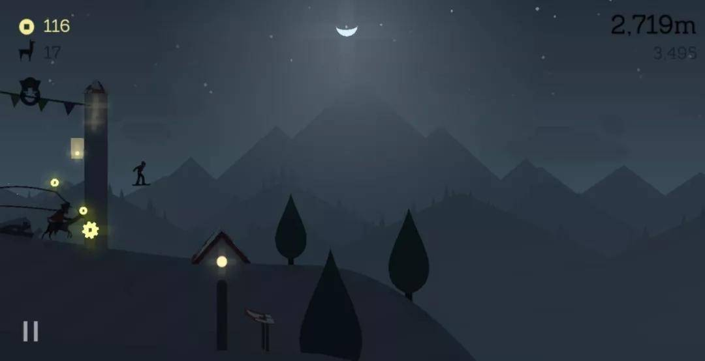

冒险，就应该从哪跌倒从哪爬起来。

第一次玩这个游戏，真以为是在玩「滑雪大冒险」。但这款游戏的重点不在操作技术，而在于对冒险的定义。“禅模式”是这款游戏的特色，在这个模式中没有分数也没有死亡，你可以从哪跌倒就立刻从哪爬起来。结合简约的画风与清新的bgm，你可以舒适地享受这美好旅途。

**50.星噬**

终有一日，整个宇宙都将在我面前黯然失色。

看画面就知道这又是一款高颜值唯美游戏。游戏玩法简单，你需要通过不断吞噬其他星系来完成任务目标。在游戏过程中，你只能吞噬比你小的蓝色星系，而要远离那些能将你吞噬的红色星系。总的来说游戏并不难，用于休闲解闷很不错。

**51.月圆之夜**

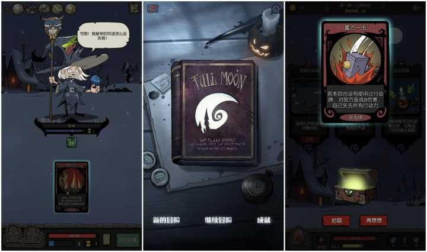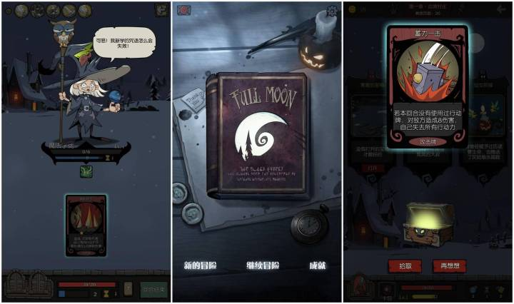

小红帽与……呃……一堆怪物。

这是一款黑暗童话主题风格的独立卡牌游戏。为了找到神秘失踪的外婆，小红帽就此踏上黑森林的冒险之旅。游戏不仅继承一般卡牌游戏多职业与多卡牌种类的设定，和对手的选择性互动、多线性结局也是这款游戏的特色，诱导玩家一步步沉浸其中。

**52.修剪艺术**

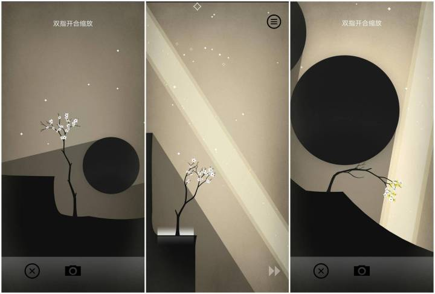

蜿蜒曲折，只为一刻繁花似锦。

一款佛系男女必备的禅意游戏。你需要在树生长的过程中为它修剪，躲避阻碍，以至于它有足够的动力向光芒处伸展，最后开出美妙绝伦的花朵。观摩游戏中树木的生长经历，让我们不禁思索关于人生的修剪艺术。

**53.我在7年后等着你**

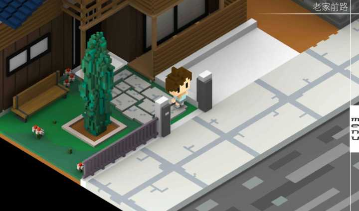

我相信，你一定会做出和我一样的选择。

与「去月球」一样，这是一款完全剧情向的RPG游戏，同样拥有可拍成电影的感人剧情。游戏以男主意图找回记忆开始，为我们逐渐揭开背后与女主的7年之约之谜。剧情铺设很长，但多说一句都是剧透，不如去玩玩游戏，与男主一起找回丢失的记忆碎片。

**54.我的世界**

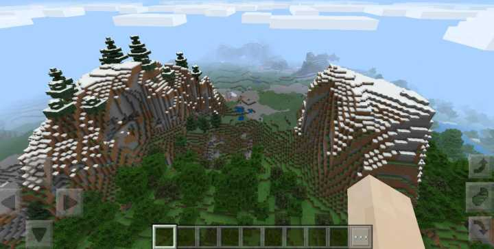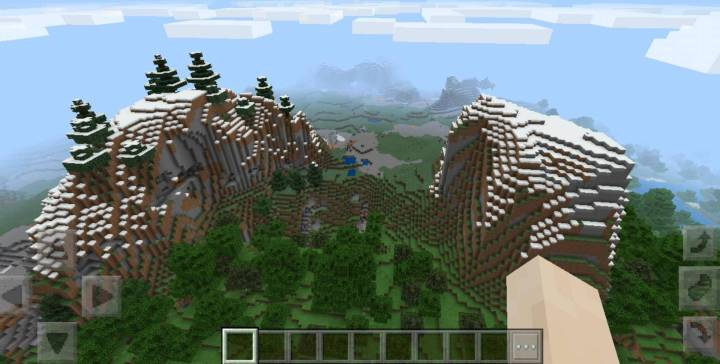

让内心的世界得到安置。

这是一款瞬间火爆全球的沙盒游戏，整个世界由像素积木块构成。在这里，只有想不到，没有做不到，你可以创造任何你心中的事物。它释放了我们的创造力与想象力，让我们每个人心中的世界都得到了安置。你还可以在网上浏览大神们那些令人惊叹的作品，并把他们的分享植入自己的软件里以获得更好的观赏体验。此外，你还可以和你的朋友、恋人联机，一起构造属于你们的世界。

[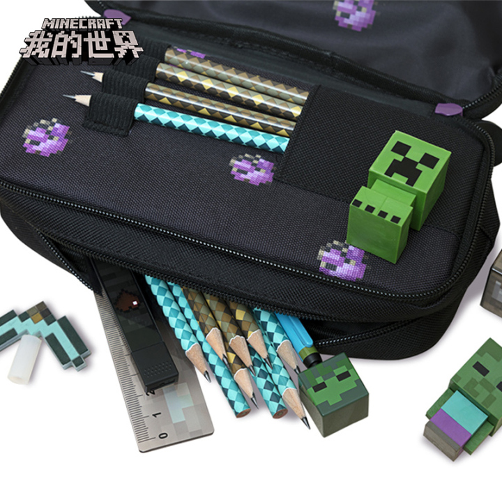我的世界末影龙笔袋 中小学生周边文具盒大容量钢笔铅淘宝¥ 49.00去购买](https://s.click.taobao.com/t?e=m%3D2%26s%3DcJrJ%2B3YAMWNw4vFB6t2Z2ueEDrYVVa64yK8Cckff7TVRAdhuF14FMcx2PQYCXQHtJ1gyddu7kN8Atbf9FqI%2BxAaXQZijrFYGBih3Oft2s0pMIkUPZyjWyp3YXO2CkBYVrTKt0rAYSd5bEpbMsdh0cj7FOSPF5bQ7pDqxmnuA0ubmtVFQLzdyxpaYzSMEwlxT%2FufIeaShmLvWGPPZ03CRxKqVDuw%2BkFJ5rlAGoOxI1uT0MrbhEk%2B62TycZjAPhPKVz8YFe5%2BWp5pfzNmQ3EAS89zmZSGq9ptbzgq8wFaQkp3GDF1NzTQoPw%3D%3D&union_lens=lensId:TAPI@1606436020@0b5819c0_8fd5_176070c6142_0e5b@01)

**55.涂鸦上帝、恶魔、农场**

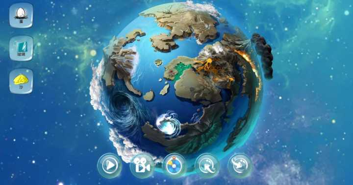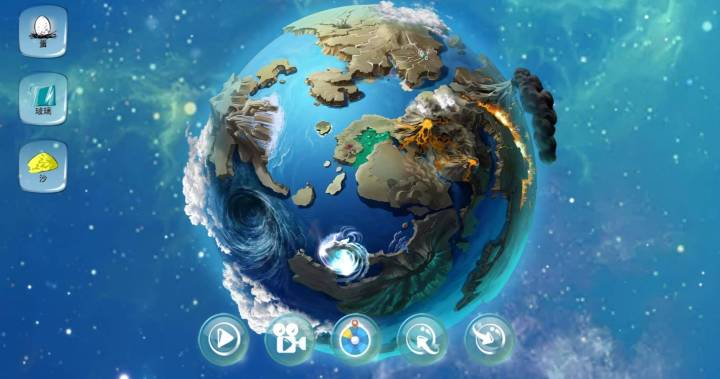

融合成就丰富世界。

一款脑洞大开的休闲益智游戏。游戏玩法简单，一开始给出几种基本元素，然后你需要不断将它们合成以创造新元素，然后有些生成的元素还会在画面中显示。极其丰富的元素与场景切换让这款游戏有点肝，但又因为自由度高也没有剧情要求，所以也不易沉迷。有些另类的合成路径还让人们感叹设计者们的奇葩脑洞……

**56.天鹅绝唱**

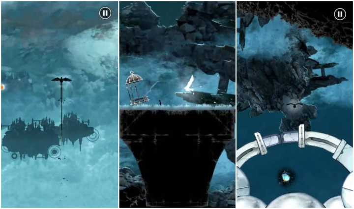

从此，世界五彩斑斓。

看多了简易画风，可以尝试这款画面丰富鲜艳的游戏。这款油画画风的游戏以自然与城市工业化的矛盾为主题，配合云里雾里的背景与柔和悠长又稍带些许悲凉的音乐，成为了一部感染力极强的艺术作品。游戏采用点触式操作，通过不断转动手机屏幕以改变方向。旅途中你需要不断净化那群白色的“鸟”，当你不断被碰撞直至变白则游戏结束。对了，地图略大，如果迷路，可以暂停看看地图。

**57.漂泊**

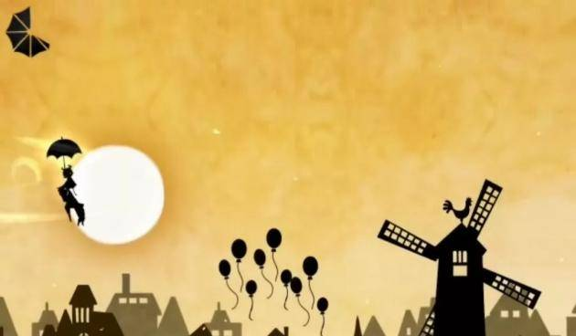

代表和平的羽毛是否也代表着新生？

一款让手残党窒息的横版跑酷游戏。玩家需要躲避空中的热气球、飞鸟、导弹以及底下的楼房、大树等各种障碍物，带着魔法伞完成一个个任务。游戏简易的画风、贴合完美的音效、呼唤和平的剧情都是游戏的亮点。首尾呼应的羽毛更是发人深省。

**58.模拟山羊**

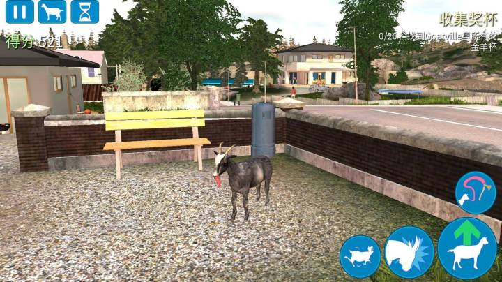

无法用正常眼光来看待这款游戏。

这是一款节奏欢快的沙雕游戏。游戏中你将扮演一只山羊，山羊唯一的任务就是破坏。当然，偶尔你也会被汽车怼飞，还能在地上滚滚，发发羊癫疯什么的……此外，不同类型的羊还有不同的特性，不过依然很沙雕……然而，当新鲜感消退，这款游戏3D但不精致的画面还有各种奇特的bug还是让人有一种想弃游的冲动。

**59.迷失自我**

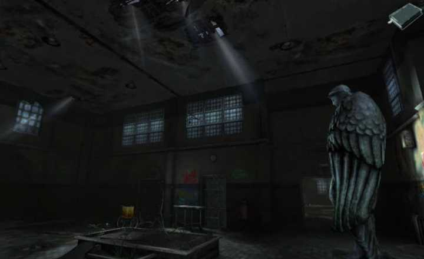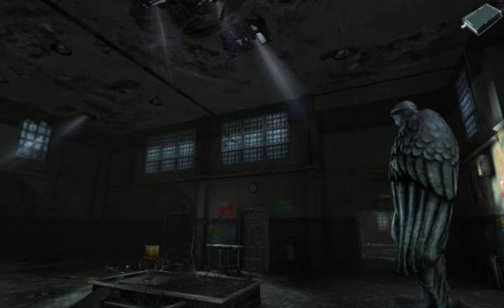

我第一次这么喜欢柜子。

强烈推荐这款恐怖生存解谜游戏。一家庞大而废弃的精神病院即将被拆除。玩家扮演一名副警长，进入里面检查是否还有人在，却不小心跌落在不熟悉的地方，从此他的目标只有活下去并逃出这家医院。在探索过程中，他逐渐发现这家医院背后的秘密。这款游戏亮点在于恐怖氛围渲染非常出色，你会时不时听到尖叫声、脚步声、还有物体发出的声响。相信遇到柜子你也会跟我一样先冲进去躲会儿……

**60.海之号角**

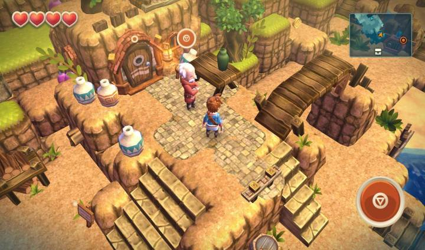

平息失控。

这款游戏在ARPG类型的基础上增加了探索解谜的元素。讲述了主角的父亲离开家独自一人与宿敌“海之号角”决斗，而主角沿着父亲的足迹一路冒险，最终控制“海之号角”的故事。游戏系统符合塞达尔风格，配音配乐也很出色。此外，击败最终boss之后可以继续探索未知海域，是一款自由度很高的游戏。

**61.疯狂动物园—极速跑酷**

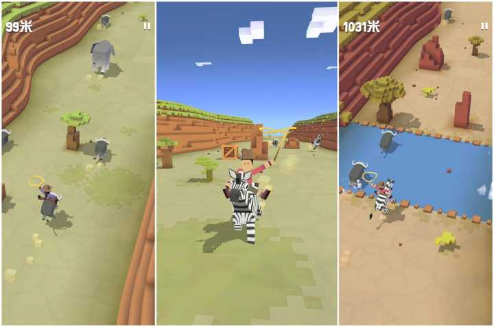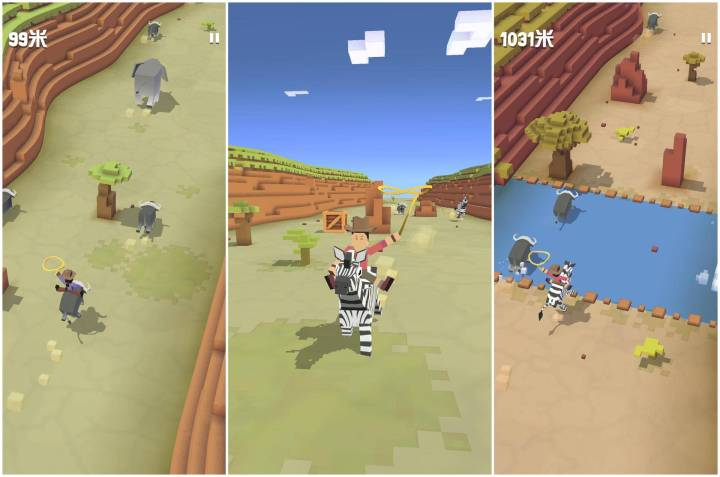

地方大了，什么动物都有。

模拟经营与跑酷的融合让这款游戏为玩家同时带来短期和长期快感，大大提升游戏耐玩性。在游戏中，你不仅可以骑乘动物跑酷，不断突破自己的极限；还可以通过不断搜捕不同的动物以增加动物园门票价格，玩一场模拟经营游戏。画面简易干净，音乐乡村风格，各种各样的动物让你眼花缭乱，在跑酷中，许多动物还有不同的效果等你挖掘。

**62.笨拙的忍者**

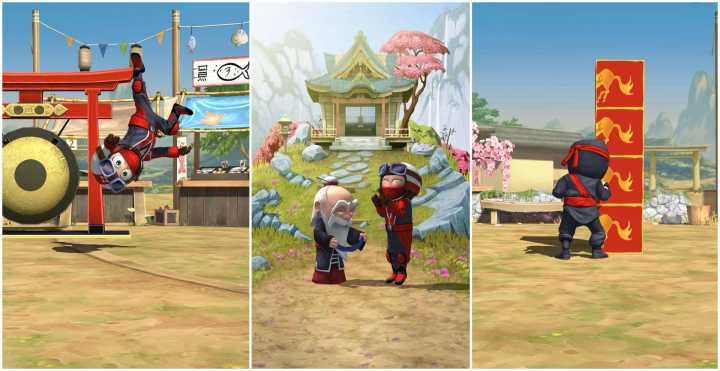

到哪找脾气这么好的人？

一款很有趣的模拟养成游戏，卡通画风比较讨喜。你将训练一个呆萌的忍者，让他成为一个优秀的忍者，并帮他找到自己失散已久的女友。在游戏中，你可以跟他进行花样百出的互动，其实就是疯狂虐他……当完成某一小任务时，他还会跟你击掌，似乎很开心的样子。像这种生命力顽强、耐心幽默、脾气又好的男生可真不多见了呀~

**63.1010！**

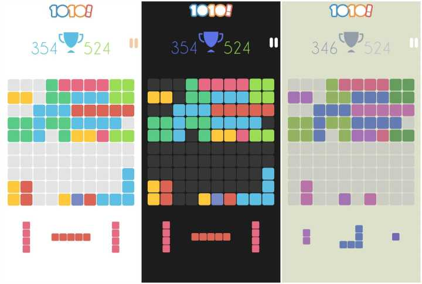

计划式「俄罗斯方块」。

一款画风简洁的休闲益智小游戏。你需要用底下不断刷新的方块来填充中间的格子，当横向或纵向格子被填充满后自动消除，同时得分。分数无上限，直到方块没有位置去填充为止。是一款打法时间的利器。

**64.踪迹：谋杀之谜**

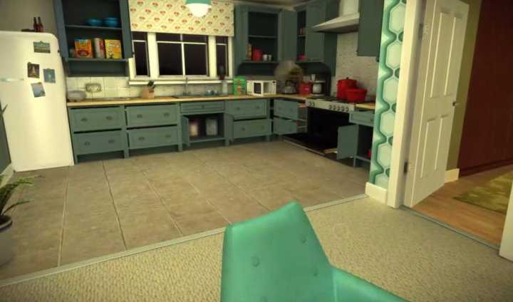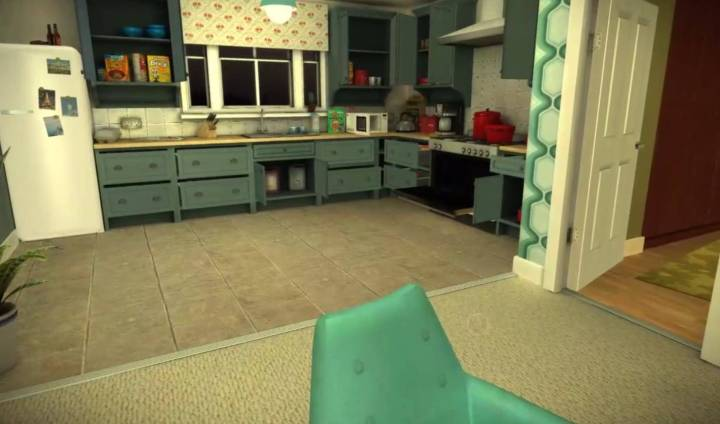

来当一波名侦探。

这款3D益智游戏以谋杀案为主题设计诸多谜题。玩家将扮演一名侦探，通过凶杀案现场的诸多线索与疑点一步步还原案件真相，将凶手绳之以法。游戏解谜题材生活化，非常适合喜欢侦探推理的玩家。配合现实化场景与轻音乐渲染，很容易让玩家沉浸其中。

**65.勇敢的约翰**

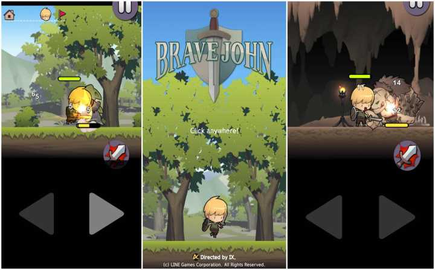

胆小鬼的勇敢冒险之旅。

一款卡通画风的RPG休闲游戏。为了阻止大魔王的复活，胆小呆萌的约翰还是“被迫”找回那个复活所需的宝石。游戏丰富的职业与多类型关卡设计出色。战士、杀手、黑暗魔法师……护送战、boss战、防御战，总有你喜欢的场景或玩法。操作简单的游戏也透露着复杂，你需要不断注意敌人的攻击前摇并快速躲开，因为小约翰真的不耐打。

**66.异形工厂**

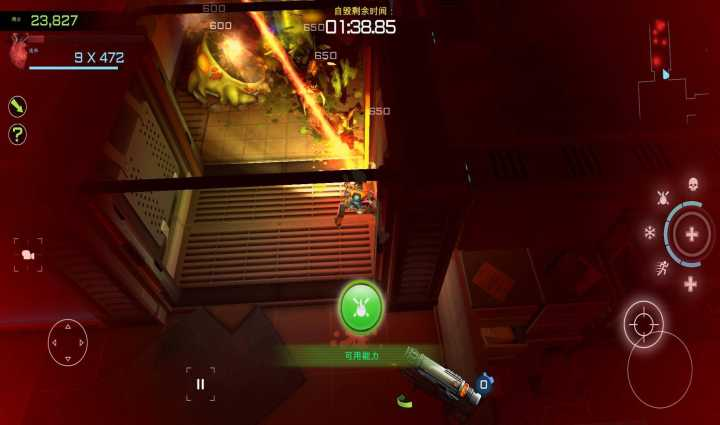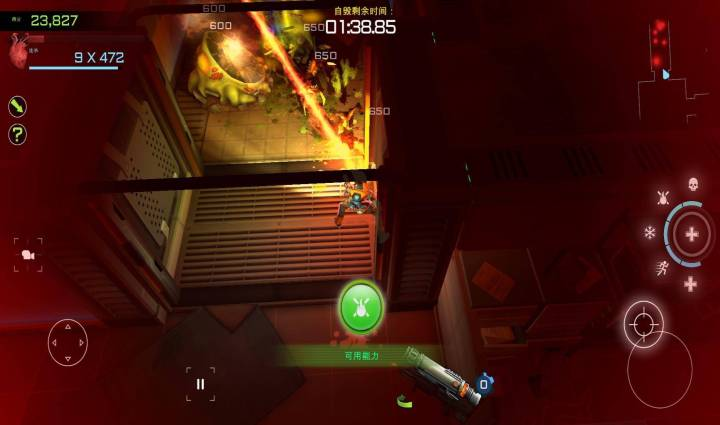

爽就行了！

一款画风精致的动作射击游戏。这款游戏不重视剧情，几乎可以说是个纯打怪游戏。在每局开始时，你需要装备主武器、副武器和盔甲。30多种武器的选择加上种类丰富的怪物，尽情地屠杀吧！

**67.虚拟入侵**

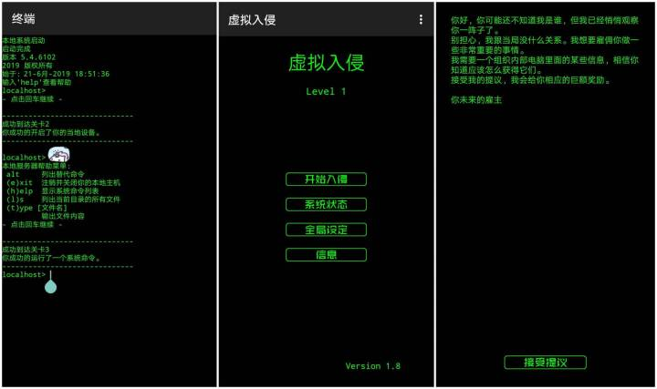

玩了一会儿，想滚去学习……

（第一张图打马赛克防止透露答案）这款模拟黑客入侵的益智游戏通过一条剧情线贯穿始终，在剧情发展过程中利用线索与提示来解谜。游戏采用和「脑裂」一样的黑底绿字画面，关卡设计短小精悍。你不仅可以感受游戏独特的解谜乐趣，还能顺便学学英语单词hhhh。

**68.喜欢和你在一起**

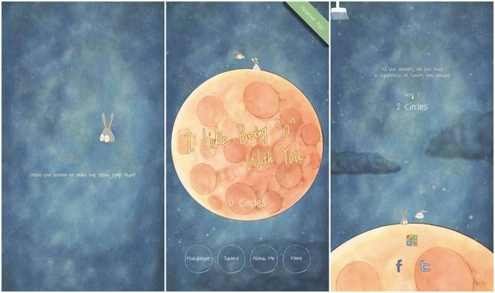

离开你，我就会死！

这是一款音乐欢快，画风唯美的休闲小游戏，以“和喜欢的人一起环球旅行”为灵感制作。游戏玩法很简单，两只小兔子绕着大球转圈，血量会随着时间缓慢流逝，两只兔子每次相遇可以回血。看看你能坚持几圈吧！此外，游戏还有情侣版哦~

**69.王权**

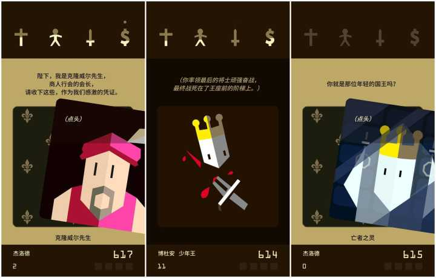

平衡比什么都重要。

一款画风简易的策略类卡牌游戏。玩家需要根据事件影响不断做出选择，以平衡游戏中4种数值（宗教、人们、军队、财富）。任何一项数值消耗殆尽则游戏结束，下一任国王将继承遗志重新开始游戏。有些时候，一个选择能同时增加所有数值，也可能直接将某项数值归0。看看你能在位几年吧！

**70.跳舞的线**

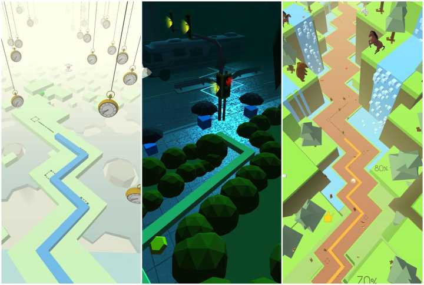

总有一个关卡能让你震撼。

一款积木画风的点触式音乐游戏。玩家需要不断依靠音乐节奏与线的指引躲避沿路障碍。每一关，你不仅能听完一首高质量的音乐，还能用余光欣赏两边的唯美风景。丰富的场景与难度变化，提高了游戏耐玩性。虽然广告很多，不过这也是一款看广告什么都能干的游戏，毕竟还是免费的，只期待广告的弹出位置能更亲民些。

**71.双子**

母子？兄妹？还是情侣？

平静、依偎、涟漪、甜蜜；黑暗、谜雾、寒风、陨落。两枚小球交相呼应，彼此牵绊，完成一段治愈浪漫却又充满困难险阻的旅程。这款优雅华丽的禅式游戏以高颜值唯美画面和完美贴合不同场景的配乐为我们带来一次舒适的视听盛宴。虽无剧情设计，但又让我们不自觉联想到与自己最亲密的人。

**72.手指画线**

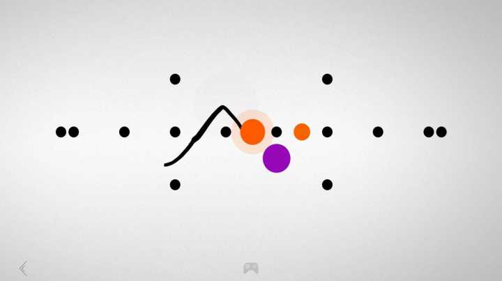

微操实战。

一款画风清新简易的益智游戏。游戏玩法简单，玩家需要用手指在屏幕上画一条线，线会按照路径不断重复以戳破不同颜色的球。线撞上左右界面会反弹，撞上上下界面或黑球则消失，撞上虫洞则传送，戳破除黑球外所有颜色的球即成功。每关游戏的成功路径不止一种，需要我们不断发挥想象力。

**73.魔女之泉1、2、3**

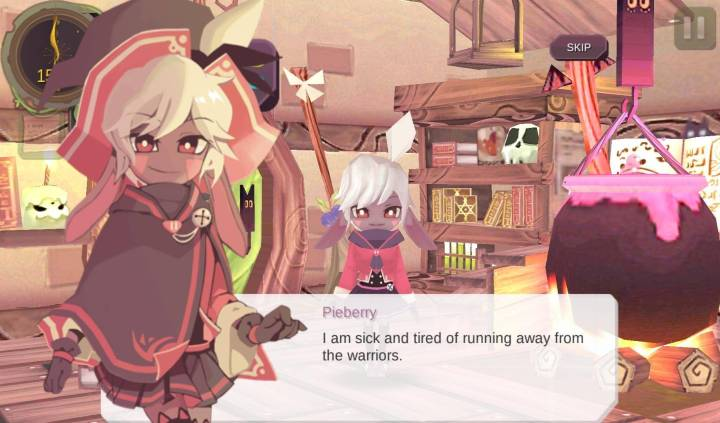

一心寻找剧情。

这是一款需要你费尽心力，到处触发剧情的RPG游戏。在这里，你可以做任何事。制作物品、收集宠物、或者直接在家当条咸鱼。游戏大背景为人类与神族的战斗，占上风的人类对魔女们展开了狩猎行动。3作游戏皆采用回合制战斗方式，游戏从1作到3作更加重视了人物立绘，也稍稍提高了画面质量，而且从2作开始去掉100天机制（主角100天内的行为影响最终剧情）。不过，2、3作的剧情还是引发了玩家们的不满……

**74.迷你地铁**

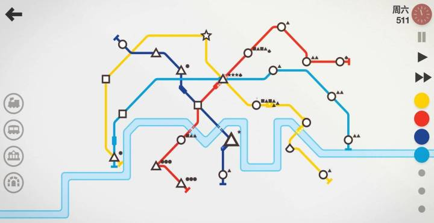

铁路规划原来如此困难。

这款休闲益智游戏模拟城市不断发展时地下铁路网的建设。随着站点数量与类型的增多，玩家需要不断重新规划道路以防止各个站点人群堵塞。铁路不断扩张、站点处不断衔接，玩家要不断算好线路长度、站点形状、道具利用情况等因素对站点拥挤程度的影响。可以说是个操作简单但很考验规划能力的游戏。

**75.流言侦探**

一部可以玩的侦探小说。

这是一部挺耗时间的文字类侦探游戏。创作者们将小说、聊天、解谜等内容融合起来，打造了这款可以玩的侦探小说。游戏中人物各自性格鲜明，相互影响着演绎了精彩的剧情。聊天中的回复选择和接受语音信息的设计也很有意思。不过游戏依然有一些缺点，作者因为重视剧情而轻视了解谜体验，而且后期剧情的突然紧凑也让许多玩家不知所措。

**76.棱镜**

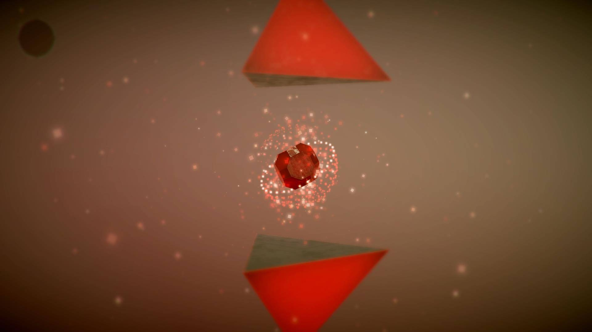

棱镜核心已经点亮。

对应、旋转、变换、拆解，玩家需将棱镜上的小球根据预设轨迹放到指定的位置上，从而不断拆解棱镜，直至得到棱镜“核心”。这款游戏将重点放在光影特效的运用与画面刻画上，我们甚至能看清棱镜的每一面纹理。拆解棱镜的过程不像玩游戏，而更像在把玩一件艺术品。休闲娱乐玩玩这款高颜值游戏，心情也会变愉悦。

**77.家园7：贵族**

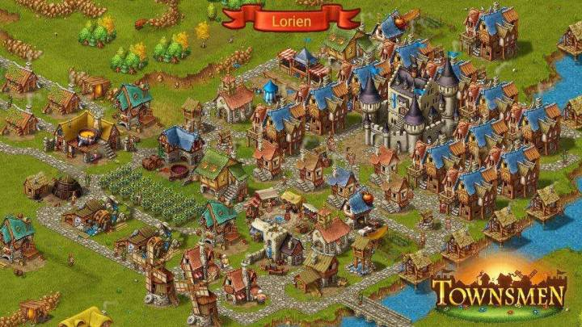Lorien是我微信名哈哈哈

世外桃源。

这是一款模拟经营类游戏，分为剧情和沙盒模式。在这里，你可以建造多种建筑或装饰物满足市民要求，还可以调整税金、与商人交易、与强盗战斗、甚至做研究来解锁游戏新元素，以打造属于你自己的世外桃源。此外，游戏细节刻画良好（其实画质还可以，只是用游戏自带的功能截图像素会变低）。你不仅可以看到每个市民的行动，还能听见诸如泼水声、鸟叫声、抗议声等背景音效，而且幸福值还会影响市民们的工作效率。

**78.极速变色龙**

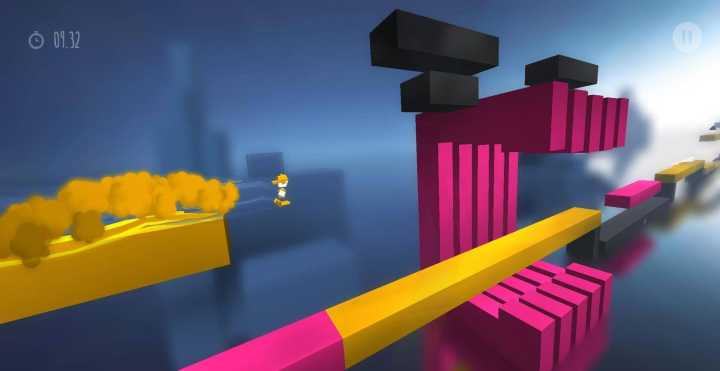

跑酷也能跑出打击感。

一款积木块画风的跑酷游戏。玩家需不断切换颜色，保证自身颜色与路面相同。此外也不能撞击黑色方块，不然游戏结束。风速的跑酷、流畅的动作、配合快节奏音乐，再加上每次人物落地或游戏失败迸发的碎方块，让这款跑酷游戏极具节奏感与打击感。

**79.混沌之戒1、2、3**

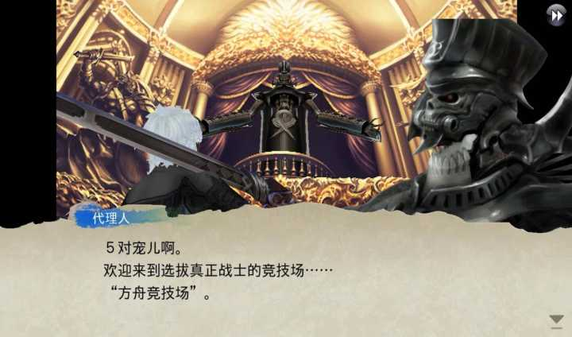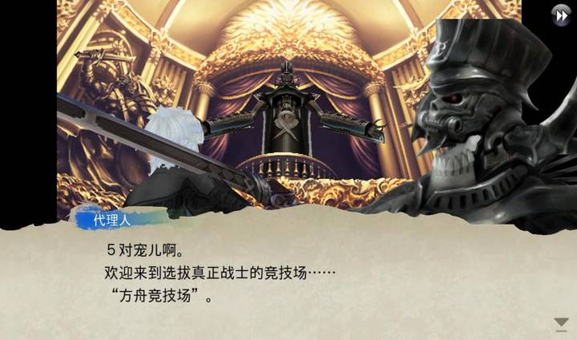

剧情杀。

3款游戏皆为大型回合制RPG游戏，剧情相互独立。1作中，5对人被召唤到方舟竞技场，他们被要求相互搏斗最终只留下1对人，而你就要帮助主角们解开方舟竞技场之谜；2作中，世界即将毁灭，玩家需要取出5名活祭的灵魂以拯救世界，却发现……；3作则讲述玩家受神秘女士指引，前往蓝色星球展开冒险的故事。最有趣的是，对于1作而2作，游戏初始的选择会导致剧情的变化。

**80.回忆之旅**

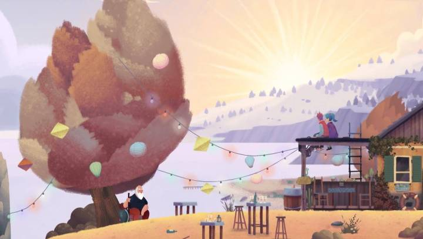

假如能重来……

初进游戏，它细腻的手绘风格画面配合柔和的音乐一下子吸引住了我。游戏从老人接到一封信后收拾行囊离家出走开始，通过触景生情的方式，为我们逐渐揭开老人年轻时的故事。这款益智游戏需要你不断改变游戏地形，帮助老人创造通路，以到达最终目的地。直到最后我们才明白，他不是离家，而是回家。

**81.画中世界**

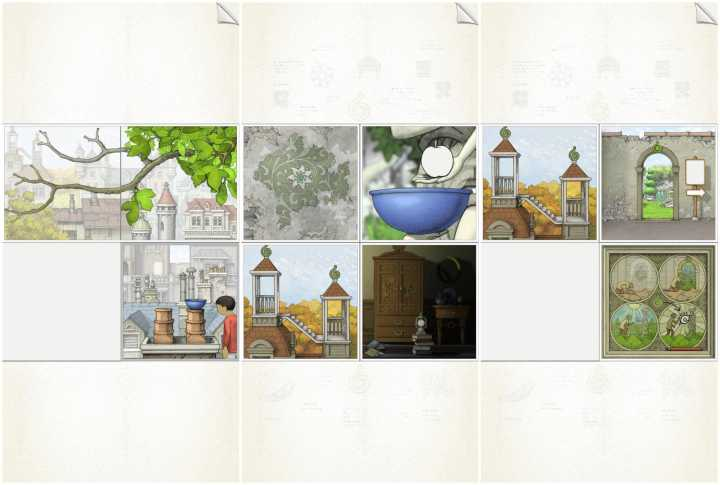

一人一画一世界。

这款穿越时空阻隔的拼图解谜类游戏通过不断嵌套、补充画中的元素，以不同时间线上的线索相互交错推动剧情发展。最有趣的是，这款游戏虽无任何文字描述，却似乎透露着某些人生哲理。我们可以在解谜过程中同时看到不同人生阶段的男生，他们共同组成了在每个玩家心中不尽相同的故事。

**82.花语月**

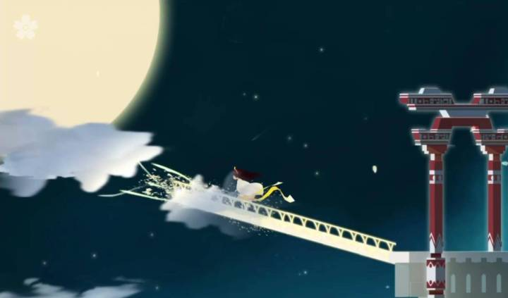

我自奔月去。

非常文艺的休闲益智类游戏。游戏操作和玩法都很简单，大多数场景交互通过一笔画完成，玩家需要按照要求路径或虚线路径画一笔画。游戏随无剧情，但空灵的音乐和文艺的画风还是吸引了一批玩家，他们都沉醉于游戏的唯美意境。

**83.黑暗旅行**

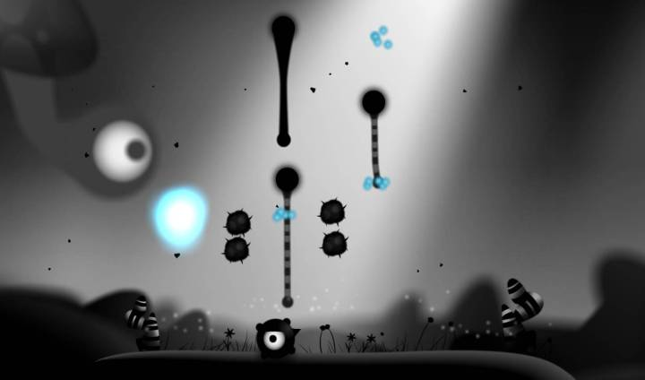

一段光影交织的旅程。

这是一款关卡式益智游戏。通过手指滑动改变地形，再配合游戏中的多种道具让小黑球到达发出闪亮蓝光的位置即可过关。在游戏中，你不仅可以和画面背景元素交互，还能看到游戏对细节的刻画。萌萌的小黑球受到撞击会露出眩晕的表情。你停止操作，他还会露出无语的神情。细腻的画风、宁静的音乐、与黑白灰混合的色调为我们带来平静安逸的感受。

**84.飞跃印刷史**

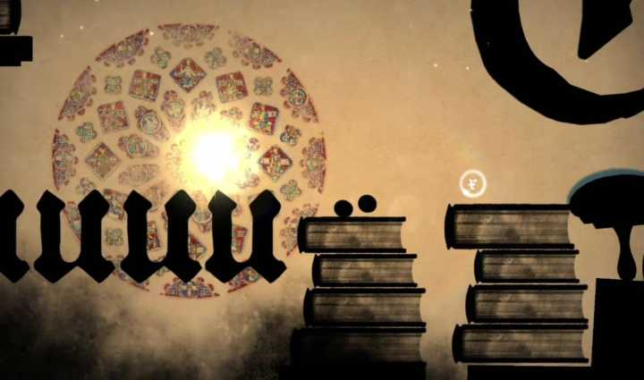

将历史存进游戏里。

这款休闲冒险游戏以精心的玩法设计与详细文字资料结合，带我们重温了世界文字样式的发展与造字过程。玩家可以一边玩游戏，一边体会文字与印刷术悠久的发展历史。创意如此，设计者们还很重视对游戏意境的渲染。光看贴图画面，一股历史感扑面而来，是一款难得的寓教于乐佳作。

**85.伯特伦•费德历险记EP1、EP2**

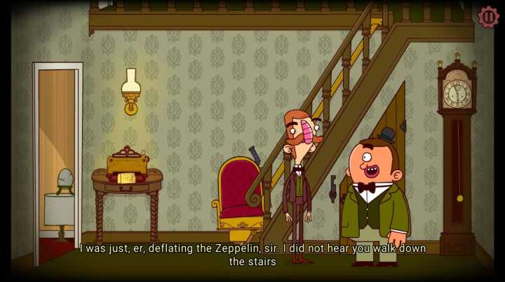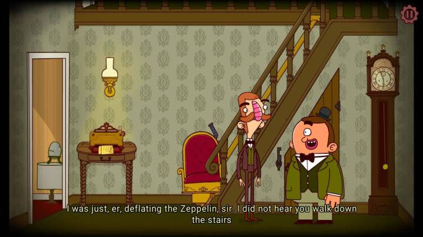

一部可以玩的动画片。

这是一款将解谜融入动画片中的章节式游戏，也同样是一款重剧情而轻解谜的游戏。游戏讲述主角与随从一起追踪伦敦疯狂的连环杀人魔的故事，似乎是在影射当时让伦敦陷入社会恐慌的“开膛手杰克”。不过主角尖锐滑稽的配音与幽默，加上剧情中一些搞笑逗趣的元素，让这个悬疑故事不再那么恐怖。

**86.波克艾克大冒险**

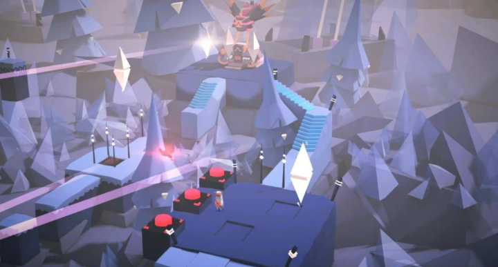

部落缺乏的不是电子乐，而是燥热的内心。

游戏采用抽象化低模画面，充斥强节奏感电子乐，讲述波克艾克为了寻找部落失去的声音而踏上冒险之旅。虽说是音乐解谜类游戏，不过是在解谜过程中有音乐相伴，而且解谜内容并不难，适合解谜新手体验。

**87.缤纷彩带**

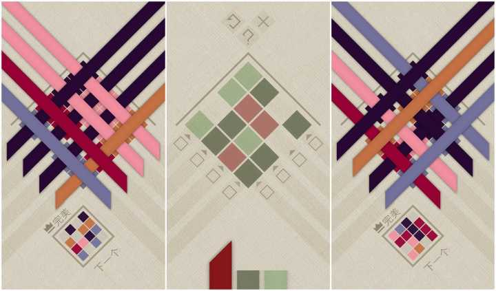

得借助纸笔推算。

一款不能太相信自己脑力的休闲益智游戏。玩家用彩带串住每一个格子，一共需要穿两层，而第二层彩带需要和底下格子的颜色一样。所有格子都达成这样的效果则通关。你会发现由于颜色杂乱，走一步看一步的操作方式很容易挡住颜色，影响思考。所以这种游戏可能需要纸笔做标记而后一气呵成的操作。纯净的彩带、柔和的画布背景、加上轻盈的钢琴音，似乎我们都喜欢这种唯美风格的益智游戏。

**88.被错过的天堂**

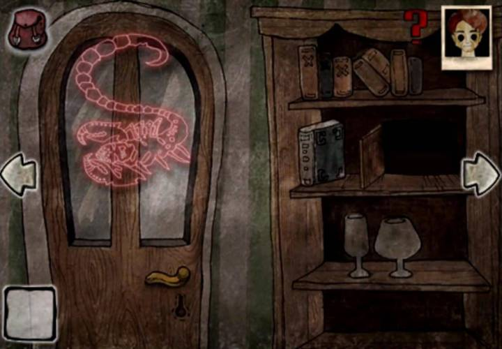

好结局可能也不太好。

一款题材有趣的老解谜游戏。讲述了一对夫妻不知什么原因昏迷后从房间醒来，却发现自己被封印在屋子里，然后接触封印的故事。游戏流程简短，解谜依然由探索以及各种老式小游戏构成。游戏唯一“缺点”就是解谜引导语过多，很多解谜因素很平常但还是进行了很多文字描述。不过这种设定对当时的玩家来说也算正常，毕竟是快20年前的游戏了……

**89.暗影格斗2、3**

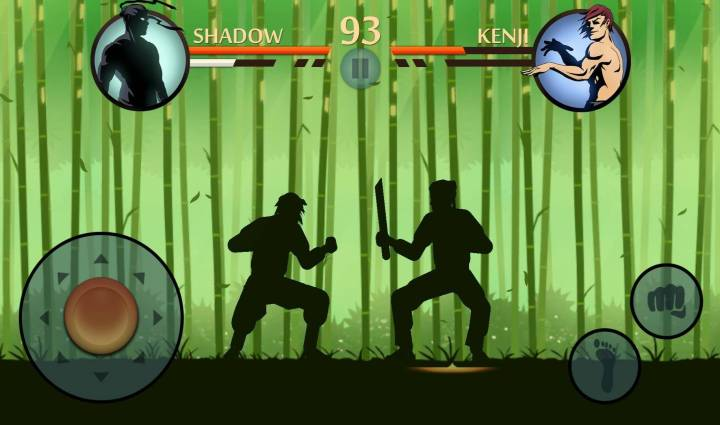

有剧情的格斗游戏。

2作所有游戏人物都为纯黑色暗影，配合一张简易却具真实感的背景布，让格斗也变得唯美起来。各种各样的武器、盔甲、暗器供你选择，它们也都有自己的特性，技能树中也能解锁新的战斗姿势。足够肝的普通关卡更是提高了游戏耐玩性，装备的获取难度也让很多玩家为这款格斗游戏赋予了休闲的情感。

对于3作而言，人物不再暗影风格，而是更贴近真实打斗。虽然游戏更加精致，也增强了打击感，但总觉得它失去了2作格斗的美感。而且对于某些bug，以及糟糕的ai设计，也遭到了许多玩家吐槽。

**90.ICEY**

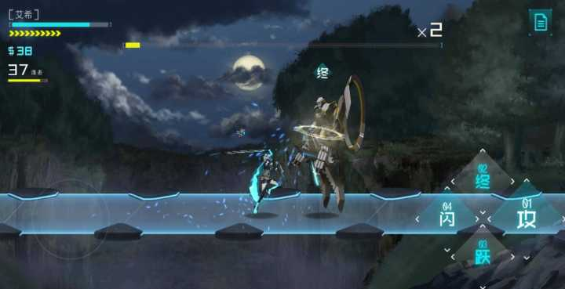

探索自我。

这款2D横板ARPG游戏以精湛的画风、华丽的特效和自然流畅的操作给予玩家畅爽的游戏体验。你还也可以用金币学技能来解锁更多酷炫连击姿势。此外，游戏旁白NPC还是个逗比的存在，你的每一次动作失败，旁白大哥都会很逗比地吐槽你。正因如此，很多玩家还会故意做错动作来调戏旁白君。在真结局中，你能看到整个游戏的主旨。

[ICEY 艾希手游周边二次元动漫衣服连帽卫衣加绒外套上淘宝¥ 88.00去购买](https://s.click.taobao.com/t?e=m%3D2%26s%3D0Esd9mnVT%2F5w4vFB6t2Z2ueEDrYVVa64yK8Cckff7TVRAdhuF14FMcx2PQYCXQHtJ1gyddu7kN8Atbf9FqI%2BxAaXQZijrFYGBih3Oft2s0pMIkUPZyjWyp3YXO2CkBYVIPBGd8BnON7fnvQh3553f9RMHE3IWBDapDqxmnuA0ubmtVFQLzdyxpaYzSMEwlxT%2FufIeaShmLvWGPPZ03CRxHCnHjNreoNp13BQe3EEuZb0MrbhEk%2B62TycZjAPhPKVz8YFe5%2BWp5pfzNmQ3EAS89zmZSGq9ptbzgq8wFaQkp3GDF1NzTQoPw%3D%3D&union_lens=lensId:TAPI@1606436020@0b5819c0_8fd5_176070c6142_0e5c@01)

**91.急速冲击**

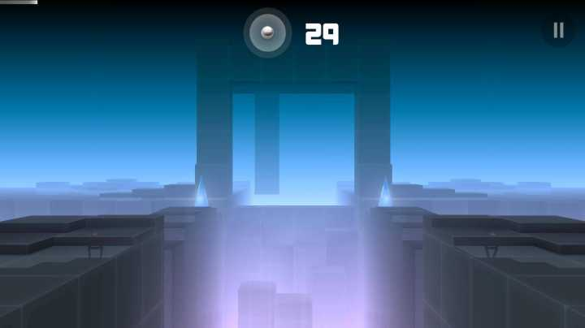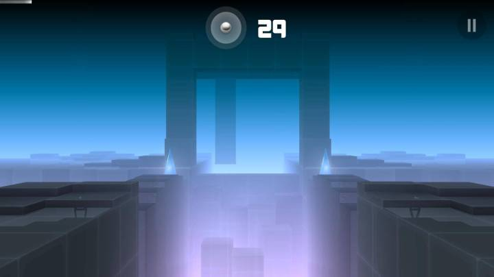

在前进的路上，打碎一切阻碍。

曾经上课经常用来消遣的休闲游戏，考验反应力。你需要抛出铁球打碎阻拦你前进路上的障碍，每次使用铁球或撞上障碍物会掉球数，直到球消耗完则游戏结束，游戏目标就是尽量撑过更远的距离。模型近处可见的精细纹理、场景的无缝变换，超爽的打击快感让很多玩家“中毒”，不过最重要的还是勾起了它们以前和同伴比切磋的回忆。

**92.老爸曾是小偷**

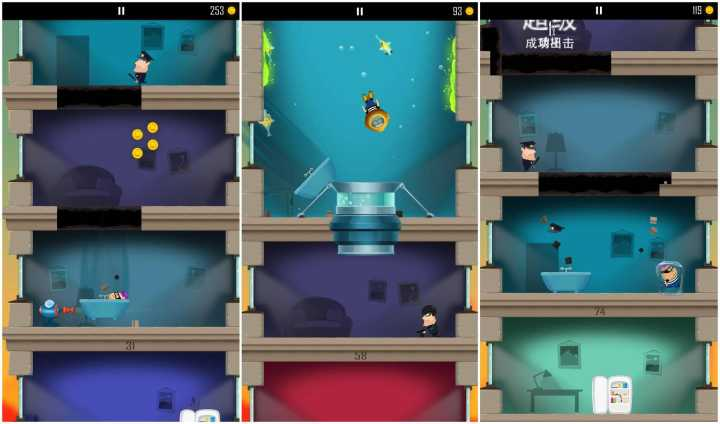

这老爸破坏力贼强！

为了妻子和孩子，这个抢银行的老爸要开始他的极限跑酷了。这款萌萌画风的休闲跑酷游戏超有节奏感，一个憨憨的胖子一直在横向奔跑，碰到障碍物则会掉头。期间要找准机会不断撞破楼层，躲避警察和各种陷阱。越到后面的楼层，陷阱越密集，看看你能坚持几层吧。对于上班族或学生党来说，把这游戏当成个解压工具也不错。

**93. 一起玩陶艺**

用心创造艺术品。

一款很佛系的休闲游戏。玩法简单，通过制作各种各样的陶艺，最后以拍卖的方式获得收益。游戏设计陶艺的过程宁静自然，我们享受的也是休闲的制作环境和制作完成后满满的成就感。不过有许多商品需要同时花费金币和钻石，这就有点强迫玩家充钱的意思了。而且拍卖判定不太智能，似乎重成本而轻创意。如果能优化这两点，一定能成为5星级休闲游戏。

**94.众生游**

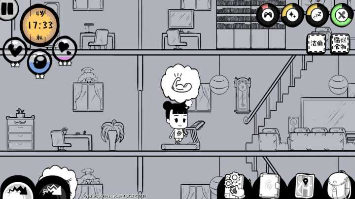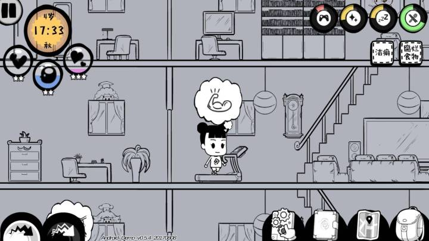

我们能否通过后天的选择改变命运？

模拟经营类游戏的卖点，在于它可以让我们体验现实中很难体验的生活。每个人都不能选择自己的出身，但可以在有限的时间、有限的条件下自由选择做其他事。游戏将模拟在不同出身条件下你一生的生活，你的每个选择都会改变你的属性值。你可以通过这款游戏，体会先天出身和后天努力对我们人生的影响有什么不同。

**95.伪装游戏**

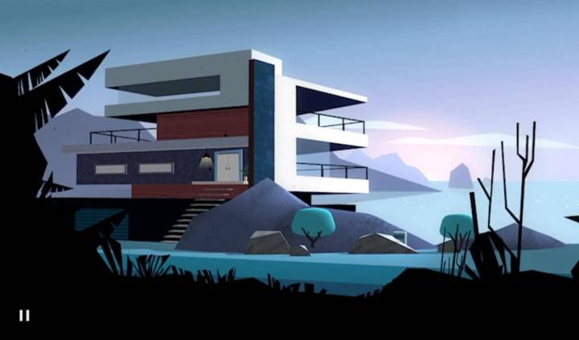

特工VS特工。

这是一款题材新颖的解谜游戏。玩家被上司指派追踪敌方的一名女特工，而女特工却策划杀死了自己的上司，游戏正式开始……这款游戏画风简易，几何图形般的模型设计让我们把注意力放在追逐剧情和解谜上。游戏解谜比较丰富简单，对新手玩家非常友好。而剧情方面，游戏也是留下了很大的伏笔。

**96.深海水族馆**

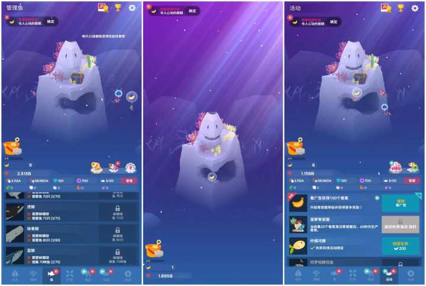

我从来没有这么喜欢广告过。

一款足够耐玩的休闲游戏，游戏目标就是不断收集各种各样的鱼和珊瑚，让水族馆充满生命力。丰富多样的鱼种、不同类型的主题背景大大提高了游戏耐玩性，对于收集癖来说这里简直是天堂。看着自己的水族馆更加华丽热闹，想想这深海的的石头也能不再孤单了。

**97.旅行青蛙**

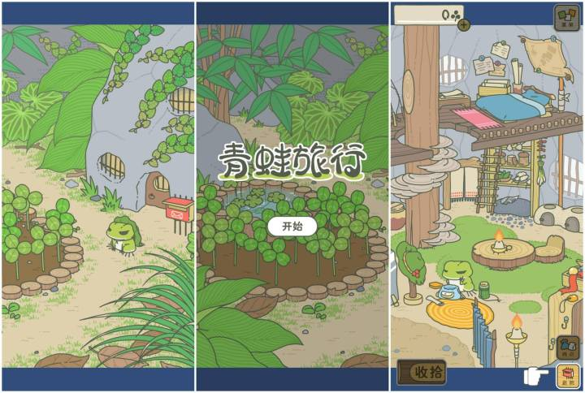

在手机里养“儿子”。

曾在2018年初爆火的佛系游戏，很多人把这只喜欢旅行的青蛙当自己儿子养。你需要不断收集三叶草，帮蛙子整理各种旅游用品，而后蛙子就会带回旅行照片或特产给你。游戏佛系在于我们不清楚它什么时候回来，一上线发现它不在，总会有一种淡淡的忧伤，这跟父母担心离家的孩子一模一样。不过这款游戏还是很能满足收集欲的，而且很随缘。如果你害怕其它手机游戏耽误你时间，那你可以试试玩这个。

[旅行青蛙公仔毛绒玩具周边淘宝¥ 16.80去购买](https://s.click.taobao.com/t?e=m%3D2%26s%3D77HAu2dYKOxw4vFB6t2Z2ueEDrYVVa64XoO8tOebS%2BdRAdhuF14FMcx2PQYCXQHtJ1gyddu7kN8Atbf9FqI%2BxAaXQZijrFYGBih3Oft2s0pMIkUPZyjWyp3YXO2CkBYV4CTJ55g4VTuCH3zAJZX7dbJJseZIjvA615%2F%2BuhipGV0uyRHckDmQEFcG41fWwUiB04bt%2FCh0HCbYpehvGGzR%2FucJj1rz2vt8tAaK%2F19g%2FPmRCUms4757Av61MgKCuzV3IXo9Hpa%2Ffj5o%2BI8ssrVDqUTkTm3o5eKOToc1vbQZVKjGDmntuH4VtA%3D%3D&union_lens=lensId:TAPI@1606436020@0b0b0c08_009c_176070c6194_c314@01)

**98.浅塘**

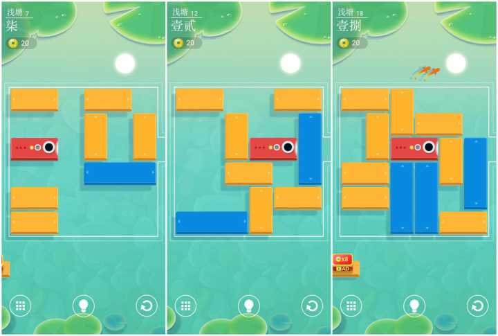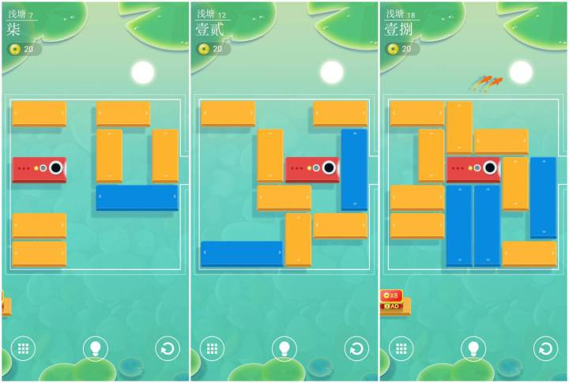

唯美版华容道。

将高颜值标签与华容道自身魅力结合，成就了这款高分休闲益智游戏。游戏的唯美意境甚至盖过了玩法本身，简易清新的画面、宁静的音乐，玩着玩着就发现时间已悄然流逝（其实是因为越到后面越难hhhh）。

**99.漫漫旅途**

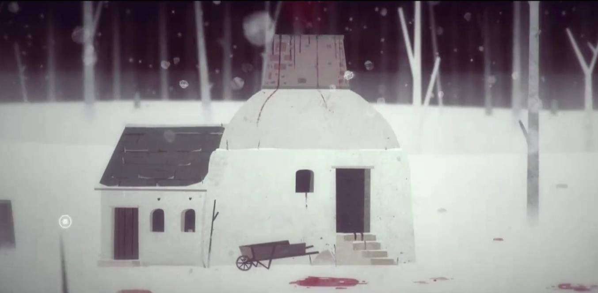

在祥和中感受恐怖。

这款恐怖解谜游戏的灵感诞生于瑞典民俗，人们为了预知未来而冒风险进入另一个世界。游戏采用剪纸风格的画面。新世界恐怖的生物与黑、白、红构成的色调共同为游戏蒙上了一层诡秘氛围。刚开始玩这个游戏会很一头雾水的，因为这游戏“哲学三问”里一个答案都没给。不过这游戏也是挺关心人的，如果一头雾水，还可以看提示和地图。对了，结尾有彩蛋，带你了解游戏背后的民俗秘密~

**100.拒绝上班**

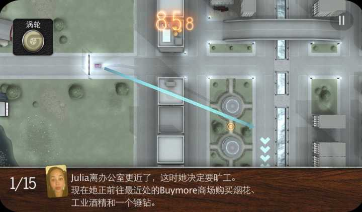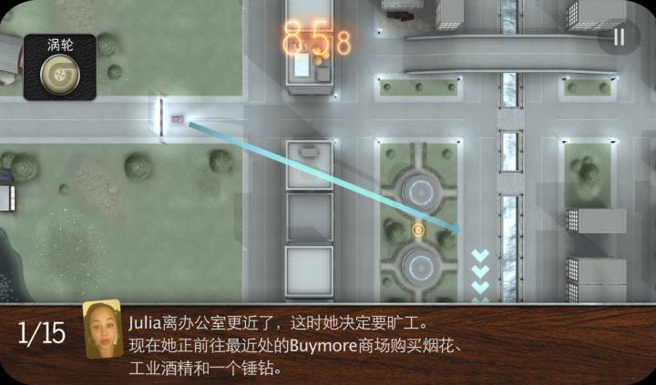

改名叫《好好开车》吧。

这是一款开车游戏。啊不，一款撞车游戏。在每个关卡中，玩家要操纵许多不同类型的车到达指定路口。不过你每开一辆车，路径都会被记录，你操控下一辆车时，会遇上你原来操控的车。然后随着车数增多，随着各种各样开车轨迹的涌现，总有一辆车是你避不开的。玩会儿这游戏，终于会好好开车了。

**101.小3传奇**

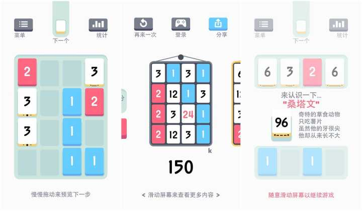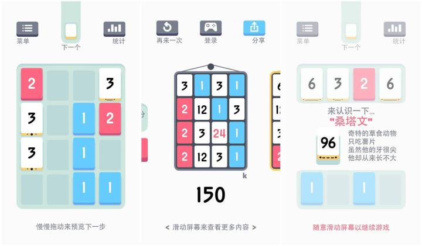

《小3传奇》→《2048》

一款画风简易的休闲益智游戏。尽量叠加更大的数字，每次操作也都会产生新数字。不过只有“3”以上的数字可以叠加，而“1”只能和“2”，或者说“2”只能和“1”叠加成“3”，其他都不可以。每次挑战成功一个新数字，你都能认识一个萌萌的新朋友。

**102.喵斯快跑**

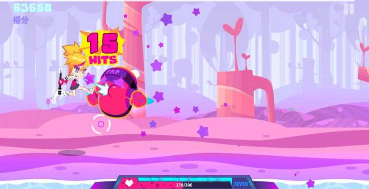

可以改背景音乐的跑酷游戏。

这是一款跑酷与音乐相结合的游戏。玩惯了降落的音符，再玩这种游戏一开始也会有些不适应。充满粉红少女心的卡通画风与欢快的音乐让这款游戏深受女性玩家的喜爱。总的来说这不像标签写的音乐游戏，倒像一款可以改背景音乐的跑酷游戏~~~

**103.无限循环系列**

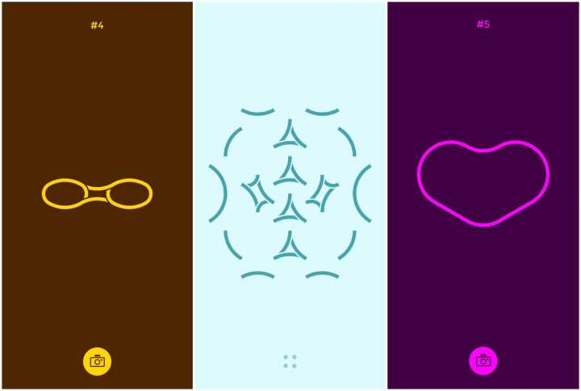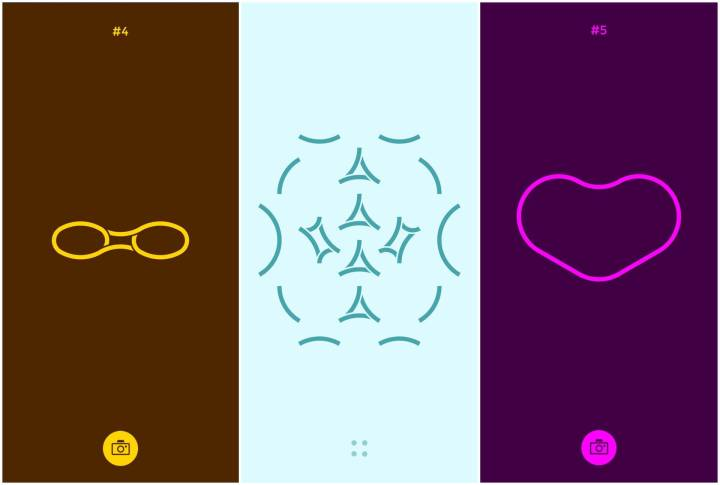

另类拼图游戏。

同样是一款休闲益智游戏，也同样拥有唯美游戏配备的简洁画风和轻音乐。你需要将每个关卡给出的众多杂乱的线条拼成一个或几个图形。线条每点击一次就会旋转一个方向，想想看你的朋友看你一直在点乱七八糟的线条会是什么反应呢？当然，也可以将这款游戏安利给Ta！

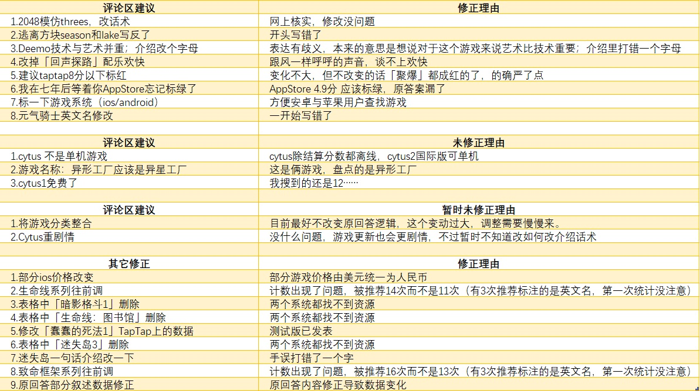

>来自：https://www.zhihu.com/question/25984324/answer/727952266