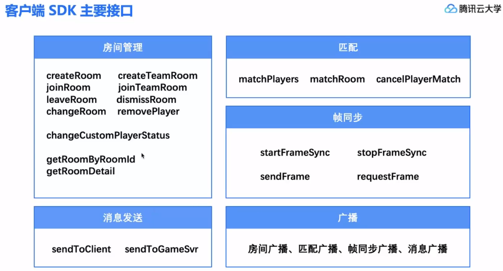
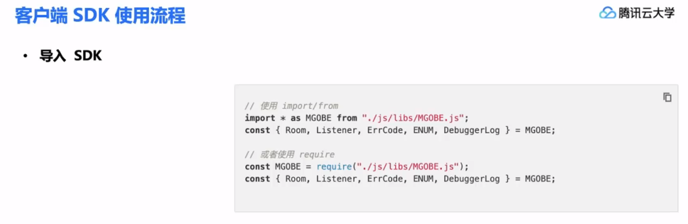
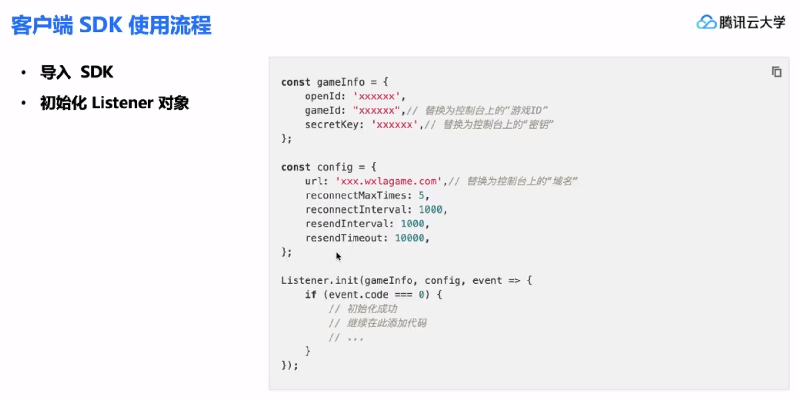
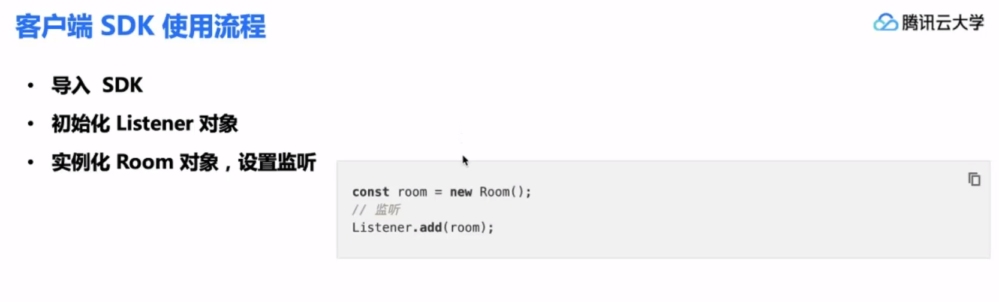
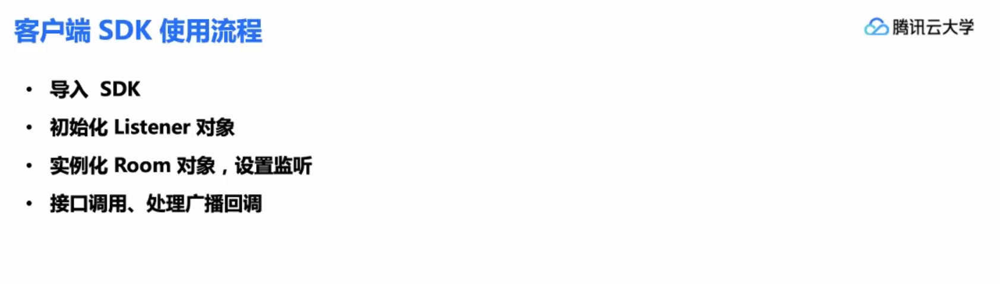

## 客户端SDK主要接口




## 客户端SDK使用流程










## 帧同步

```typescript
// 初始化SDK
const gameInfo: MGOBE.types.GameInfoPara = {		// 游戏信息
    gameId: "xxx",
    openId: "xxx",
    secretKey: "xxx",
}
const config: MGOBE.types.ConfigPara = {			// 游戏配置
    url: "xxx.com",
    isAutoRequestFrame: true,		// 是否自动补帧（默认false）
}
MGOBE.Listener.init(gameInfo, config, event => {
    if (event.code === MGOBE.ErrCode.EC_OK) {
        let room = new MGOBE.Room();
        MGOBE.Listener.add(room);
    }
});


// 判断SDK是否初始化
function isInited(): boolean {
    return !!MGOBE.Player && !!MGOBE.Player.id;		// 初始化成功后才有玩家ID
}

// 查询自己是不是房主
function isOwner(): boolean {
    return roomInfo.owner === MGOBE.Player.id;
}


// 房间内广播回调
// In MGOBE.d.ts
class RoomBroadcastHandler { }
class Room extends RoomBroadcastHandler { }


// 创建房间 
const playerInfo: MGOBE.types.PlayerInfoPara = {
	name: "测试玩家",
	customPlayerStatus: 0,			// 自定义玩家状态
	customProfile: "",				// 自定义玩家信息
};
const createRoomPara: MGOBE.types.CreateRoomPara = {
	roomName: "cocos_demo",			
	roomType: "create",
	maxPlayers: 5,					// 房间最大玩家数量
	isPrivate: true,				// 是否私有
	customProperties: "",			// 自定义房间属性
	playerInfo,						// 玩家信息
};
global.room.initRoom();
global.room.createRoom(createRoomPara, event => {
    if (event.code === MGOBE.ErrCode.EC_OK) {
        // ...
    } else if (event.code === MGOBE.ErrCode.EC_ROOM_PLAYER_ALREADY_IN_ROOM) {		// 已经在房间内
		// ...
    } else {
        // ...
    }
});


// 匹配队友
global.room.initRoom();
global.room.matchPlayers(matchPlayersPara, event => {
    if (event.code === MGOBE.ErrCode.EC_OK) {
        // ...
    } else if (event.code === MGOBE.ErrCode.EC_ROOM_PLAYER_ALREADY_IN_ROOM) {		// 已经在房间内
		// ...
    } else {
        // ...
    }
});


// 离开房间
global.room.leaveRoom({}, event => {
    if (event.code === MGOBE.ErrCode.EC_OK || event.code === MGOBE.ErrCode.EC_ROOM_PLAYER_NOT_IN_ROOM) {
        // ...
    } else {
        // ...
    }
});
```


## 随机数

```javascript
const seed = frame.ext.seed + frame.id;
MGOBE.RandomUtil.init(seed);
MGOBE.RandomUtil.random();
```


## 引用

> [游戏联机对战引擎 官网](https://cloud.tencent.com/document/product/1038)
>
> [纯前端如何利用帧同步做一款联机游戏？](https://forum.cocos.org/t/topic/99992)
>
> [使用签名初始化 SDK](https://cloud.tencent.com/document/product/1038/38863)